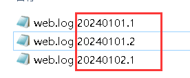
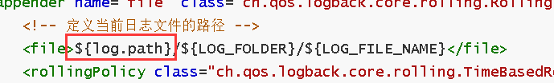

# 1 logback-spring.xml

logback集成到springboot中，xml配置文件为：

```xml
<?xml version="1.0" encoding="UTF-8"?>
<configuration scan="true" scanPeriod="10 minutes">
    <!-- 将日志输出到控制台，并自定义日志的格式 -->
    <appender name="STDOUT" class="ch.qos.logback.core.ConsoleAppender">
        <layout class="ch.qos.logback.classic.PatternLayout">
            <pattern>%d{yyyy-MM-dd HH:mm:ss,GMT+8} [%t] [%p][%c][%M][%L] -> %m%n</pattern>
        </layout>
    </appender>

    <!-- 从spring的配置文件中引入 project.folder 和 log.root.level 的值 -->
    <springProperty scope="context" name="log.path" source="project.folder"/>
    <springProperty scope="context" name="log.root.level" source="log.root.level"/>

    <!-- 定义日志文件夹名称和日志文件名，根据实际情况更改 -->
    <property name="LOG_FOLDER" value="logs"/>
    <property name="LOG_FILE_NAME" value="web.log"/>

    <!-- 将日志输出到文件，并实现日志文件的滚动管理 -->
    <appender name="file" class="ch.qos.logback.core.rolling.RollingFileAppender">
        <!-- 定义当前日志文件的路径 -->
        <file>${log.path}/${LOG_FOLDER}/${LOG_FILE_NAME}</file>
        <rollingPolicy class="ch.qos.logback.core.rolling.TimeBasedRollingPolicy">
            <!-- 设置日志文件的命名规则和滚动策略：按日期和索引序号 -->
            <FileNamePattern>${log.path}/${LOG_FOLDER}/${LOG_FILE_NAME}.%d{yyyyMMdd}.%i</FileNamePattern>
            <!-- 应用程序启动时清理历史记录 -->
            <cleanHistoryOnStart>true</cleanHistoryOnStart>
            <!-- 设置滚动触发策略，按文件大小和时间滚动 -->
            <timeBasedFileNamingAndTriggeringPolicy
                    class="ch.qos.logback.core.rolling.SizeAndTimeBasedFNATP">
                <!-- 单个日志文件的最大大小限制 -->
                <MaxFileSize>20MB</MaxFileSize>
            </timeBasedFileNamingAndTriggeringPolicy>
            <!-- 保留历史日志的最大天数 -->
            <MaxHistory>30</MaxHistory>
        </rollingPolicy>
        <!-- 设置日志编码和输出格式 -->
        <encoder>
            <pattern>%d{yyyy-MM-dd HH:mm:ss,GMT+8} [%t] [%p][%c][%M][%L] -> %m%n</pattern>
            <charset>UTF-8</charset>
        </encoder>
        <!-- 配置文件的追加模式：是否覆盖旧的日志 -->
        <append>false</append>
        <!-- 设置审慎模式，适用于多实例环境 -->
        <prudent>false</prudent>
    </appender>

    <root level="${log.root.level}">
        <appender-ref ref="STDOUT"/>
        <appender-ref ref="file"/>
    </root>
</configuration>
```


# 2 解析

xml文件的名称必须是logback-spring.xml，springboot对该文件有特殊的扩展。

整个xml分为两个部分，也就是两个附加器`<appender>`，分别名为STDOUT和file。先说STDOUT，它主要配置的是控制台的日志输出格式：

```xml
<appender name="STDOUT" class="ch.qos.logback.core.ConsoleAppender">
    <layout class="ch.qos.logback.classic.PatternLayout">
        <pattern>%d{yyyy-MM-dd HH:mm:ss,GMT+8} [%t] [%p][%c][%M][%L] -> %m%n</pattern>
    </layout>
</appender>
```

格式为：

```
%d{yyyy-MM-dd HH:mm:ss,GMT+8} [%t] [%p][%c][%M][%L] -> %m%n
```

这个格式化字符串通常用于日志框架（如 Log4j 或 Logback）中的日志输出配置，定义了日志输出的格式。以下是各个部分的含义：

- `%d{yyyy-MM-dd HH:mm:ss,GMT+8}`：表示日志的时间戳，格式为 "yyyy-MM-dd HH:mm"，时区为 GMT+8。
- `%t`：表示线程名称。
- `%p`：表示日志级别，如 DEBUG、INFO、WARN、ERROR。
- `%c`：表示日志记录器的名称（通常是类的全名或包名）。
- `%M`：表示产生日志的方法名。
- `%L`：表示日志输出的行号。
- `%m`：表示日志信息的内容。
- `%n`：表示换行符。

在日志输出中，这个配置可能会生成类似这样的日志条目：

```less
2024-11-02 15:30:45,GMT+8 [main] [INFO][com.example.MyClass][myMethod][25] -> 这是日志信息
```

这种格式便于定位日志的产生位置、时间和相关信息，可以更有效地调试和分析程序。

然后是file，配置它的目的是将日志输出到文件，并实现日志文件的滚动管理。

```xml
<!-- 将日志输出到文件，并实现日志文件的滚动管理 -->
<appender name="file" class="ch.qos.logback.core.rolling.RollingFileAppender">
    <!-- 定义当前日志文件的路径 -->
    <file>${log.path}/${LOG_FOLDER}/${LOG_FILE_NAME}</file>
    <rollingPolicy class="ch.qos.logback.core.rolling.TimeBasedRollingPolicy">
        <!-- 设置日志文件的命名规则和滚动策略：按日期和索引序号 -->
        <FileNamePattern>${log.path}/${LOG_FOLDER}/${LOG_FILE_NAME}.%d{yyyyMMdd}.%i</FileNamePattern>
        <!-- 应用程序启动时清理历史记录 -->
        <cleanHistoryOnStart>true</cleanHistoryOnStart>
        <!-- 设置滚动触发策略，按文件大小和时间滚动 -->
        <timeBasedFileNamingAndTriggeringPolicy
                                                class="ch.qos.logback.core.rolling.SizeAndTimeBasedFNATP">
            <!-- 单个日志文件的最大大小限制 -->
            <MaxFileSize>20MB</MaxFileSize>
        </timeBasedFileNamingAndTriggeringPolicy>
        <!-- 保留历史日志的最大天数 -->
        <MaxHistory>30</MaxHistory>
    </rollingPolicy>
    <!-- 设置日志编码和输出格式 -->
    <encoder>
        <pattern>%d{yyyy-MM-dd HH:mm:ss,GMT+8} [%t] [%p][%c][%M][%L] -> %m%n</pattern>
        <charset>UTF-8</charset>
    </encoder>
    <!-- 配置文件的追加模式：是否覆盖旧的日志 -->
    <append>false</append>
    <!-- 设置审慎模式，适用于多实例环境 -->
    <prudent>false</prudent>
</appender>
```

它生成的日志文件名会附带日期和索引，通过这个格式设置的：

```xml
<FileNamePattern>${log.path}/${LOG_FOLDER}/${LOG_FILE_NAME}.%d{yyyyMMdd}.%i</FileNamePattern>
```

`.%d{yyyyMMdd}.%i`就是日期和索引，如图：



相同日期用不同索引区别。

文件中日志输出格式同控制台。

接下来说一下springboot对此文件的扩展，也就是这个标签：

```xml
<springProperty scope="context" name="log.path" source="project.folder"/>
<springProperty scope="context" name="log.root.level" source="log.root.level"/>
```

一般的xml是不允许直接从配置文件，如application.yml中引入值的，但是springboot对logback-spring.xml的扩展，允许其定义一个`<springProperty>`，然后使用其属性`source`来引入配置项的值。这样通过`<springProperty>`，其他标签就可以将其引入，达到间接引入配置项值的目的。

比如，在这个例子中第一个`<springProperty>`的名称是`log.path`，引入的是`project.folder`的值，其他标签就可以引入`log.path`从而引入`project.folder`的值：

