# 1 项目模块结构

项目分为前端和后端，整个项目分为4个模块：

- job
- admin
- web
- common

其中，job为根模块，主要用于管理其他3个模块。

admin主要管理后端的请求，以及后端特有的业务。

web主要管理前端的请求，以及前端特有的业务。

common是公共模块，前端和后端都能访问这个模块，比如一些公共的工具业务逻辑，公共的数据库操作等就放在这个模块中。

本次的演示使用maven进行项目创建，搭建出springboot项目，不使用springboot的脚手架创建。


# 2 搭建项目模块

## 2.1 搭建根模块job

首先创建根模块，创建的模板选择`maven-archetype-site`：

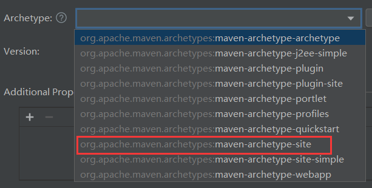

指定坐标：

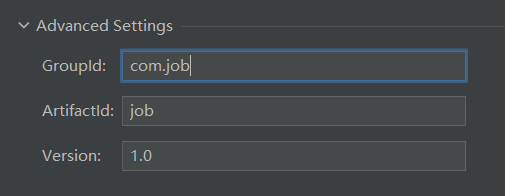

等待项目创建，创建完毕后生成的pom：

```xml
<project xmlns="http://maven.apache.org/POM/4.0.0" xmlns:xsi="http://www.w3.org/2001/XMLSchema-instance"
  xsi:schemaLocation="http://maven.apache.org/POM/4.0.0 http://maven.apache.org/xsd/maven-4.0.0.xsd">
  <modelVersion>4.0.0</modelVersion>

  <groupId>com.job</groupId>
  <artifactId>job</artifactId>
  <version>1.0</version>

  <name>Maven</name>
  <url>http://maven.apache.org/</url>
  <inceptionYear>2001</inceptionYear>

  <distributionManagement>
    <site>
      <id>website</id>
      <url>scp://webhost.company.com/www/website</url>
    </site>
  </distributionManagement>

  <properties>
    <project.build.sourceEncoding>UTF-8</project.build.sourceEncoding>
  </properties>

  <build>
    <plugins>
      <plugin>
        <artifactId>maven-site-plugin</artifactId>
        <configuration>
          <locales>en,fr</locales>
        </configuration>
      </plugin>
    </plugins>
  </build>
</project>
```

修改，保留以下内容：

```xml
<project xmlns="http://maven.apache.org/POM/4.0.0" xmlns:xsi="http://www.w3.org/2001/XMLSchema-instance"
  xsi:schemaLocation="http://maven.apache.org/POM/4.0.0 http://maven.apache.org/xsd/maven-4.0.0.xsd">
  <!-- 模块版本，保留 -->
  <modelVersion>4.0.0</modelVersion>

  <!-- 当前项目的坐标，保留 -->
  <groupId>com.job</groupId>
  <artifactId>job</artifactId>
  <version>1.0</version>

  <!-- 修改项目名 -->
  <name>job</name>

  <!-- 属性，保留字符集 -->
  <properties>
    <project.build.sourceEncoding>UTF-8</project.build.sourceEncoding>
  </properties>

</project>
```

修改完后，重新编译pom：

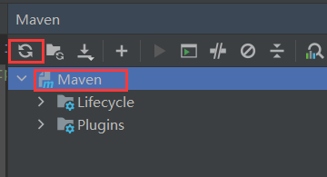

因为根模块只做依赖管理，因此源目录可以删除，我选择删除：

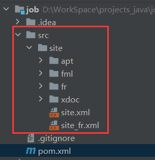


## 2.2 搭建公共模块common

在job目录中创建子模块，同样创建maven工程，但是创建模板选择`maven-archetype-quickstart`：

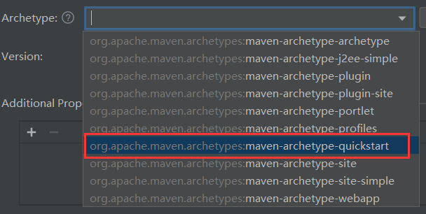

指定坐标，组织名继承至根模块，一般不动，主要修改模块名，IDEA的智能识别能识别模块名，因此这里完全不需要动：

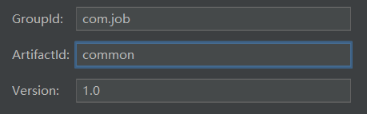

等待创建完成，生成的pom如下：

```xml
<project xmlns="http://maven.apache.org/POM/4.0.0" xmlns:xsi="http://www.w3.org/2001/XMLSchema-instance"
         xsi:schemaLocation="http://maven.apache.org/POM/4.0.0 http://maven.apache.org/xsd/maven-4.0.0.xsd">
    <modelVersion>4.0.0</modelVersion>
    <parent>
        <groupId>com.job</groupId>
        <artifactId>job</artifactId>
        <version>1.0</version>
    </parent>

    <artifactId>common</artifactId>
    <packaging>jar</packaging>

    <name>common</name>
    <url>http://maven.apache.org</url>

    <properties>
        <project.build.sourceEncoding>UTF-8</project.build.sourceEncoding>
    </properties>

    <dependencies>
        <dependency>
            <groupId>junit</groupId>
            <artifactId>junit</artifactId>
            <version>3.8.1</version>
            <scope>test</scope>
        </dependency>
    </dependencies>
</project>
```

因为是job的子模块，因此会生成父模块坐标：

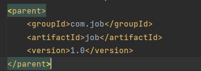

然后修改pom，保留以下内容：

```xml
<project xmlns="http://maven.apache.org/POM/4.0.0" xmlns:xsi="http://www.w3.org/2001/XMLSchema-instance"
         xsi:schemaLocation="http://maven.apache.org/POM/4.0.0 http://maven.apache.org/xsd/maven-4.0.0.xsd">
    <modelVersion>4.0.0</modelVersion>
    <parent>
        <groupId>com.job</groupId>
        <artifactId>job</artifactId>
        <version>1.0</version>
    </parent>

    <artifactId>common</artifactId>
    <packaging>jar</packaging>

    <name>common</name>

    <properties>
        <project.build.sourceEncoding>UTF-8</project.build.sourceEncoding>
        <!-- 指定java版本，同时其他标签可以通过${}引用 -->
        <java.version>11</java.version>
		<!-- 表示项目源码使用的jdk版本是11 -->
        <maven.compiler.source>${java.version}</maven.compiler.source>
        <!-- 表示项目打包后字节码使用的jdk版本是11 -->
        <maven.compiler.target>${java.version}</maven.compiler.target>
    </properties>
    
    <dependencies>
        <dependency>
            
        </dependency>
    </dependencies>
</project>
```

指定编译和打包的版本，同jdk版本。

然后删除测试目录：

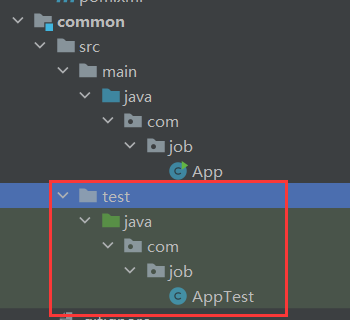

删除类`App`：


在main下创建resources资源目录：

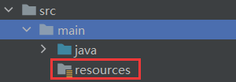


## 2.3 搭建后端模块admin

同样创建maven项目，同样使用`maven-archetype-quickstart`模板，然后坐标这些如法炮制，这里不演示。创建完后修改pom为：

```xml
<project xmlns="http://maven.apache.org/POM/4.0.0" xmlns:xsi="http://www.w3.org/2001/XMLSchema-instance"
         xsi:schemaLocation="http://maven.apache.org/POM/4.0.0 http://maven.apache.org/xsd/maven-4.0.0.xsd">
    <modelVersion>4.0.0</modelVersion>
    <parent>
        <groupId>com.job</groupId>
        <artifactId>job</artifactId>
        <version>1.0</version>
    </parent>

    <artifactId>admin</artifactId>
    <packaging>jar</packaging>

    <name>admin</name>

    <properties>
        <project.build.sourceEncoding>UTF-8</project.build.sourceEncoding>
        <java.version>11</java.version>
        <maven.compiler.source>${java.version}</maven.compiler.source>
        <maven.compiler.target>${java.version}</maven.compiler.target>
    </properties>

    <dependencies>
        <dependency>
            <groupId>com.job</groupId>
            <artifactId>common</artifactId>
            <version>1.0</version>
        </dependency>
    </dependencies>
</project>
```

引用common的依赖，在maven依赖中查看：

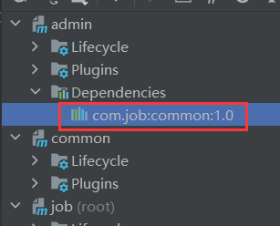

然后删除测试目录，`App`，创建资源目录。

## 2.4 搭建前端模块web

如法炮制，这里主要展示修改后的pom：

```xml
<project xmlns="http://maven.apache.org/POM/4.0.0" xmlns:xsi="http://www.w3.org/2001/XMLSchema-instance"
         xsi:schemaLocation="http://maven.apache.org/POM/4.0.0 http://maven.apache.org/xsd/maven-4.0.0.xsd">
    <modelVersion>4.0.0</modelVersion>
    <parent>
        <groupId>com.job</groupId>
        <artifactId>job</artifactId>
        <version>1.0</version>
    </parent>

    <artifactId>web</artifactId>
    <packaging>jar</packaging>

    <name>web</name>

    <properties>
        <project.build.sourceEncoding>UTF-8</project.build.sourceEncoding>
        <java.version>11</java.version>
        <maven.compiler.source>${java.version}</maven.compiler.source>
        <maven.compiler.target>${java.version}
    </properties>

    <dependencies>
        <dependency>
            <groupId>com.job</groupId>
            <artifactId>common</artifactId>
            <version>1.0</version>
        </dependency>
    </dependencies>
</project>
```

## 2.5 \<packaging>解释

当父模块的 `<packaging>` 为 `pom` 时，意味着该模块主要用于管理和聚合子模块的依赖关系和配置，它自身不会被打包成可执行的文件。父模块通常只包含子模块的依赖、构建配置等，并不直接生成可运行的代码或 Jar 包。

而子模块的 `<packaging>` 设置为 `jar` 表示它们会被编译并打包成 `.jar` 文件，最终可以作为独立的库或者应用程序运行。具体来说：

- **父模块**：通常设置 `<packaging>pom</packaging>`，它不打包代码，只是定义了项目的整体结构，子模块的管理以及 Maven 插件的配置等。
- **子模块**：可以设置 `<packaging>jar</packaging>`，表示这些子模块是可被编译成 `.jar` 文件的项目，包含实际的业务代码或功能逻辑。


# 3 改造为springboot项目

## 3.1 引入springboot项目依赖

经过以上步骤后，项目的结构已经搭建好了，但是现在的项目是maven项目，我们需要改造为springboot项目。

改造为springboot项目，就需要引入springboot的依赖，在根模块中引入依赖，这样整个项目都能作用：

依赖：

```xml
<groupId>org.springframework.boot</groupId>
<artifactId>spring-boot-starter-parent</artifactId>
<version>版本</version>
```

xml：

```xml
<project xmlns="http://maven.apache.org/POM/4.0.0" xmlns:xsi="http://www.w3.org/2001/XMLSchema-instance"
         xsi:schemaLocation="http://maven.apache.org/POM/4.0.0 http://maven.apache.org/xsd/maven-4.0.0.xsd">
    <modelVersion>4.0.0</modelVersion>
	<!-- 引入springbooot项目依赖，让maven项目变成springboot项目 -->
    <parent>
        <groupId>org.springframework.boot</groupId>
        <artifactId>spring-boot-starter-parent</artifactId>
        <version>2.7.6</version>
    </parent>

    <groupId>com.job</groupId>
    <artifactId>job</artifactId>
    <version>1.0</version>
    <packaging>pom</packaging>

    <name>job</name>

    <modules>
        <module>admin</module>
        <module>common</module>
        <module>web</module>
    </modules>


    <properties>
        <project.build.sourceEncoding>UTF-8</project.build.sourceEncoding>
    </properties>
</project>
```

## 3.2 引入springboot的web依赖测试

现在job已经引入springboot依赖，其他3个模块是他的子模块，自然能继承springboot的依赖。整个项目已经变成springboot项目，现在我们在common模块中引入springboot的web依赖进行测试：

依赖：

```xml
<groupId>org.springframework.boot</groupId>
<artifactId>spring-boot-starter-web</artifactId>
```

由于job中引入的springboot依赖中指定了版本，此处继承至job，因此没有指定版本。

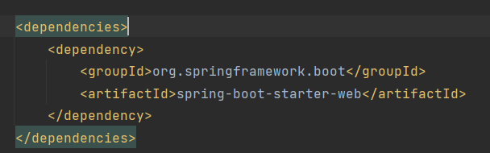

admin和web包通过依赖传递也引入了web依赖：

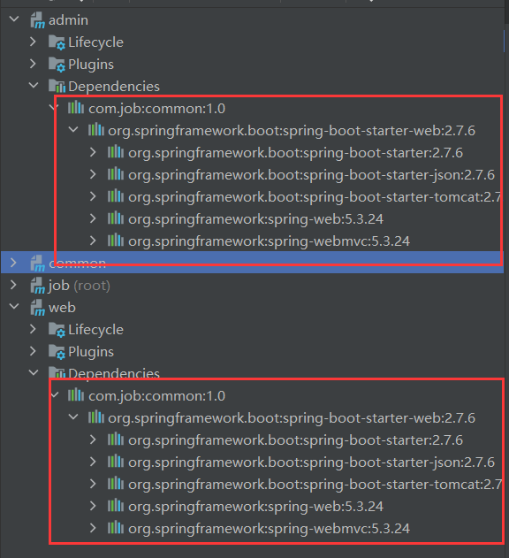

### 3.2.1 创建启动类

以web模块为例。

现在可以编写一个简单的控制器进行测试，首先创建启动类，步骤如下：

1. 启动类以Application为后缀。
2. 添加`@SpringbootAoolication`标识为springboot启动类。
3. 定义`main()`。
4. 在方法中调用`SpringApplication`的`run()`。
5. 将启动类字节码对象和`args`(`main()`的参数)作为参数传入`run()`中。

```java
@SpringBootApplication
public class WebApplication {
    public static void main(String[] args) {
        SpringApplication.run(WebApplication.class, args);
    }
}
```

### 3.2.2 配置文件

创建springboot的配置文件，我选择yml文件：


配置基础项：

- 端口
- 请求路径前缀

```yml
server:
  servlet:
    context-path: /api
  port: 8090
```

### 3.2.3 控制器输出测试

创建控制器然后向页面输出hello world进行测试：

```java
@RestController
@RequestMapping("/hw")
public class HWController {

    @GetMapping
    public String hw() {
        return "hello world";
    }
}
```

启动项目：

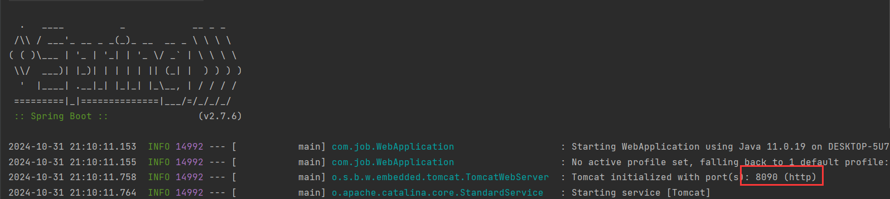

访问接口，以api作为前缀：


后端模块同样的操作：

启动类：

```java
@SpringBootApplication
public class AdminApplication {
    public static void main(String[] args) {
        SpringApplication.run(AdminApplication.class, args);
    }
}
```

配置项：

```yml
server:
  servlet:
    context-path: /admin
  port: 8091
```

控制器：

```java
@RestController
@RequestMapping("/test")
public class TestController {
    @GetMapping
    public String test() {
        return "admin server start!";
    }
}
```

将后端服务启动，访问接口，以admin为前缀：

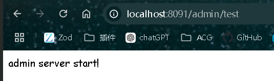


# 4 springboot配置项

常用的配置项见[springboot常用配置项.md](./springboot常用配置项.md)。

在admin和web模块中引入这些配置项：

```yml
server:
  servlet:
    context-path: /admin              # 请求前缀
    session:
      timeout: PT60M                  # session 过期时间，1小时
  port: 8090                          # 端口号

spring:
  mvc:
    # 未找到请求资源时不返回404，抛出 NoHandlerFoundException 异常
    throw-exception-if-no-handler-found: true
  web:
    resources:
      add-mappings: false             # 关闭静态资源自动映射

  datasource:
    url: jdbc:mysql://localhost:3306/database_name?serverTimezone=GMT%2B8&useUnicode=true&characterEncoding=utf8&autoReconnect=true&allowMultiQueries=true
    username: root
    password: 1234
    driver-class-name: com.mysql.cj.jdbc.Driver
    hikari:
      pool-name: HikariCPDatasource
      minimum-idle: 5
      idle-timeout: 180000
      maximum-pool-size: 10
      auto-commit: true
      max-lifetime: 1800000
      connection-timeout: 30000
      connection-test-query: SELECT 1

  mail:
    host: smtp.qq.com                           # SMTP 服务器地址
    port: 465                                   # 邮件服务器端口 (465 或 587)
    default-encoding: UTF-8                     # 默认编码
    properties:
      mail:
        smtp:
          socketFactory:
            class: javax.net.ssl.SSLSocketFactory   # 使用 SSL 连接
        debug: true                                 # 开启调试模式，查看邮件发送的详细日志
    username: test@qq.com
    password: 123                                   # 使用邮箱官网申请的授权码

# 管理员账户和密码
admin:
  account: admin
  password: 123456

# 日志配置
log:
  root:
    level: debug    # 日志级别

# 项目路径配置
project:
  folder: d:/project_folder/web   # 项目文件路径

# 开发环境标识
isDev: true
```


# 5 引入日志xml

在admin和web模块中创建logback-spring.xml文件，放到resource目录下：

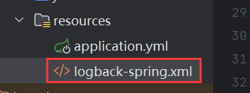

为什么需要日志？因为出现问题可以通过日志定位。

模板如下：

```xml
<?xml version="1.0" encoding="UTF-8"?>
<configuration scan="true" scanPeriod="10 minutes">
    <!-- 将日志输出到控制台，并自定义日志的格式 -->
    <appender name="STDOUT" class="ch.qos.logback.core.ConsoleAppender">
        <layout class="ch.qos.logback.classic.PatternLayout">
            <pattern>%d{yyyy-MM-dd HH:mm:ss,GMT+8} [%t] [%p][%c][%M][%L] -> %m%n</pattern>
        </layout>
    </appender>

    <!-- 从spring的配置文件中引入 project.folder 和 log.root.level 的值 -->
    <springProperty scope="context" name="log.path" source="project.folder"/>
    <springProperty scope="context" name="log.root.level" source="log.root.level"/>

    <!-- 定义日志文件夹名称和日志文件名，根据实际情况更改 -->
    <property name="LOG_FOLDER" value="logs"/>
    <property name="LOG_FILE_NAME" value="web.log"/>

    <!-- 将日志输出到文件，并实现日志文件的滚动管理 -->
    <appender name="file" class="ch.qos.logback.core.rolling.RollingFileAppender">
        <!-- 定义当前日志文件的路径 -->
        <file>${log.path}/${LOG_FOLDER}/${LOG_FILE_NAME}</file>
        <rollingPolicy class="ch.qos.logback.core.rolling.TimeBasedRollingPolicy">
            <!-- 设置日志文件的命名规则和滚动策略：按日期和索引序号 -->
            <FileNamePattern>${log.path}/${LOG_FOLDER}/${LOG_FILE_NAME}.%d{yyyyMMdd}.%i</FileNamePattern>
            <!-- 应用程序启动时清理历史记录 -->
            <cleanHistoryOnStart>true</cleanHistoryOnStart>
            <!-- 设置滚动触发策略，按文件大小和时间滚动 -->
            <timeBasedFileNamingAndTriggeringPolicy
                    class="ch.qos.logback.core.rolling.SizeAndTimeBasedFNATP">
                <!-- 单个日志文件的最大大小限制 -->
                <MaxFileSize>20MB</MaxFileSize>
            </timeBasedFileNamingAndTriggeringPolicy>
            <!-- 保留历史日志的最大天数 -->
            <MaxHistory>30</MaxHistory>
        </rollingPolicy>
        <!-- 设置日志编码和输出格式 -->
        <encoder>
            <pattern>%d{yyyy-MM-dd HH:mm:ss,GMT+8} [%t] [%p][%c][%M][%L] -> %m%n</pattern>
            <charset>UTF-8</charset>
        </encoder>
        <!-- 配置文件的追加模式：是否覆盖旧的日志 -->
        <append>false</append>
        <!-- 设置审慎模式，适用于多实例环境 -->
        <prudent>false</prudent>
    </appender>

    <root level="${log.root.level}">
        <appender-ref ref="STDOUT"/>
        <appender-ref ref="file"/>
    </root>
</configuration>
```

解析见[logback日志xml文件.md](./logback日志xml文件.md)


# 6 再次引入依赖

只有一个springboot的web依赖还不够，接下来引入项目常用的依赖。

在根模块的pom中加入`<dependencyManagement>`：

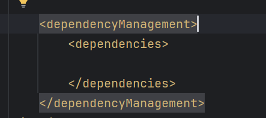

然后引入这些依赖：

```xml
<dependencyManagement>
    <dependencies>
        <!-- mybatis -->
        <dependency>
            <groupId>org.mybatis.spring.boot</groupId>
            <artifactId>mybatis-spring-boot-starter</artifactId>
            <version>${mybatis.version}</version>
        </dependency>
        <!-- 邮件发送 -->
        <dependency>
            <groupId>org.springframework.boot</groupId>
            <artifactId>spring-boot-starter-mail</artifactId>
            <version>${springboot.version}</version>
        </dependency>
        <!-- mysql -->
        <dependency>
            <groupId>com.mysql</groupId>
            <artifactId>mysql-connector-j</artifactId>
            <version>${mysql.version}</version>
        </dependency>
        <!-- 日志 -->
        <dependency>
            <groupId>ch.qos.logback</groupId>
            <artifactId>logback-classic</artifactId>
            <version>${logback.version}</version>
        </dependency>
        <dependency>
            <groupId>ch.qos.logback</groupId>
            <artifactId>logback-core</artifactId>
            <version>${logback.version}</version>
        </dependency>
        <!-- aop -->
        <dependency>
            <groupId>org.aspectj</groupId>
            <artifactId>aspectjweaver</artifactId>
            <version>${aspectjweaver.version}</version>
        </dependency>
        <!-- okhttp3 -->
        <dependency>
            <groupId>com.squareup.okhttp3</groupId>
            <artifactId>okhttp</artifactId>
            <version>${okhttp3.version}</version>
        </dependency>
        <!-- json相关 -->
        <dependency>
            <groupId>com.alibaba</groupId>
            <artifactId>fastjson</artifactId>
            <version>${fastjson.version}</version>
        </dependency>
        <!-- apache-common -->
        <dependency>
            <groupId>org.apache.commons</groupId>
            <artifactId>commons-lang3</artifactId>
            <version>${commons.lang3.version}</version>
        </dependency>
        <dependency>
            <groupId>commons-codec</groupId>
            <artifactId>commons-codec</artifactId>
            <version>${commons-codec.version}</version>
        </dependency>
        <dependency>
            <groupId>commons-io</groupId>
            <artifactId>commons-io</artifactId>
            <version>${commons.io.version}</version>
        </dependency>
    </dependencies>
</dependencyManagement>
```

这些依赖的版本引用维护在`<properties>`中维护：

```xml
<properties>
    <mybatis.version>2.2.2</mybatis.version>
    <springboot.version>2.7.6</springboot.version>
    <mysql.version>8.0.31</mysql.version>
    <logback.version>1.2.11</logback.version>
    <aspectjweaver.version>1.9.4</aspectjweaver.version>
    <okhttp3.version>3.2.0</okhttp3.version>
    <fastjson.version>1.2.66</fastjson.version>
    <commons.lang3.version>3.4</commons.lang3.version>
    <commons.codec.version>1.9</commons.codec.version>
    <commons.io.version>2.5</commons.io.version>
</properties>
```

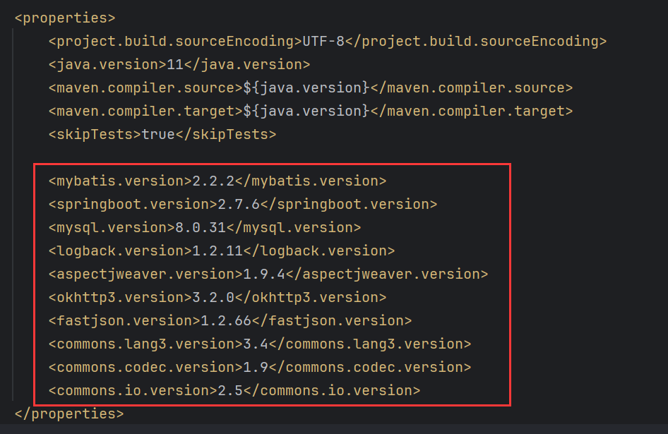

`<dependencyManagement>`的主要作用是管理依赖的版本，它不会真正引入依赖：

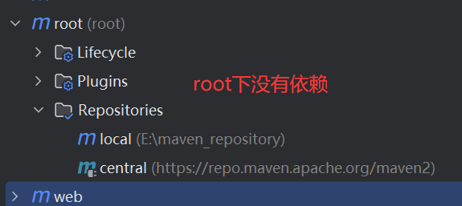

在根模块中声明`<dependencyManagement>`，以集中管理依赖版本，这对于多模块项目特别有用。通过这种方式，你可以在父模块中定义依赖及其版本，然后在子模块中引用这些依赖，而不需要在每个子模块中重复指定版本号。

真正引入依赖的是common模块：

```xml
<dependencies>
    <dependency>
        <groupId>org.springframework.boot</groupId>
        <artifactId>spring-boot-starter-web</artifactId>
    </dependency>
    <!-- mybatis -->
    <dependency>
        <groupId>org.mybatis.spring.boot</groupId>
        <artifactId>mybatis-spring-boot-starter</artifactId>
    </dependency>
    <!-- 邮件发送 -->
    <dependency>
        <groupId>org.springframework.boot</groupId>
        <artifactId>spring-boot-starter-mail</artifactId>
    </dependency>
    <!-- mysql -->
    <dependency>
        <groupId>com.mysql</groupId>
        <artifactId>mysql-connector-j</artifactId>
    </dependency>
    <!-- 日志 -->
    <dependency>
        <groupId>ch.qos.logback</groupId>
        <artifactId>logback-classic</artifactId>
    </dependency>
    <dependency>
        <groupId>ch.qos.logback</groupId>
        <artifactId>logback-core</artifactId>
    </dependency>
    <!-- aop -->
    <dependency>
        <groupId>org.aspectj</groupId>
        <artifactId>aspectjweaver</artifactId>
    </dependency>
    <!-- okhttp3 -->
    <dependency>
        <groupId>com.squareup.okhttp3</groupId>
        <artifactId>okhttp</artifactId>
    </dependency>
    <!-- json相关 -->
    <dependency>
        <groupId>com.alibaba</groupId>
        <artifactId>fastjson</artifactId>
    </dependency>
    <!-- apache-common -->
    <dependency>
        <groupId>org.apache.commons</groupId>
        <artifactId>commons-lang3</artifactId>
    </dependency>
    <dependency>
        <groupId>commons-codec</groupId>
        <artifactId>commons-codec</artifactId>
    </dependency>
    <dependency>
        <groupId>commons-io</groupId>
        <artifactId>commons-io</artifactId>
    </dependency>
</dependencies>
```

很明显，common在引入依赖时，并没有指定版本。


# 7 跳过测试阶段

另外，在根模块中，还添加了`<skipTests>true</skipTests>`，这个的目的是为了跳过maven生命周期中的测试阶段，让编译阶段之后直接进入打包阶段，加快项目构建时间。

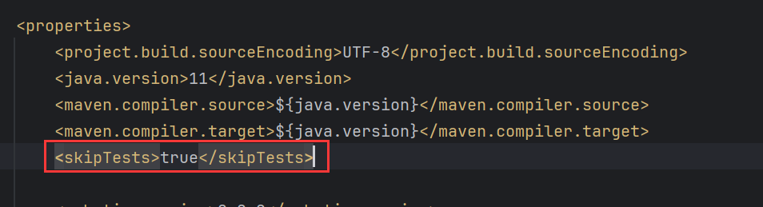


# 8 排除logback依赖

这步排除的是springboot自带的依赖，因为springboot天生集成了logback，但是某个版本存在漏洞，因此用我们自己的logback依赖。

在common模块中，common引入了springboot的web依赖，在这个依赖中排除logbcak：

```xml
<dependency>
        <groupId>org.springframework.boot</groupId>
        <artifactId>spring-boot-starter-web</artifactId>
        <!-- 排除spring的logback -->
    	<exclusions>
            <exclusion>
                <groupId>ch.qos.logback</groupId>
                <artifactId>logback-classic</artifactId>
            </exclusion>
            <exclusion>
                <groupId>ch.qos.logback</groupId>
                <artifactId>logback-core</artifactId>
            </exclusion>
        </exclusions>
    </dependency>
```


# 9 添加打包插件

如果不添加打包插件，那么在打包的时候就会抛出异常。只需要给admin和web模块添加打包插件即可，因为admin和web依赖于common，最终打包的时候会把common模块给打包进去，所以最后也只需要打包admin和web模块。

插件的xml如下：

```xml
<build>
    <plugins>
        <plugin>
            <!-- 使用 spring-boot-maven-plugin 作为打包插件 -->
            <groupId>org.springframework.boot</groupId>
            <artifactId>spring-boot-maven-plugin</artifactId>
            <!-- 根模块引用父模块springboot时指定了版本，可以省略 -->
            <version>2.7.6</version>
            <executions>
                <execution>
                    <goals>
                        <goal>repackage</goal>
                    </goals>
                </execution>
            </executions>
            <configuration>
                <mainClass>启动类全类名</mainClass>
            </configuration>
        </plugin>
    </plugins>
</build>
```
