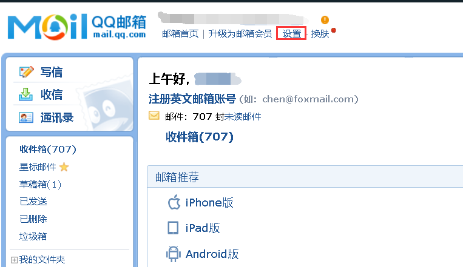
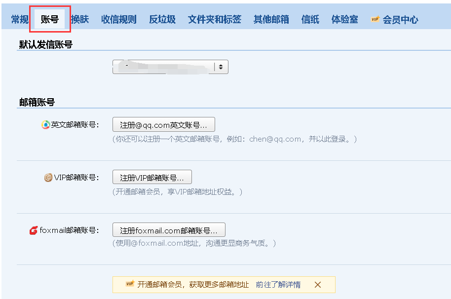
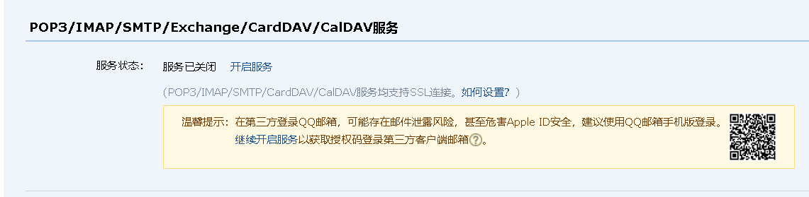
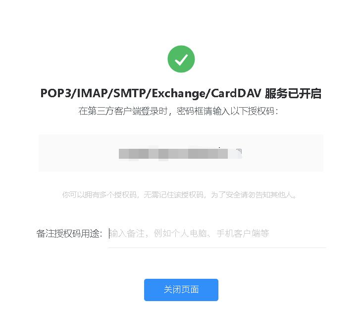
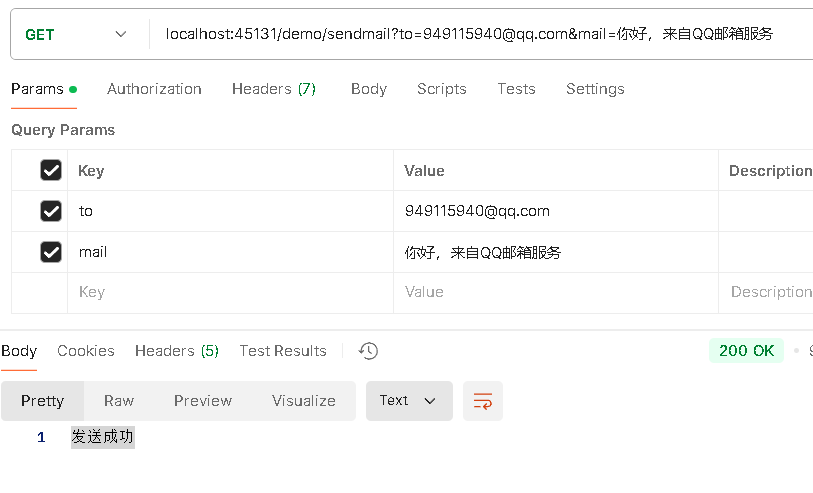
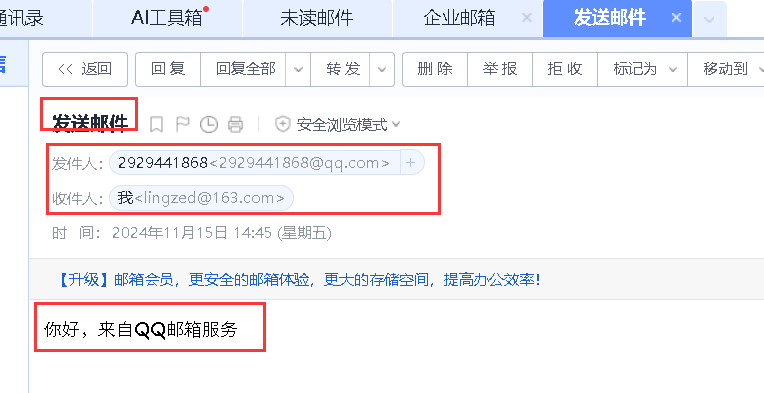
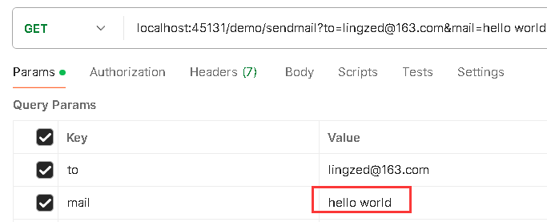
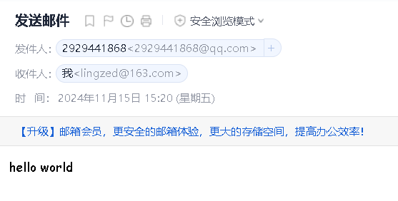

# 1 依赖

springboot自生集成了发送邮件的功能，它的起步依赖如下：

```xml
<dependency>
    <groupId>org.springframework.boot</groupId>
    <artifactId>spring-boot-starter-mail</artifactId>
</dependency>
```


# 2 配置项

使用邮件功能需要的配置如下：

```yml
spring:
  mail:
    host: smtp.qq.com                   			# SMTP 服务器地址
    port: 465                           			# 邮件服务器端口(465或587)
    default-encoding: UTF-8              			# 默认编码
    properties:
      mail:
        smtp:
          socketFactory:
            class: javax.net.ssl.SSLSocketFactory  	# 使用 SSL 连接
        debug: true                       			# 开启调试模式，可以查看邮件发送的详细日志
    username: test@qq.com
    password: 123									# 非密码，而是邮箱官网申请的授权码
```

下面是配置项的解释：

- `host`：SMTP 服务器地址，即邮件服务器的主机名或 IP 地址，此处使用的是qq邮箱服务器的地址。
- `port`：邮件服务器的端口号，通常使用端口 `587`（用于 TLS 加密）或端口 `465`（用于 SSL 加密）。
- `default-encoding`：默认编码。
- `mail.smtp.socketFactory.class`：指定自定义的套接字工厂类，通常与 **SSL/TLS** 加密邮件传输有关，此处指定为`SSLSocketFactory`，即设置邮件发送时使用 SSL 加密连接。
- `mail.debug`：开启调试模式，可以查看邮件发送的详细日志。
- `username`：用于身份验证的邮件账户用户名（通常是电子邮件地址）。此`username`仅用于身份验证，不作为邮件中的发送人，当然如果非要使用此`username`作为发送人，可以通过`@Value`注入。
- `password`：用于身份验证的密码，并非邮箱的密码，而是在邮箱官网申请的授权码。

为了保证邮件功能的正常运行，以下配置项是必须的：

```yml
spring:
  mail:
    host: smtp.qq.com                   			
    port: 465                           			
    username: test@qq.com
    password: 123									
```

一些可选的配置项：

```yml
spring:
  mail:         			
    properties:
      mail:
        smtp:
        	auth: true
```

- `auth`：是否启用身份验证，通常设为 `true`，确保邮件服务器验证发件人身份。


# 3 申请QQ邮箱授权码

我选择QQ邮箱作为邮箱服务器，因此需要到QQ邮箱官网申请授权码，步骤如下：

1、进入官网设置：



2、选择账号选项：



3、找到POP3/IMAP服务：



4、开启此服务，并获取授权码：




# 4 快速开始

## 4.1 邮件信息类

邮件信息类用来设置邮件主题、标题、邮件内容等信息，springboot提供的邮件信息类有两种：

- `SimpleMailMessage`
- `MimeMessage`

两者区别如下：

| 特性     | `SimpleMailMessage`            | `MimeMessage`                                |
| -------- | ------------------------------ | -------------------------------------------- |
| 邮件类型 | 纯文本邮件                     | 支持 HTML、附件、富文本、图像等多种类型      |
| 邮件内容 | 只能发送纯文本内容             | 可以发送 HTML 格式邮件、附件、内嵌图像等     |
| 附件支持 | 不支持附件                     | 支持附件（通过 `MimeMessageHelper` 添加）    |
| 复杂性   | 简单，易用                     | 灵活、强大，但使用起来稍复杂                 |
| 使用场景 | 用于简单的通知邮件、信息邮件等 | 用于发送包含 HTML 内容、附件、图片等复杂邮件 |

## 4.2 邮件服务类

邮件服务类`JavaMailSender`，发送邮件的动作由这个类来完成。

发送方法：`send()`

```java
// 发送SimpleMailMessage
public void send(SimpleMailMessage msg) {};
// 发送MimeMessage
public void send(MimeMessage msg) {};
```

## 4.3 演示

首先引入邮箱的依赖，然后配置邮箱的配置项。下面分别演示用`SimpleMailMessage`和`MimeMessage`发送邮件。

### 4.3.1 发送SimpleMailMessage

步骤如下：

1. 发送动作由`JavaMailSender`完成，因此先注入`JavaMailSender`。
2. 创建`SimpleMailMessage`。
3. 配置邮件信息，如发送人、收件人、标题、邮件内容等。
4. 调用`send()`发送邮件。

服务层：

```java
@Service
public class EmailService {
    @Resource
    private JavaMailSender javaMailSender;

    @Value("${spring.mail.username}")
    private String mailFrom;

    public void sendMail(String to, String mail) {
        try {
            SimpleMailMessage massage = new SimpleMailMessage();
            massage.setFrom(mailFrom);              // 设置发送人
            massage.setTo(to);                      // 设置收件人
            massage.setSubject("发送邮件");          // 设置主题或者标题
            massage.setSendDate(new Date());
            massage.setText(mail);                  // 设置邮件内容

            javaMailSender.send(massage);
        } catch (Exception e) {
            System.out.println("邮件发送失败");
            System.out.println(e);
            throw new RuntimeException(e)
        }
    }
}
```

控制器：

```java
@RestController
@RequestMapping("/sendmail")
public class MailController {
    @Resource
    private EmailService emailService;

    @GetMapping
    public String sendMail(String to, String mail) {
        emailService.sendMail(to, mail);
        return "发送成功";
    }
}
```

调用API发送，接收方是网易邮箱：



效果：



### 4.3.2 发送MimeMessage

步骤如下：

1. 注入`JavaMailSender`
2. 调用`JavaMailSender`的`createMimeMessage()`拿到`MimeMessage`。
3. 创建`MimeMessageHelper`，将`MimeMessage`传入，由`MimeMessageHelper`帮助`MimeMessage`完成邮件设置。
4. 通过`MimeMessageHelper`设置邮件信息，如发送人、收件人、标题、邮件内容等。
5. 调用`send()`发送邮件。

业务层：

```java
@Service
public class EmailService {
    @Resource
    private JavaMailSender javaMailSender;

    @Value("${spring.mail.username}")
    private String mailFrom;

    public void sendMail(String to, String mail) {
        try {
            MimeMessage message = javaMailSender.createMimeMessage();
            // 第二个参数表示是否发送带有附件、嵌入图像等复杂内容的邮件
            MimeMessageHelper mimeMessageHelper = new MimeMessageHelper(message, true);
            mimeMessageHelper.setFrom(mailFrom);
            mimeMessageHelper.setTo(to);
            mimeMessageHelper.setSubject("发送邮件");
            mimeMessageHelper.setSendDate(new Date());
            mimeMessageHelper.setText(mail);

            javaMailSender.send(message);
        } catch (Exception e) {
			System.out.println("邮件发送失败");
            System.out.println(e);
            throw new RuntimeException(e)
        }
    }
}
```

控制器：

```java
@RestController
@RequestMapping("/sendmail")
public class MailController {
    @Resource
    private EmailService emailService;

    @GetMapping
    public String sendMail(String to, String mail) {
        emailService.sendMail(to, mail);
        return "发送成功";
    }
}
```

效果：





带附件，使用`MimeMessageHelper`的`addAttachment()`方法：

```java
public void addAttachment(String name, File file) {};
```

第一个参数是附件名，第二个参数是附件。