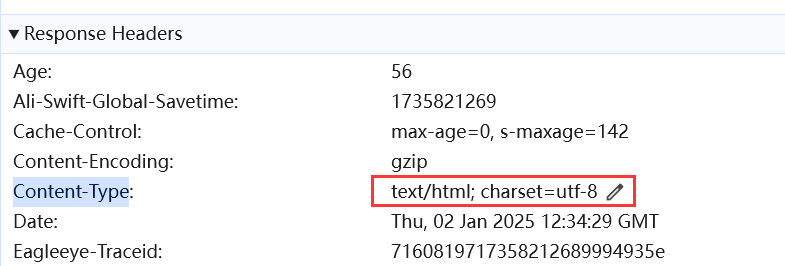

# 1 响应中的Content-Type

## 1.1 浏览器怎么知道服务器响应的资源类型 

浏览器是如何知道服务器返回的资源类型的？比如下面是两个URL：

https://www.taobao.com/和https://img.alicdn.com/bao/upload/O1CN01xUFKGv1RkkYXKCAMM_!!6000000002150-0-yinhe.jpg

第一个是淘宝网址：


第二个是一张图片：


为什么请求第一个URL，浏览器就知道返回一个页面，而请求第二个URL，浏览器就知道返回一张图片？是因为URL的后缀名吗，因为第二张URL的后缀.jpg？

并非如此，实际上浏览器之所以知道服务器返回的资源类型，是因为服务器告诉浏览器的，通过响应头`Content-Type`来告知浏览器。第一个URL请求返回的响应头中`Content-Type`是`text/html`：



表示一个HTML格式的文档，浏览器接收到这个信息后，它就知道需要将服务器返回的资源是一个HTML文档，它就会解析HTML，并渲染出页面，呈现出来的效果就是一个页面。

而第二个URL请求返回的响应头中的`Content-Type`是`image/jpeg`：


`image/jpeg`是MIME图片类型中的一种，MIME是Web服务器中配置的用于识别和传输图片的类型，我们大致的理解为`image/jpeg`图片的一种类型就行了，表示为JPEG格式的图片。

其他的格式还有：

- `image/png`
- `image/gif`
- `image/webp`

总之，我们只需知道，这些格式是用来表示图片的。浏览器接收到这个信息，那么它就知道服务器返回的资源是一个图片，那么它就会按照图片的解析规则去解析这些资源，呈现的效果就是一张图片。

> 浏览器解析服务器的响应内容，不是由URL决定的，而是由`Content-Type`决定的，`Content-Type`指定为什么类型，浏览器就会解析为什么类型。

响应头的传输速度非常快，在响应体还没到达浏览器时，浏览器就已经接收到响应头了，浏览器通过`Content-Type`中类型，就能提前知道需要将响应体按什么类型来解析，那么等到响应体到达浏览器后，浏览器就能着手进行解析了。

## 1.2 与URL没有关系

浏览器解析内容完全由`Content-Type`决定，与URL没有关系，为了方便理解，这里有一个案例：

```java
@GetMapping("/test.txt")
public void test2(HttpServletResponse response) throws IOException {
    response.setContentType("text/plain;charset=utf-8");
    try (ServletOutputStream outputStream = response.getOutputStream()) {
        String res = "<h1>这是标题</h1>\n" +
                "<p>这是段落</p>\n" +
                "<div>这是div</div>";
        outputStream.write(res.getBytes());
    }
}
```

这个接口，返回的是一个HTML文本，但是我设置了`Content-Type`为`text/plain`，这表示一个纯文本格式的内容。那么浏览器就会按照文本格式进行解析，所以页面展示的就是文本，标签也被解析为了文本：


将`Content-Type`设置为`text/html`，那么浏览器就会按照HTML文档格式进行解析，这样才会解析为一个HTML页面：


再反观我们的接口地址，咋一看好像是一个文件，如果按照`text/plain`类型进行解析，返回的文本很容易理解为text.txt文件中的内容，但实际上，服务器中根本没有text.txt这个文件：


所以，URL跟响应的资源类型毫无联系，解析为什么样的内容是由`Content-Type`决定的。而`Content-Type`是由服务器响应给浏览器的。因此完全由后端来控制。甚至于，我还可以把`Content-Type`设置为图片格式，让浏览器将这段文本按照图片类型进行解析：


当然文本肯定不能解析为一个图片，所以浏览器返回了一个错误格式的图片，但就算内容不是图片类型，浏览器依然返回了一个图片格式。

## 1.3 springboot中返回字符串

如果接口返回的是字符串，那么springboot默认会将`Content-Type`设置为`text/html`格式，且用`setHeader()`或`setContentType()`均无法更改：


无法更改，都是`text/html`：


所以，在响应的时候，我们又多了一种方式，就是不返回值，直接写入内容给浏览器并设置`Content-Type`指定浏览器的解析格式为我们想要的内容格式。


# 2 请求中的Content-Type

说完响应，我们再来说说请求，其实请求头中也是有`Content-Type`字段的。它用于告诉服务器，该用什么格式来解析浏览器发送的数据。就跟浏览器该用什么格式解析响应的数据一样。只不过这里解析数据的角色变为了服务器。总的来看，`Content-Type`就是告诉两端该如何解析接收的数据。

请求的数据放在请求体中，服务器接收请求体中的数据，如何解析就是靠`Content-Type`字段，但是`GET`请求是一个例外，因为`GET`请求没用请求体，它的请求数据是URL参数，所以**`GET`请求通常不需要指定`Content-Type`字段**。

请求头中常见的`Content-Type`：

1. `application/json`：表示请求体中的数据是 JSON 格式。
2. `application/x-www-form-urlencoded`：表示请求体中的数据是以键值对形式编码的，常用于表单提交。
3. `multipart/form-data`：表示请求体中包含文件上传的内容，常用于上传文件的表单提交。
4. `text/plain`：表示请求体中数据是纯文本。

下面是一个`POST`请求示例：

```http
POST /api/data HTTP/1.1
Host: example.com
Content-Type: application/json
Content-Length: 48

{"username": "admin", "password": "123456"}
```

表示请求数据是JSON格式，那么服务器就会按照JSON格式来解析这段数据：{"username": "admin", "password": "123456"}。

如果`Content-Type`指定的解析格式与请求参数不一致，那么后端一般会抛出错误。和响应一样，请求头的速度比请求体快，因此先到达后端，而后端拿到`Content-Type`就会用指定的格式对接下来的请求体进行解析，但是等请求体的内容到达后发现内容与指定的格式不合适，解析就会失败，因此抛出错误。