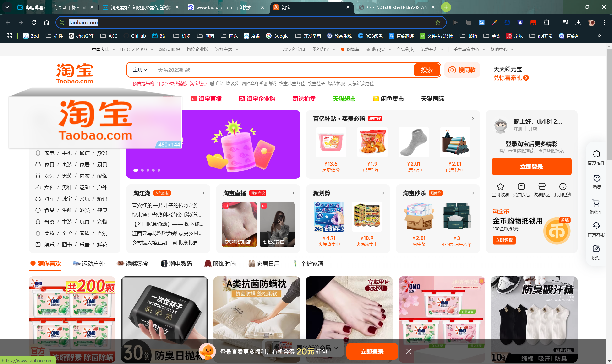
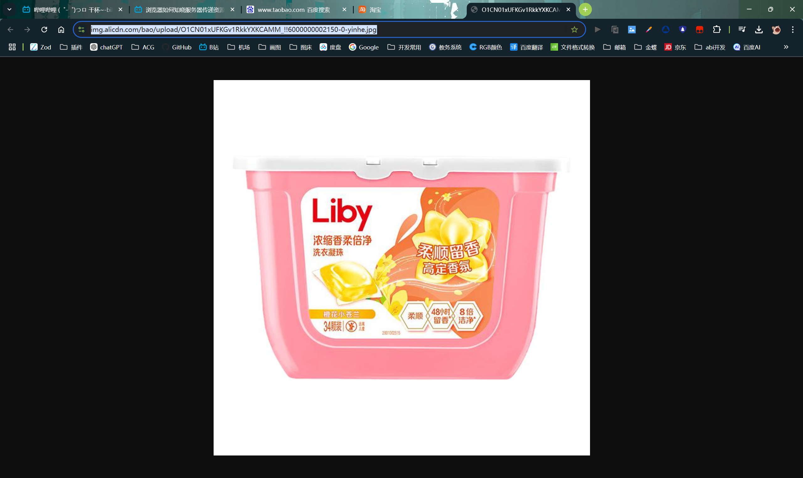
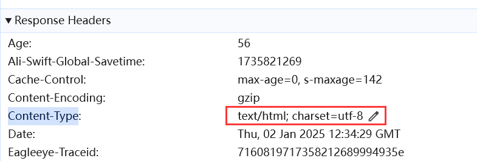
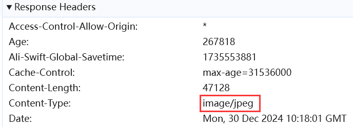
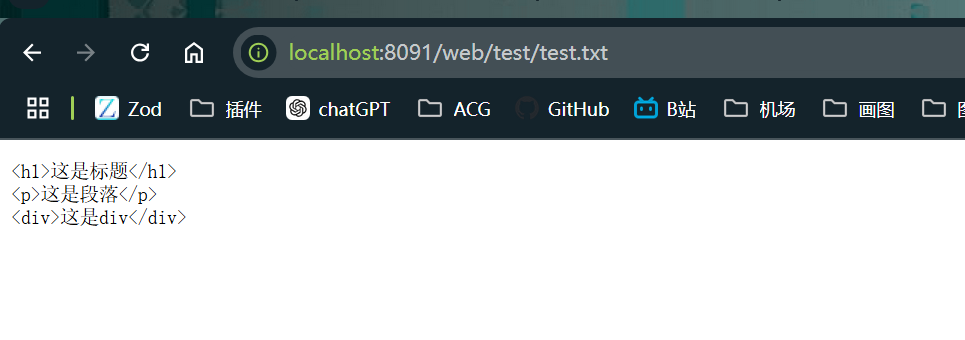
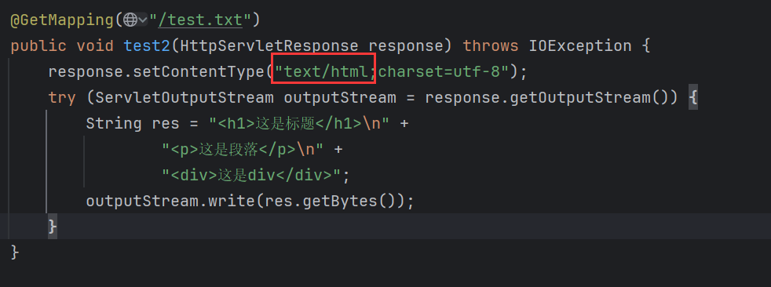
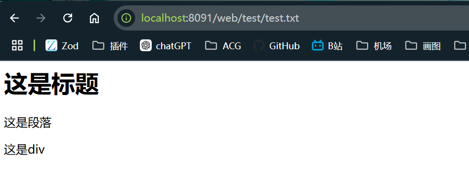
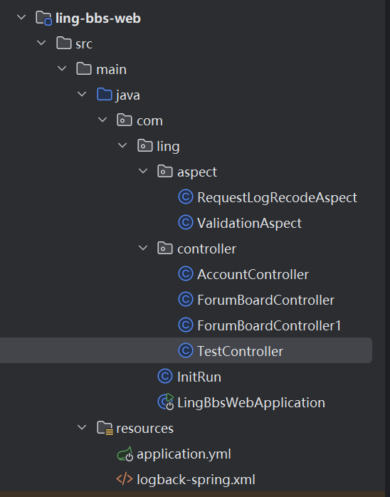
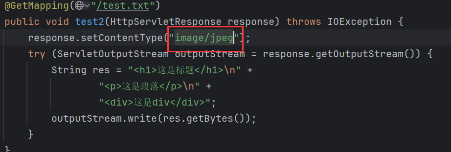
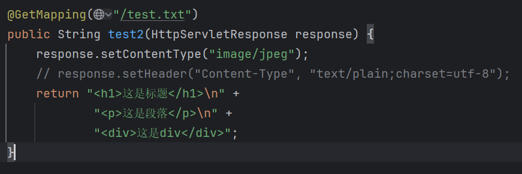

# 1 Content-Type

浏览器是如何知道服务器返回的资源类型的？比如下面是两个URL：

https://www.taobao.com/和https://img.alicdn.com/bao/upload/O1CN01xUFKGv1RkkYXKCAMM_!!6000000002150-0-yinhe.jpg

第一个是淘宝网址：



第二个是一张图片：



为什么请求第一个URL，浏览器就知道返回一个页面，而请求第二个URL，浏览器就知道返回一张图片？是因为URL的后缀名吗，因为第二张URL的后缀.jpg？

并非如此，实际上浏览器之所以知道服务器返回的资源类型，是因为服务器告诉浏览器的，通过响应头`Content-Type`来告知浏览器。第一个URL请求返回的响应头中`Content-Type`是`text/html`：



表示一个HTML格式的文档，浏览器接收到这个信息后，它就知道需要将服务器返回的资源是一个HTML文档，它就会解析HTML，并渲染出页面，呈现出来的效果就是一个页面。

而第二个URL请求返回的响应头中的`Content-Type`是`image/jpeg`：



`image/jpeg`是MIME图片类型中的一种，MIME是Web服务器中配置的用于识别和传输图片的类型，我们大致的理解为`image/jpeg`图片的一种类型就行了，表示为JPEG格式的图片。

其他的格式还有：

- `image/png`
- `image/gif`
- `image/webp`

总之，我们只需知道，这些格式是用来表示图片的。浏览器接收到这个信息，那么它就知道服务器返回的资源是一个图片，那么它就会按照图片的解析规则去解析这些资源，呈现的效果就是一张图片。

> 浏览器解析服务器的响应内容，不是由URL决定的，而是由`Content-Type`决定的，`Content-Type`指定为什么类型，浏览器就会解析为什么类型。

响应头的传输速度非常快，在响应体还没到达浏览器时，浏览器就已经接收到响应头了，浏览器通过`Content-Type`中类型，就能提前知道需要将响应体按什么类型来解析，那么等到响应体到达浏览器后，浏览器就能着手进行解析了。

## 1.1 与URL没有关系

浏览器解析内容完全由`Content-Type`决定，与URL没有关系，为了方便理解，这里有一个案例：

```java
@GetMapping("/test.txt")
public void test2(HttpServletResponse response) throws IOException {
    response.setContentType("text/plain;charset=utf-8");
    try (ServletOutputStream outputStream = response.getOutputStream()) {
        String res = "<h1>这是标题</h1>\n" +
                "<p>这是段落</p>\n" +
                "<div>这是div</div>";
        outputStream.write(res.getBytes());
    }
}
```

这个接口，返回的是一个HTML文本，但是我设置了`Content-Type`为`text/plain`，这表示一个纯文本格式的内容。那么浏览器就会按照文本格式进行解析，所以页面展示的就是文本，标签也被解析为了文本：



将`Content-Type`设置为`text/html`，那么浏览器就会按照HTML文档格式进行解析，这样才会解析为一个HTML页面：





再反观我们的接口地址，咋一看好像是一个文件，如果按照`text/plain`类型进行解析，返回的文本很容易理解为text.txt文件中的内容，但实际上，服务器中根本没有text.txt这个文件：



所以，URL跟响应的资源类型毫无联系，解析为什么样的内容是由`Content-Type`决定的。而`Content-Type`是由服务器响应给浏览器的。因此完全由后端来控制。甚至于，我还可以把`Content-Type`设置为图片格式，让浏览器将这段文本按照图片类型进行解析：




当然文本肯定不能解析为一个图片，所以浏览器返回了一个错误格式的图片，但就算内容不是图片类型，浏览器依然返回了一个图片格式。

## 1.2 springboot中返回字符串

如果接口返回的是字符串，那么springboot默认会将`Content-Type`设置为`text/html`格式，且用`setHeader()`或`setContentType()`均无法更改：




无法更改，都是`text/html`：


所以，在响应的时候，我们又多了一种方式，就是不返回值，直接写入内容给浏览器并设置`Content-Type`指定浏览器的解析格式为我们想要的内容格式。