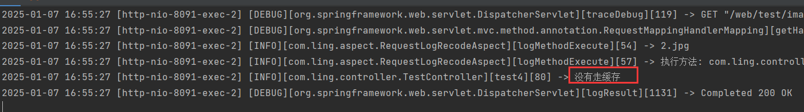
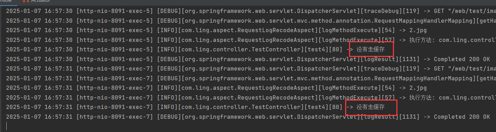

# 1 Cache-Control

`Cache-Control`控制浏览器缓存，请求和响应中都有这个头字段。`Cache-Control`表示强缓存，与之对应的还有协商缓存。

请求头和响应头都设置了`Cache-Control`，谁生效，具体情况如下：

| **设置场景**               | **客户端设置的值**         | **服务器设置的值** | **缓存控制规则**                                             |
| -------------------------- | -------------------------- | ------------------ | ------------------------------------------------------------ |
| **客户端和服务器都不设置** | 无                         | 无                 | 不缓存，每次都会向服务器发起请求。                           |
| **仅客户端设置**           | `max-age=0`                | 无                 | 走协商缓存（`If-Modified-Since` 或 `If-None-Match`）。如果服务器返回 304，则使用缓存，否则下载新内容。 |
|                            | `no-cache`                 | 无                 | 类似 `max-age=0`，需要服务器确认资源有效性，走协商缓存流程。 |
|                            | `no-store`                 | 无                 | 禁用缓存，每次都直接从服务器获取资源。                       |
|                            | 其他值（如 `max-age=600`） | 无                 | 客户端控制缓存时间，缓存 `600` 秒内直接使用缓存，超过时间发起新请求。 |
| **仅服务器设置**           | 无                         | 如 `max-age=3600`  | 浏览器按照服务器响应头中的 `Cache-Control` 进行缓存。        |
|                            | 无                         | `no-cache`         | 浏览器需协商缓存（向服务器确认资源有效性）。                 |
|                            | 无                         | `no-store`         | 禁用缓存，每次都从服务器获取资源。                           |
| **客户端和服务器同时设置** | `max-age=0`                | 任意值             | 客户端设置优先，走协商缓存流程。                             |
|                            | `no-cache`                 | 任意值             | 客户端设置优先，走协商缓存流程。                             |
|                            | `no-store`                 | 任意值             | 客户端设置优先，不缓存，直接从服务器获取资源。               |
|                            | 其他值（如 `max-age=600`） | `max-age=3600`     | 以服务器设置为准，缓存 `3600` 秒内直接使用缓存，超过时间发起新请求。 |

---

## 1.1 刷新行为

| **刷新方式**        | **请求头中的设置**         | **行为**                                           |
| ------------------- | -------------------------- | -------------------------------------------------- |
| 普通刷新（F5）      | `Cache-Control: max-age=0` | 强制走协商缓存流程，服务器确认资源有效性。         |
| 强制刷新（Ctrl+F5） | `Cache-Control: no-store`  | 禁用缓存，直接从服务器获取资源，忽略所有缓存规则。 |

刷新行为是一个比较坑的地方，因为如果是普通刷新，那么相当于在请求头中设置`Cache-Control: max-age=0`，此时走协商缓存，需要服务器确认的资源有效性，如果缓存资源有效，那么服务器会响应304，浏览器接收到304就会走缓存。但是如果服务器没有做校验有效性的步骤，而是直接返回那么浏览器就拿到了新的值，没有走缓存。

如果是强制刷新，相当于在请求头中设置`Cache-Control: no-store`，直接禁用了缓存，也会拉取新的值。

**手动点击浏览器的刷新按钮，也会强制走协商缓存。**

所以，如果响应设置了缓存时间，在浏览器中刷新会导致浏览器不走缓存，下面是一个例子：

```java
@GetMapping("/image/{fileName}")
@RequestLogRecode
public void test4(@ExcludeParamLog HttpServletRequest request,
                  @ExcludeParamLog HttpServletResponse response,
                  @PathVariable String fileName) throws IOException {
    log.info("没有走缓存");
    String projectFolder = webConfig.getProjectFolder();
    Path path = Paths.get(projectFolder + File.separator + "image").resolve(fileName).normalize();
    org.springframework.core.io.Resource resource = new UrlResource(path.toUri());
    if (!resource.exists() || !resource.isReadable()) {
        response.setStatus(HttpServletResponse.SC_NOT_FOUND); // 返回404状态码
        response.getWriter().write("Image not found or not readable."); // 返回错误信息
        return;
    }
    response.setContentType("image/jpeg");
    response.setHeader("Cache-Control", "public, max-age=10");
    try (InputStream is = resource.getInputStream();
         OutputStream os = response.getOutputStream()) {
        byte[] bytes = new byte[1024];
        int len;
        while ((len = is.read(bytes)) != -1) {
            os.write(bytes, 0, len);
        }
    }
}
```

这个是通过图片名访问图片的接口，响应头中设置缓存为10s：

```java
response.setHeader("Cache-Control", "public, max-age=10");
```

第一次请求，打印出信息，浏览器没有走缓存：



再次请求，此处通过刷新：


打印了两次，说明浏览器没有走请求：



正是因为刷新导致缓存规则变成协商缓存，而我们的接口中又没有响应304，而是直接写出图片。

想要看到缓存效果，需要打开新标签页，不用触发刷新：

.gif)

---

## 1.2 总结

1. 客户端设置的 `max-age=0`、`no-cache`、`no-store` 优先于服务器设置，用于明确表示不使用强缓存。
2. 其他情况下，浏览器以服务器的 `Cache-Control` 设置为准。
3. 刷新和强制刷新操作会改变缓存控制规则，导致不同的行为。

---


# 2 协商缓存