# 快速入门

> 这里有一个需求，使用springboot开发一个web应用，浏览器发起请求/hello，网页返回hello world字符串。
>
> request：http://localhost:8080/hello
>
> response："hello wold"
>
> 了解这个需求后，主要分为三个步骤完成：
>
> 1. 创建springboot工程，并勾选相关开发依赖
> 2. 定义HelloController类，并添加hello方法，并添加注释
> 3. 运行测试

## 创建springboot工程

> 首先是创建springboot工程，【New】>>【Module】>>【Spring Initializr】

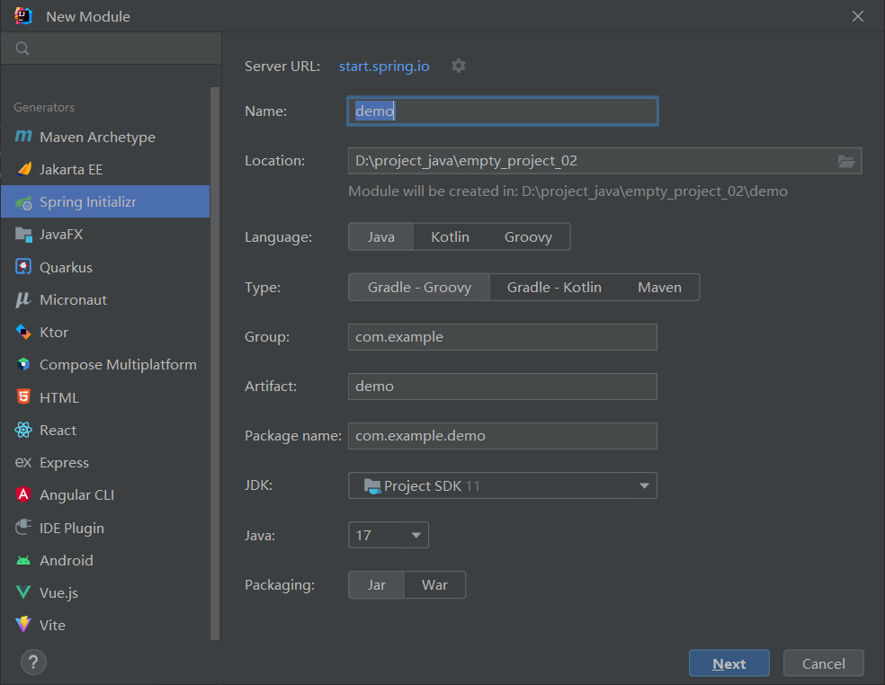

> 先输入组名和模块名：

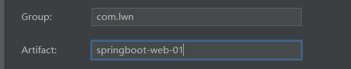

> 然后语言选中java，类型选择maven：

> java版本选择同JDK版本：

> 可以看见java版本没有11，这是因为当前idea版本不支持JDK8、JDK11只支持17和21，但是阿里云目前支持老版本的idea，老版本支持JDK11，将Server URL改成https://start.aliyun.com即可：

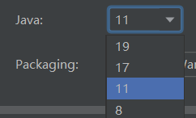

> 然后是项目路径，根据情况自行修改，包名是idea自己创建的，更改随意：

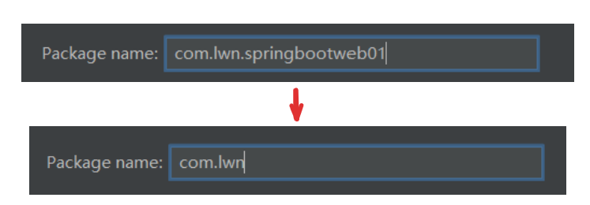

> 下一步，选择springboot的版本，一般选择2.7的稳定版，然后选择依赖，由于是web开发因此要选择spring web依赖：

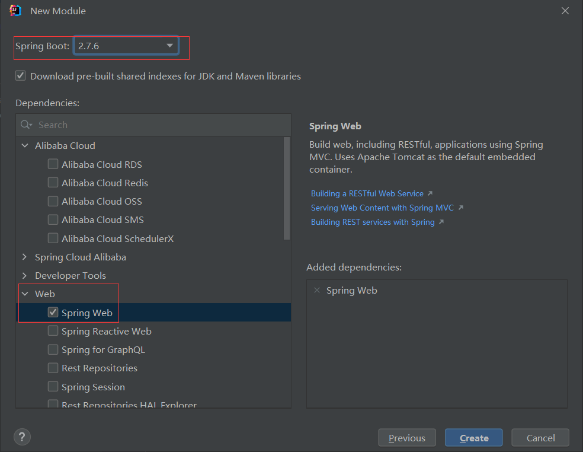

> 创建好后，这两个文件是暂时不需要的，可以删除：

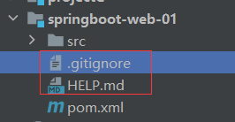

> 然后看pom的信息，项目的坐标和一些项目描述信息：

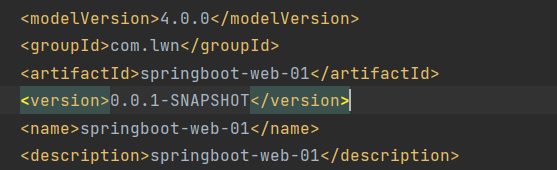

> java版本、springboot版本、字符集的信息：

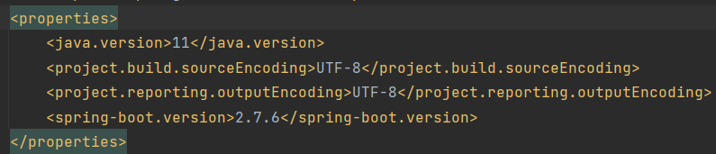

> 依赖信息，spring-boot-starter-web是springwbe开发的依赖，下面的是单元测试的依赖：

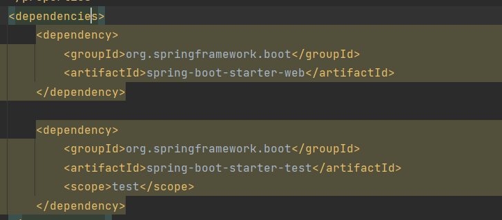

> 以及一些maven和spring框架的插件信息：

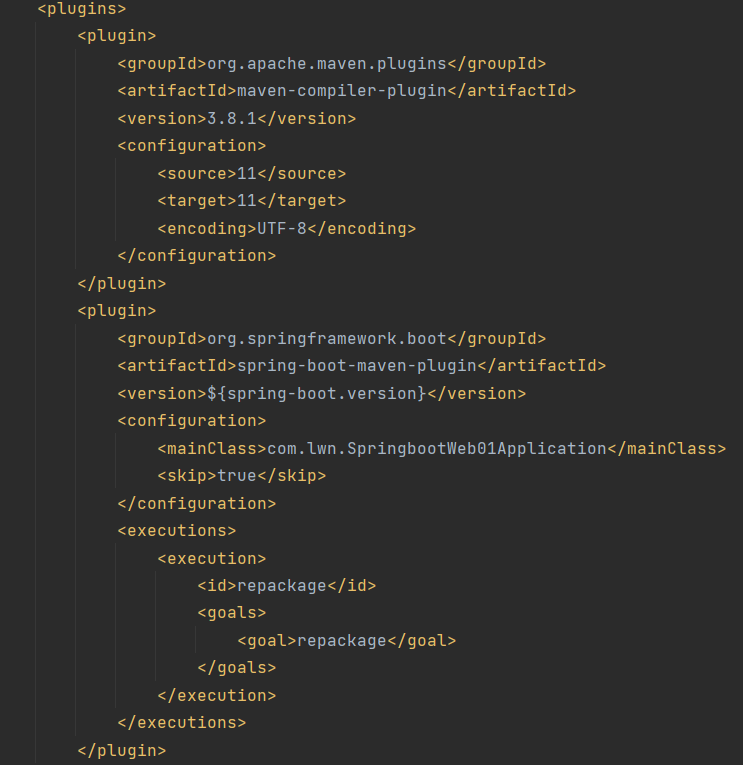

> 然后看src下面有一个带Application字样的类，这个是spring工程的启动类，简单来说就是用来启动项目的，这个类的写法是非常固定的所以在创建工程时，springboot已经自动创建好了：

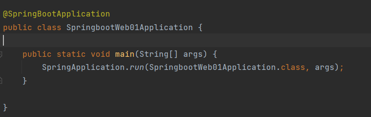

> 在resource下有一个配置文件application.properties这是springboot中的默认配置文件：

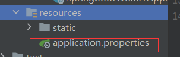

## 创建控制类

> 在com.lwn下创建一个Controller层，然后创建HelloController类
>
> @Controller：控制器注解，控制请求和相应
>
> @GetMapping：发生GET请求的注释
>
> @ResponseBody：返回值直接写入HTTP相应体中，如果是字符串页面返回字符串，如果是对象，先解析成JSON再返回给页面

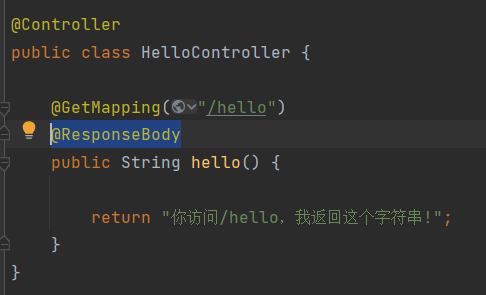

> 访问这个地址http://localhost:8080/hello：

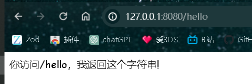

