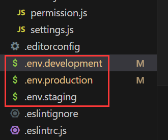

# env文件&process.env对象

`process.env` 是 Node.js 提供的对象，**专门用来读取环境变量**，也就是从 `.env` 文件中读取变量。 Vue CLI 是基于 Webpack 构建工程的，而 Webpack 又运行在 Node.js 环境中，因此 Vue 项目中通过 `process.env` 来读取配置文件里的配置项。这也是 Vue 官方默认采用的方案。

`.env` 文件本身就是用来专门做环境配置的，文件名一般是固定的，比如 `.env.development`、`.env.production` 等。



`.env` 文件中的内容以 `key=value` 的形式书写，例如：

```properties
APP_TITLE=XXX标题
```

关于命名规范，`.env` 文件中的 key 通常采用**常量命名风格**（全大写字母+下划线分隔）。

在代码中，可以通过 `process.env` 对应的 key 来读取到 value 的值，例如：

```js
const title = process.env.APP_TITLE; // 读取到 "XXX标题"
```

`process.env` 是 Node.js 提供的全局对象，在 Node.js 环境中可以直接使用，无需手动引入。

env文件感觉和properties、yml、yaml文件类似。


# 项目中的环境文件说明

项目通常会有以下几种 `.env` 环境文件：

- `.env.development`：开发环境使用（对应 `npm run serve`）
- `.env.production`：生产环境使用（对应 `npm run build`）
- `.env.staging`：测试环境使用（需要自己指定）

它们的**命名一般是固定的**，就叫这些名字。 **项目运行时读取哪个文件**，取决于你执行的命令：

```shell
npm run serve    # 会读取 .env.development 文件中的环境变量
npm run build    # 会读取 .env.production 文件中的环境变量
```

## **工作原理**

读取环境变量其实是一个**替换操作**，发生在**编译阶段**。在打包（build）过程中，`process.env.XXX` 会被**直接替换成具体的值**。

所以：

- **无法在运行时动态修改**。
- 如果改了 `.env` 文件的内容，**必须重启服务**才能生效！

示例：

```javascript
const title = process.env.APP_TITLE;

// 在打包后，实际被替换成：
const title = "xxx标题";  // 直接把 APP_TITLE 的值替换进来
```