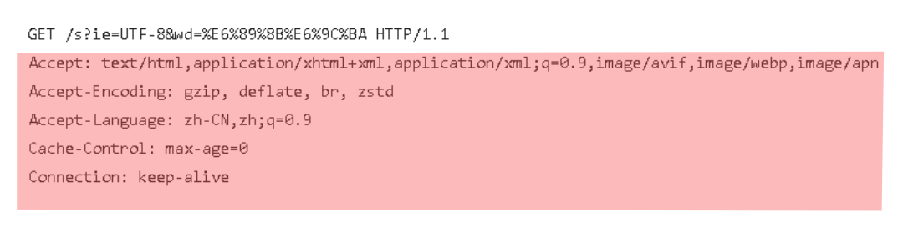
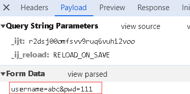

> 请求协议就是请求数据的格式，在上文中，我们已经说明其格式就是一些文本字符串，这些字符串又分为3个部分，第一行叫请求行，中间的键值对部分叫请求头，请求头下面的部分叫请求体


# 请求行

> 请求行就是请求数据的第一行的内容，请求行由3个部分组成：请求方式、资源路径、协议
>
> 如：GET /brand/findAll?name=OPPO&status=1 HTTP/1.1
>
> GET就是请求方式，当然还有其他像POST方式等等。
>
> /brand/findAll?name=OPPO&status=1就是资源路径
>
> HTTP/1.1就是协议及协议的版本


# 请求头

> 请求行下面以key: value格式的存在的字符串就是请求头：



> 请求头中携带了很多信息，包括浏览器的版本，请求的主机地址，请求的数据格式等等，常见的请求头如下：

|    请求头名称    |                          请求头解释                          |
| :--------------: | :----------------------------------------------------------: |
|       Host       |                         请求的主机名                         |
|    User-Agent    | 浏览器的版本，例如谷歌浏览器的标识类似：<br>Mozilla/5.0...Chrome/79<br>Edge浏览器的标识类似：<br>Mozilla/5.0(Windows NT...)like Gecko |
|      Accept      | 表示浏览器能接收的资源类型，如：<br>text/*，image/\*或者\*/\*表示所有 |
| Accept-Luanguage |   表示浏览器偏好的语言，服务器可以根据此返回不同语言的网页   |
| Accept-Encodeing |       表示浏览器可以支持的压缩类型，如gzip、deflate等        |
|   Content-Type   |                       请求体的数据类型                       |
|  Content-Length  |                  请求体的大小（单位：字节）                  |


# 请求体

> 请求体是POST请求特有的部分，POST请求中请求头下面的部分就是请求体，请求头和请求体之间有一个空行，通过这个空行分隔：

```
POST /empty_project_02/springboot-web-01/static/demo1.html?_ijt=r2dsj00omfsvv9ruq6vuhi2voo&_ij_reload=RELOAD_ON_SAVE HTTP/1.1
Accept: text/html,application/xhtml+xml,application/xml;q=0.9,image/avif,image/webp,image/apng,*/*;q=0.8,application/signed-exchange;v=b3;q=0.7
Accept-Encoding: gzip, deflate, br, zstd
Accept-Language: zh-CN,zh;q=0.9
Cache-Control: max-age=0
Connection: keep-alive
Content-Length: 20
Content-Type: application/x-www-form-urlencoded
Cookie: _ga=GA1.1.1052087709.1679666580; Idea-5e32811d=2696acc0-c816-4998-b944-a14d1b82ce5e
Host: localhost:63342
Origin: http://localhost:63342
Referer: http://localhost:63342/empty_project_02/springboot-web-01/static/demo1.html?_ijt=r2dsj00omfsvv9ruq6vuhi2voo&_ij_reload=RELOAD_ON_SAVE
Sec-Fetch-Dest: document
Sec-Fetch-Mode: navigate
Sec-Fetch-Site: same-origin
Sec-Fetch-User: ?1
Upgrade-Insecure-Requests: 1
User-Agent: Mozilla/5.0 (Windows NT 10.0; Win64; x64) AppleWebKit/537.36 (KHTML, like Gecko) Chrome/122.0.0.0 Safari/537.36
sec-ch-ua: "Chromium";v="122", "Not(A:Brand";v="24", "Google Chrome";v="122"
sec-ch-ua-mobile: ?0
sec-ch-ua-platform: "Windows"

{"username": "tom","pwd": "111"}
```

> 在Request Headers中是看不见请求体的，需要打开Payload>>view source：




