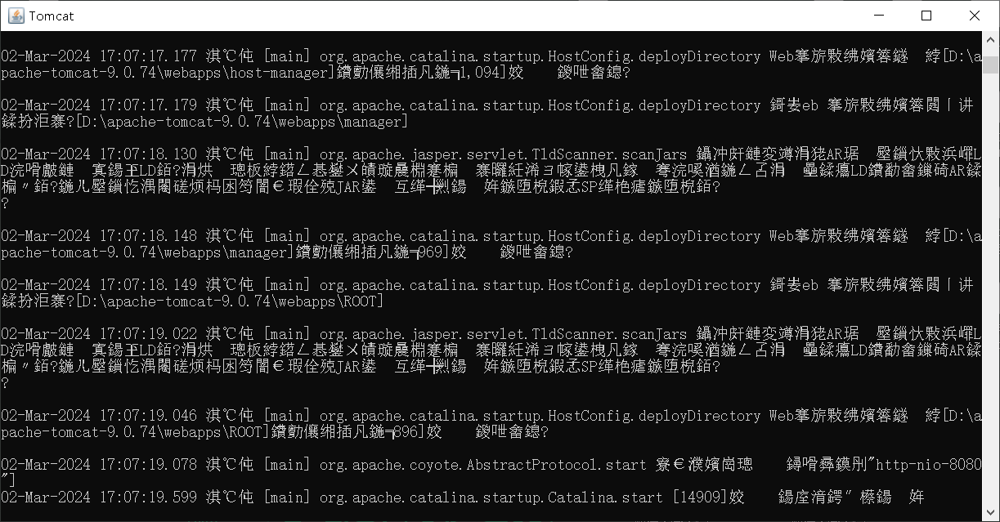
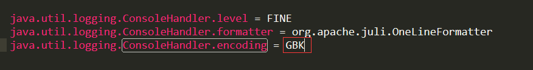
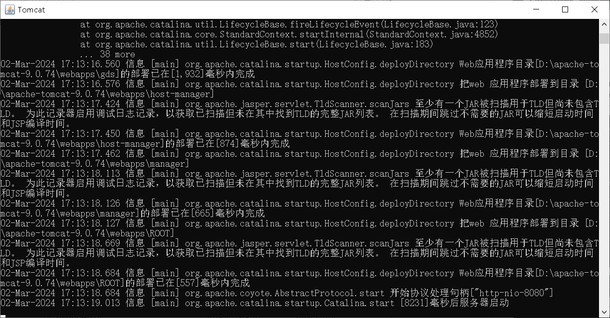

# 下载

> 官网下载地址：https://tomcat/apache.org/download-90.cgi


# 安装

> tomcat是绿色软件，压缩包直接解压即可，下面是tomcat的目录解释：

|   bin   |                   可执行文件                    |
| :-----: | :---------------------------------------------: |
|  conf   |                  配置文件目录                   |
|   lib   |              tomcat依赖的jar包目录              |
|  logs   |                  日志文件目录                   |
|  temp   |                  临时文件目录                   |
| webapps | 应用发布目录，<br>写好的web应用就放到这个目录下 |
|  work   |                    工作目录                     |


# 卸载

> 直接删除目录即可


# 启动

> 运行bin\startup.bat脚本文件



> 运行时中文乱码，因为tomcat默认编码是utf-8，改成GBK即可，进入conf/logging.properties



> 再次运行就好了：




# 关闭

> 三种方式：
>
> 1. 直接窗口x关闭，这是强制关闭
> 2. 运行bin\shutdown.bat，这是正常关闭
> 3. ctrl+c，这是正常关闭


# 修改tomcat端口

> conf\server.xml下：

```xml
<!-- 改port值 -->
<Connector port="8080" protocol="HTTP/1.1" connectionTimeout="20000" redirectPort="8443"/>
```


# 问题解决

> - 运行startup.bat时，窗口一闪而过，检查JAVA-HOME环境变量是否正确配置
>
> - 运行时端口号冲突，一般出现BindException时表示端口号出错，tomcat默认端口是8080，如果8080被占用就会冲突，找到对应程序关闭掉或者修改tomcat的端口


# 部署

> 只需将web程序放到webapps目录下，启动tomcat即可。