# 获取简单参数

> 就是传递的普通的数据，如发起一个GET请求，在路径后面携带一些参数。


## 原始方式获取参数

> 原始方式就是通过HttpServletRequest对象获取，方式是创建一个方法，形参是HttpServletRequest，通过HttpServletRequest的getParameter方法来获取请求参数。

```java
@Controller
public class DemoController {
    @GetMapping("/user")
    @ResponseBody
    public String test1(HttpServletRequest req) {
        String name = req.getParameter("name");
        String age = req.getParameter("age");
        // 这里转换age为int
        // int age1 = Integer.parseInt(age);
        return "请求的数据是name：" + name + "，age：" + age;
    }
}
```

> 发送这个请求，就能获取请求的参数：

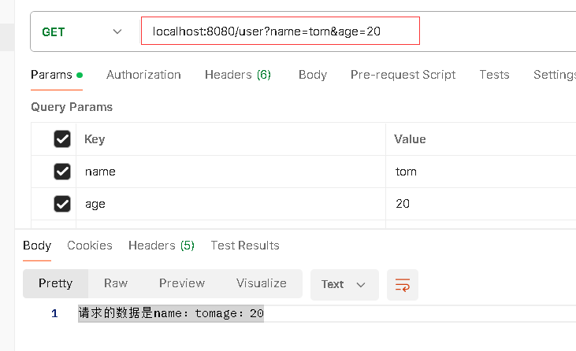


## springboot方法

> - <font color='red'>形参名与请求参数名一致</font>
>
> 这方式只需要形参名与请求参数名一致即可获取参数，同时还能自动的进行类型转换：

```java
/*springboot获取参数的方式*/
    @GetMapping("/user1")
    @ResponseBody
    // 直接在形参中定义与请求参数一致的参数名，并声明了参数类型这样springboot底层自动类型转换
    public String test2(String name, int age) {
        return "请求的数据是name：" + name + "，age：" + age;
    }
```

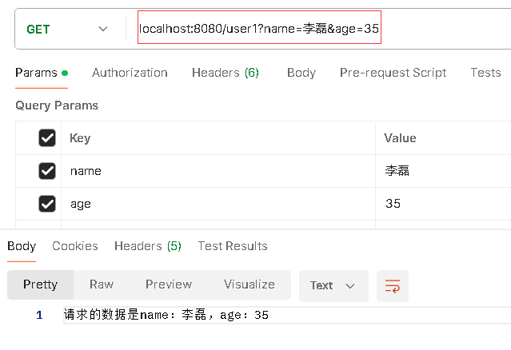

> 发送POST请求也一样：

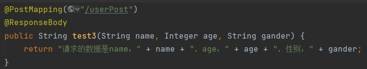

> POST请求的参数在x-www中填写：

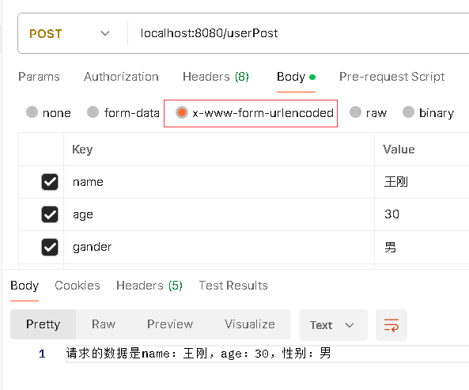

> 简单方法无论是GET请求还是POST请求只需要保证Controller中的方法形参名与请求参数名一致就能获取值。
>
> 如果参数名不一致：

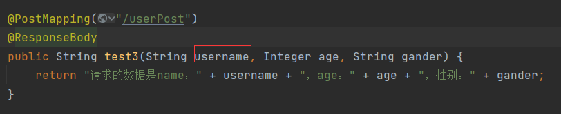

> 不会报错，一致的参数会接收，不一致的就会使用null来表示：

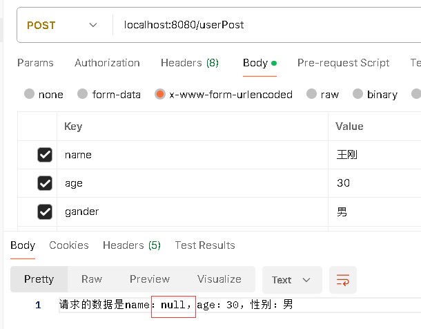

> 基于此，参数类型建议使用包装类而不是基本数据类型，因为基本数据类型在参数名不一致时不一定用null来表示。


### @RequestParam

> - <font color='red'>@RequestParam(name="请求参数名")</font>
> - <font color='red'>@RequestParam的required属性表示参数是否必填，默认为true</font>
> - <font color='red'>@RequestParam的属性defaultValue用于设置参数的默认值，如@RequestParam(defaultValue = "1")</font>
> - <font color='red'>defaultValue是字符串类型，当参数为null或空时才会使用默认值</font>
>
> 参数名不一致并不是说就不能接收，而是需要借助注解@RequestParam，只要@RequestParam的name属性值与请求参数名一致即可：

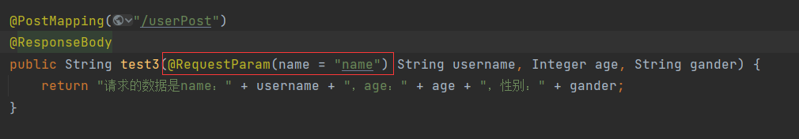

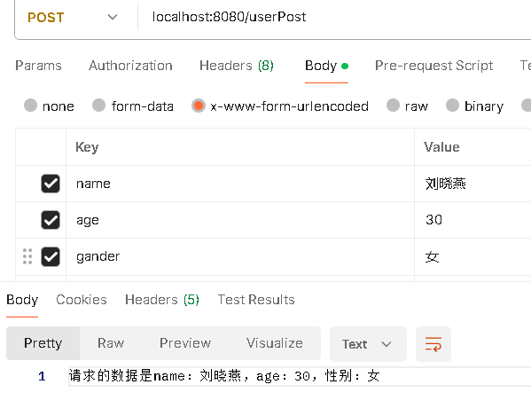

> 注意：@RequestParam有一个属性required，其默认值为true，表示参数名必填，即一旦给形参加上@RequestParam，那么这个参数就是必填项！

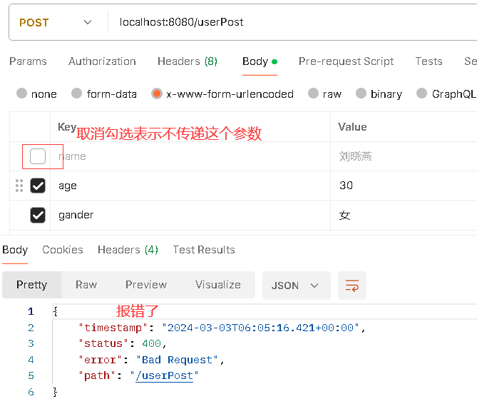

> 来看控制台：

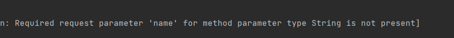

> Required request parameter 'name'......is not present，即必须的请求参数name是不存在的
>
> 改成false就非必填了：

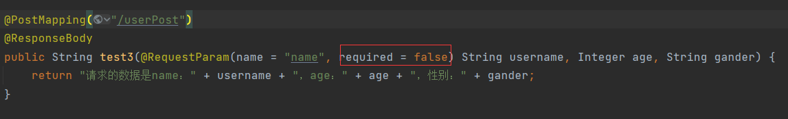

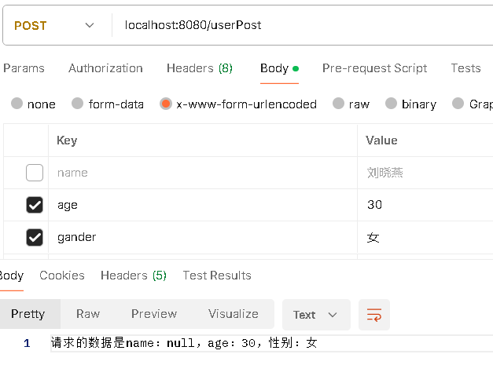


# 实体参数方式获取

> - <font color='red'>实体类属性名与请求参数名一致</font>
>
> 上面的简单参数请求只有两个参数，如果前端传入的参数有十个二十个，再使用简单参数的方式就会非常繁琐，这时可以考虑将参数封装成一个实体类，用实体类来接收这些参数，这样的参数称为实体参数。
>
> 实体参数的封装需要保证实体类的属性名与参数名保持一致。

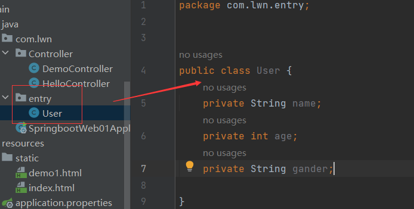

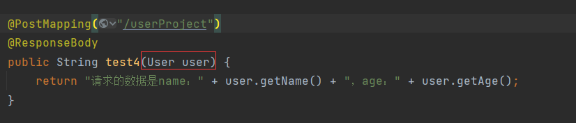

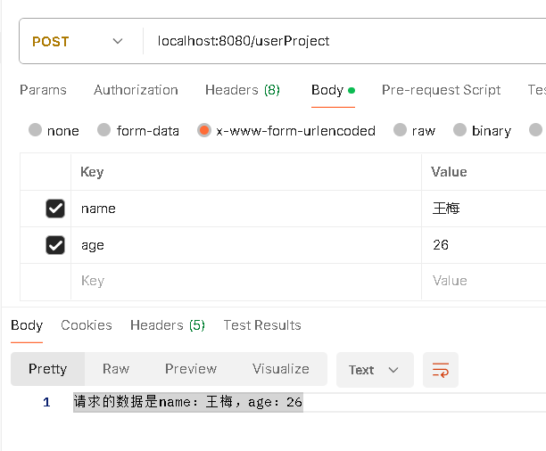

> 如果是复杂类型的实体参数，如实体类的属性又是一个实体类，以省份和城市为例：

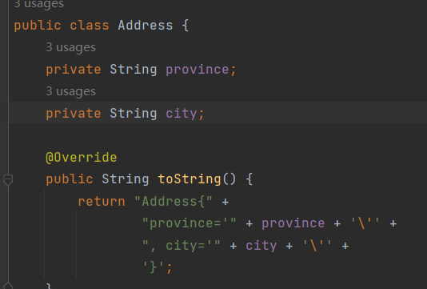

> User类型中添加address属性：

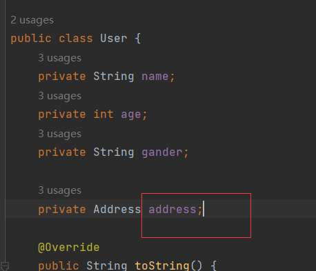

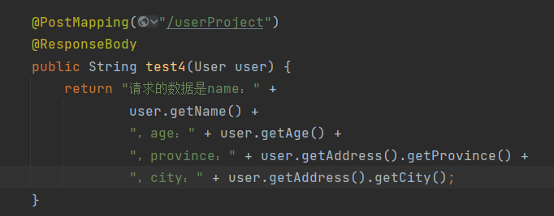

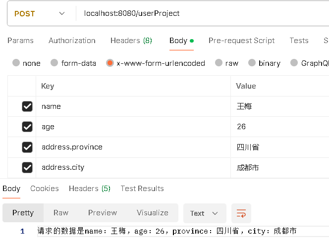


# 获取数组集合参数

> 数组集合参数的使用场景，在前端中的标签checkbox是支持多选的，比如一个form中有一个爱好选项如篮球、足球、羽毛球等等是可以选择多项的，当我们选择多项时该如何提交？其实就跟一个参数时一样的方式key=value的形式，只是key要出现多次而且，如：
>
> http://xx:8080/xxx?hobby=game&hobby=book
>
> 后端接收这样的参数有两种方式，一种时使用数组接收、另一种是使用集合接收。


## 数组接收

> 1. <font color='red'>形参类型为数组</font>
> 2. <font color='red'>形参名与请求参数名一致</font>
>
> 在方法中声明一个数组的形参，形参名与请求参数名一致就能将这些参数封装到数组中：

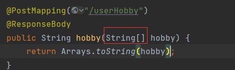

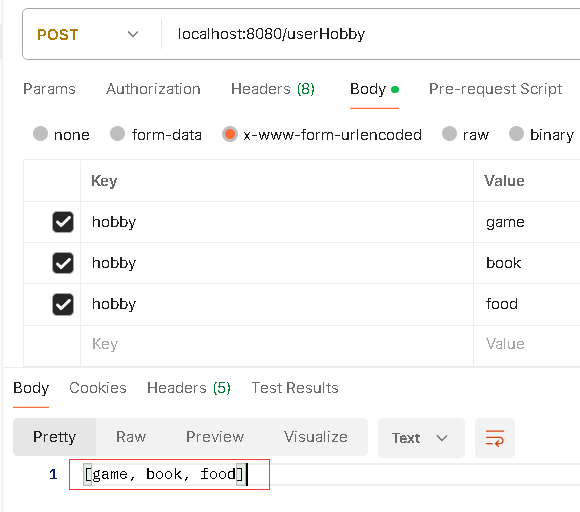


## 集合接收

> 1. <font color='red'>形参类型为集合</font>
> 2. <font color='red'>形参名需要与请求参数名一致</font>
> 3. <font color='red'>形参前面加@RequestParam</font>
>
> 为什么要@RequestParam，因为不加注解情况下会封装到数组中，加了才会封装到集合中：

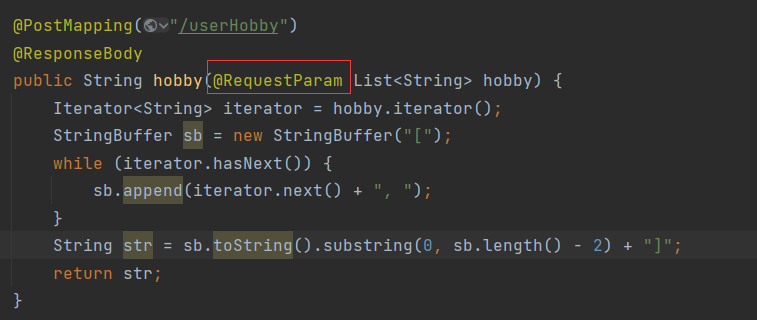

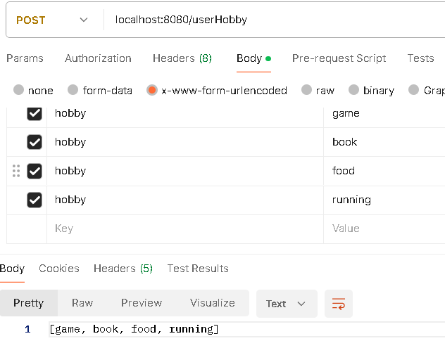


# 获取日期时间参数

> 1. <font color='red'>形参类型为Date或LocalDateTime或LocalDate</font>
> 1. <font color='red'>形参名与请求参数名一致</font>
> 1. <font color='red'>形参前面加@DateTimeFormat</font>
> 1. <font color='red'>@DateTimeFormat的pattern属性指定日期格式</font>
>
> 在表单中经常会遇到如生日，入职时间，操作日期这类的日期时间参数。这些日期参数可以根据需要将其封装到日期类Date或者java1.8以后提供的LocalDateTime/LocalDate中，由于前端在传递日期时格式多种多样，如：
>
> 2024-03-05 15:15:44、2024年3月5日 15时15分44秒、2024/03/05 15:15:44
>
> 因此，在后端需要指定前端传递过来的日期是什么格式，通过@DateTimeFormat，注解中声明属性pattern，pattern就是日期格式来规范传递的日期，比如yyyy-MM-dd HH:mm:ss，前端日期就得按照这个格式的传递，同时形参名与请求参数名保持一致。

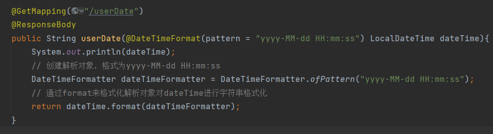

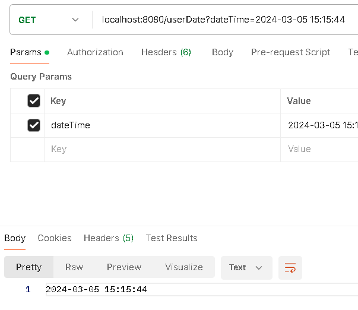

> 日期可以成功的封装到LocalDateTime中


# 获取JSON参数

> 1. <font color='red'>请求为POST</font>
> 2. <font color='red'>使用实体类接收JSON参数</font>
> 3. <font color='red'>实体类属性名与JSON的key一致</font>
> 4. <font color='red'>形参前面加@RequestBody</font>
>
> 传递JSON参数，需要POST请求，因为JSON数据是在请求体中携带传递给服务器的，在postman中要在请求中传递参数选择Body，传递JSON参数选择raw：

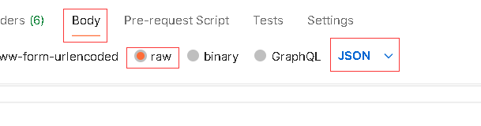

> 后端接收JSON数据一般使用实体对象来接收，也就是实体参数的方式，需要让实体对象的属性名与JSON的key名保持一致，然后要在形参名前面加上@RequestBody，@RequestBody能将JSON封装到实体对象中：

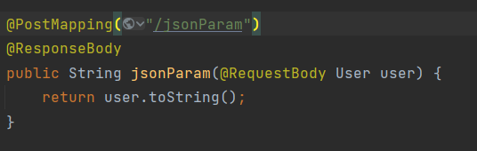

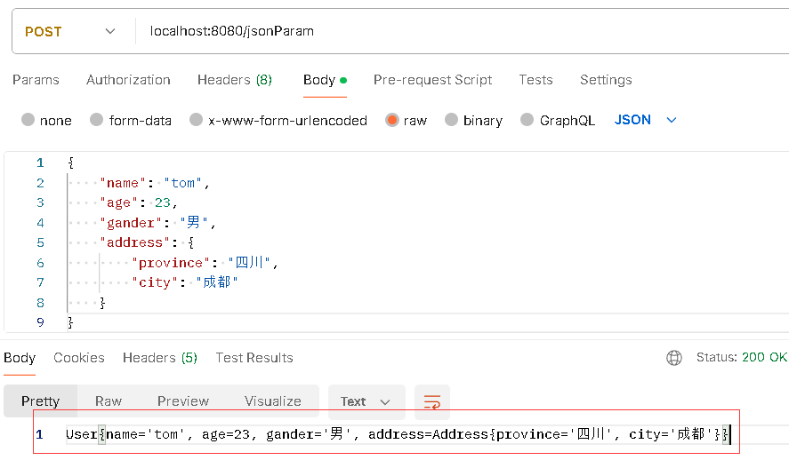


# 获取路径参数

> 1. <font color='red'>路径参数用{}定义</font>
> 2. <font color='red'>{}中声明路径参数的名称</font>
> 3. <font color='red'>形参名与路径参数名一致</font>
> 4. <font color='red'>形参前面加@PathVariable，该注解的作用是获取路径参数，并赋值给形参</font>
> 5. <font color='red'>可以定义多个路径参数，用/分隔</font>
>
> 指参数是url的一部分，比如这个请求：
>
> localhost:8080/pass/1
>
> 这里的1是请求的一部分，同时也是我们给服务器传递的参数，当然还可以写成2、100等等其他数值。路径参数的传递很简单，难点在于服务器如何获取路径参数。
>
> 在之前的请求中，都需要在Mapping()注解中映射请求路径，那么自然在这里也需要映射请求路径，但是不能写成"/pass/1"这种，如果写成了1，当这个参数是2、3或是100，就不能处理这个请求了，换言之需这个参数是动态的，而不是写死的1、2或是100。
>
> 可以写成"/pass/{id}"，用一对{}来声明一个路径参数，表示这个参数是动态的，并为这个参数取个名字叫id，我们在形参列表中再声明一个形参叫就叫id，前面再声明注解@PathVariable，表示我们要获取到这个路径参数并将路径参数绑定给该形参。形参名与路径参数名保持一致。

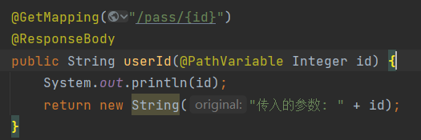

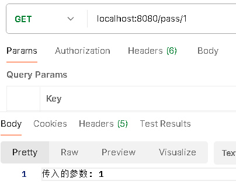

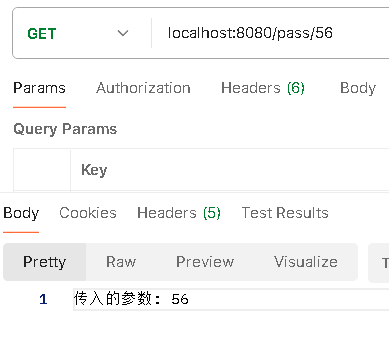

> 可以传入多个路径参数，用/分隔：

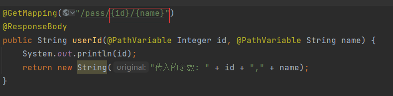

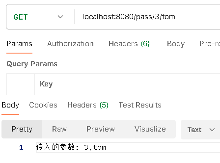

> 为什么要让形参名与路径参数名一致，就像上面一个id，一个name，保证形参名与路径名一致才能确保路径参数正确的赋值给形参，不然如果形参名不一样比如第一个不是id而是userId，那么@PathVariable就不知道该将路径参数id的值赋值给userId还是name。
>
> @PathVariable注解会根据方法参数的类型自动进行类型转换，尝试将路径参数转换为相应的类型：
>
> - 路径参数是一个整数，可将其封装成Integer类型
> - 路径参数是一个字符串，可将其封装成String类型
> - 路径参数是一个逗号分隔的列表，可将其封装成List\<Integer>或List\<String>
> - ......


# 注意

> - springboot在接收String类型的请求参数时，如果未指定参数，那么该参数不是null而是空字符串。