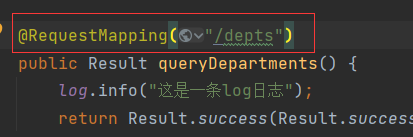
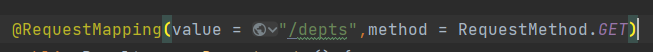
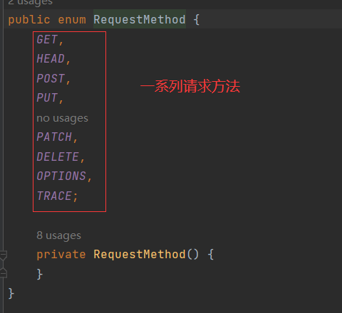
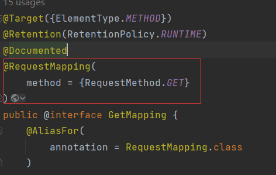

# @RequestMapper

> @RequestMapper的value属性设置请求的url地址，当只有一个参数时，value可以省略：

## 设置请求方法

> @RequestMapper接收所以方式的请求。
>
> 通过method属性设置：

> 属性不止一个时，value必须指定。
>
> RequestMethod.GET设置请求方法为GET方法。RequestMethod是一个枚举：

> 通过设置请求方式之后，只会接收该方式的请求。
>
> 简化：
>
> @RequestMapping(value = "/depts",method = RequestMethod.*GET*)
>
> 可以写成@GetMapping(value = "/depts")
>
> @GetMapping内部继承了@RequestMapping。
>
> 并指定了method = RequestMethod.GET：

> POST、PUT、DELETE等方式同理。