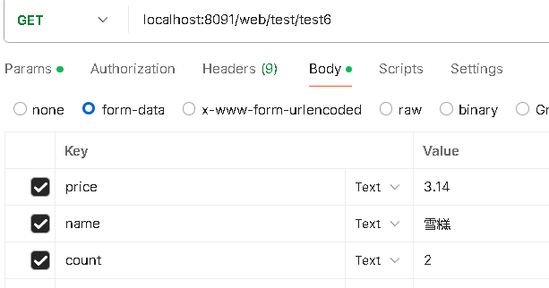
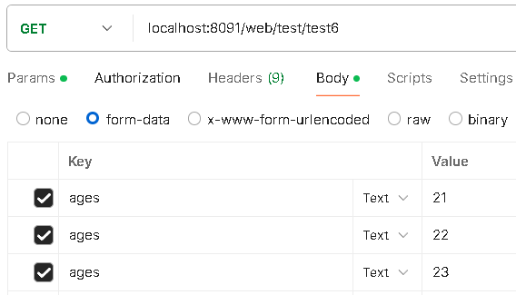
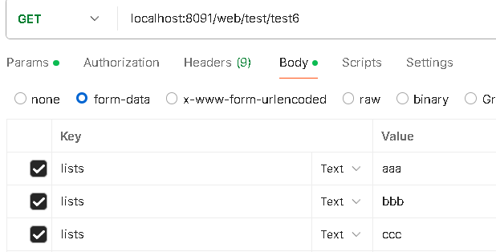
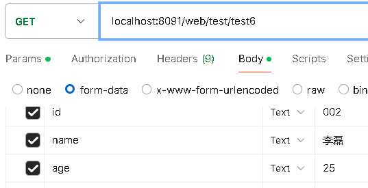
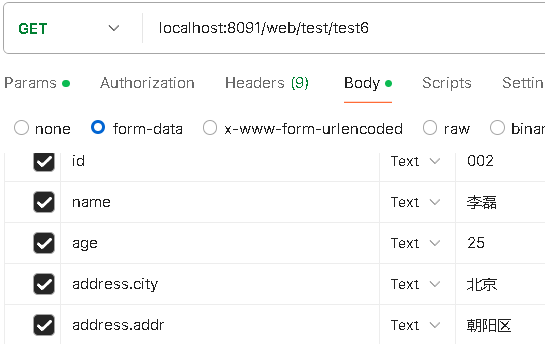
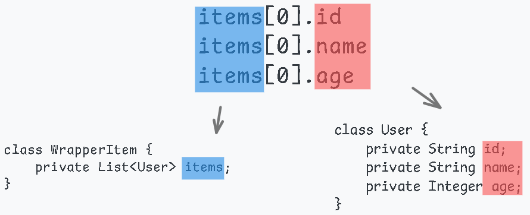

# 1 springboot请求参数的绑定规则

下面介绍springboot中请求参数的绑定规则，之前在[2.获取请求参数](2.获取请求参数)中已经说过了，但是这里再详细的说明一下绑定规则以及如何定义请求参数。

---

## 1.1 简单参数绑定

**什么是简单参数？**

**简单参数**：包括基本数据类型，包装类，字符串，日期类，UUID等。

springboot处理简单参数方式是直接绑定，保证参数名与形参名一致即可(不一致用`@RequestParam`)。

例如`Double`是包装类，那么它就是简单参数。

```java
// localhost:8091/web/test/test6?price=23.45

// 简单类型直接绑定值
@GetMapping("/test6")
public Result<String> test6(Double price) {
    return Result.success(price.toString());
}

// 响应
{
    "status": "success",
    "code": 200,
    "msg": "请求成功",
    "data": "23.45"
}
```

除了url参数，表单参数也是如此：



```java

@GetMapping("/test6")
public Result<String> test6(String name, Double price, Integer count) {
    return Result.success(name + count + "支" + price * count + "元");
}

// 响应
{
    "status": "success",
    "code": 200,
    "msg": "请求成功",
    "data": "雪糕2支6.28元"
}
```

---

### 1.1.1 简单参数数组绑定

如果用简单参数数组作为形参，也可以直接绑定，但请求参数需要这样写：

```java
// 多个参数名一致
param=value1&param=value2&param=value3&...
```

```java
// localhost:8091/web/test/test6?names=王梅&names=李磊&names=王梅

@GetMapping("/test6")
public Result<String> test6(String[] names) {
    return Result.success(Arrays.toString(names));
}

// 响应
{
    "status": "success",
    "code": 200,
    "msg": "请求成功",
    "data": "[王梅, 李磊, 王梅]"
}
```

表单参数也是如此：



```java
@GetMapping("/test6")
public Result<String> test6(Integer[] ages) {
    return Result.success(Arrays.toString(ages));
}

// 响应
{
    "status": "success",
    "code": 200,
    "msg": "请求成功",
    "data": "[21, 22, 23]"
}
```

---

### 1.1.2 简单参数集合绑定

如果是简单参数集合作为形参，也可以直接绑定，但需要声明`@RequestParam`(否则报错)，请求参数需要这样写：

```java
// 多个参数名一致
param=value1&param=value2&param=value3&...
```

```java
// localhost:8091/web/test/test6?lists=aa&lists=bb&lists=cc

// 声明@RequestParam
@GetMapping("/test6")
public Result<List<String>> test6(@RequestParam List<String> lists) {
    return Result.success(lists);
}

// 响应
{
    "status": "success",
    "code": 200,
    "msg": "请求成功",
    "data": [
        "aa",
        "bb",
        "cc"
    ]
}
```

表单参数也是如此：



```java
// 声明@RequestParam
@GetMapping("/test6")
public Result<List<String>> test6(@RequestParam List<String> lists) {
    return Result.success(lists);
}

// 响应
{
    "status": "success",
    "code": 200,
    "msg": "请求成功",
    "data": [
        "aaa",
        "bbb",
        "ccc"
    ]
}
```

---

## 1.2 非简单参数绑定

### 1.2.1 POJO参数绑定

如果是自定义的实体作为形参，那么springboot会将**请求参数看作是实体的属性**，保证属性名与参数名一致进行绑定：

```java
// 实体
class User {
    private String id;
    private String name;
    private Integer age;

    // getter && setter
}

// 属性名与参数名一致
// localhost:8091/web/test/test6?name=tom&age=22&id=001

@GetMapping("/test6")
public Result<User> test6(User user) {
    return Result.success(user);
}

// 响应
{
    "status": "success",
    "code": 200,
    "msg": "请求成功",
    "data": {
        "id": "001",
        "name": "tom",
        "age": 22
    }
}
```

表单参数也是如此：



```java
@GetMapping("/test6")
public Result<User> test6(User user) {
    return Result.success(user);
}

// 响应
{
    "status": "success",
    "code": 200,
    "msg": "请求成功",
    "data": {
        "id": "002",
        "name": "李磊",
        "age": 25,
    }
}
```

如果实体有嵌套属性，例如：

```java
class User {
    private String id;
    private String name;
    private Integer age;
    private Address address;

    // getter && setter
}

class Address {
    private String city;
    private String addr;

    // getter && setter
}
```

想要将参数绑定到嵌套属性中，那么参数需要这样来写：

```java
param.subParam=value
```

用实体作为形参时，springboot会把请求参数看作实体的属性，而要访问`city`或`addr`就需要通过`address`，而`address`又是`User`的属性，联系到参数看作实体的属性，因此我们可以构建这样的请求参数

```java
id=?&name=?&age=?&address.city=?&address.addr=?
```

请求参数可以允许嵌套写法。

```java
// localhost:8091/web/test/test6?id=001&name=tom&age=22&address.city=成都&address.addr=金牛区

@GetMapping("/test6")
public Result<User> test6(User user) {
    return Result.success(user);
}

// 响应
{
    "status": "success",
    "code": 200,
    "msg": "请求成功",
    "data": {
        "id": "001",
        "name": "tom",
        "age": 22,
        "address": {
            "city": "成都",
            "addr": "金牛区"
        }
    }
}
```

表单参数也是如此：



```java
@GetMapping("/test6")
public Result<User> test6(User user) {
    return Result.success(user);
}

// 响应
{
    "status": "success",
    "code": 200,
    "msg": "请求成功",
    "data": {
        "id": "002",
        "name": "李磊",
        "age": 25,
        "address": {
            "city": "北京",
            "addr": "朝阳区"
        }
    }
}
```

---

### 1.2.2 POJO集合参数绑定

如果是POJO集合作为形参，集合中的元素不再是简单参数，而是自定义实体，那么springboot依然是按照实体绑定的规则，会将请求参数看作是实体的属性来进行绑定。

请求参数需要这样来写：

```java
// 表单参数形式
items[0].id: 001
items[0].name: tom
items[0].age: 20
items[1].id: 002
items[1].name: lilei
items[1].age: 21
```

**关键点：**

- **必须显式声明索引**，且索引必须 **连续**（如 `items[0]`、`items[1]`）。

- 采用嵌套参数的形式，使用 `.` 号访问集合元素的属性，例如 `items[0].id`。

在该格式下，`items[0].id` 表示 `items` 集合中第一个元素（索引为 `0`）的 `id` 属性，`items[1].name` 表示第二个元素的 `name` 属性。

然后是形参定义：

**不能直接使用 `List<User> items` 作为方法参数**，而是需要通过 **包装类** 来封装 `List<User>`，即：

```java
public class UserListWrapper {
    private List<User> items;

    // getter && setter
}

```

然后在控制器方法中使用该包装类作为形参：

```java
@PostMapping("/submit")
public void submit(UserListWrapper wrapper) {
    List<User> items = wrapper.getItems();
    // 业务处理逻辑
}

```

为什么需要包装类？

从参数格式来看，`items[0].id`、`items[0].name`、`items[0].age` 这样的结构说明 `items` 是一个集合，而集合中的元素是 `User` 实体类。那么，为什么不能直接使用 `List<User> items` 作为形参呢？

原因就是我上面说过的，当集合中的元素不是简单参数，而是自定义POJO时，**Spring Boot 采用对象属性绑定的方式进行参数解析**。对于 `items[0].id` 这样的参数，Spring Boot 需要一个对象的属性 `items` 来进行绑定(映射)。如果直接使用 `List<User> items` 作为形参，Spring Boot 会尝试将 `items[0].id` 绑定到 `items` 的属性上。但 `List` 作为 Java 提供的接口，并没有属性，因此无法完成绑定。

反过来想，springboot不是需要一个对象的属性来和`items[0].id`绑定吗，那么我们就定义一个这样的对象，声明一个属性就叫`items`类型为`List`，内部的元素为`User`。将这个对象作为形参，这不就能将`items[0].id`绑定到它的属性`items`上了吗，再进一步不久能解析 `User` 内部的 `id`、`name`、`age` 等属性了吗。而这个对象包装了`List`那么就是包装类。

**结论**：

- **要将请求参数封装到 `List<POJO>` 中，必须使用包装类来封装 `List<POJO>`，并以包装类作为形参。**

- **请求参数格式要求：**

  - **索引必须连续**，形如 `items[0]`、`items[1]`。

  - **遵循嵌套属性格式**，如 `items[0].id`、`items[0].name`、`items[1].age`。

- **包装类命名规范：**

  - **包装类中的属性名应与请求参数的集合名一致**，如 `items[0].id` 中的 `items`，则包装类的属性也应命名为 `	items`。

  - **POJO 实体类的属性名需与请求参数一致**，如 `id`、`name`、`age`，`User` 类中的字段名称必须匹配请求参数的键名，否则绑定失败。

    

```java


@GetMapping("/test6")
public Result<List<User>> test6(UserListWrapper userListWrapper) {
    List<User> users = userListWrapper.getUsers();
    return Result.success(users);
}

// 响应
{
    "status": "success",
    "code": 200,
    "msg": "请求成功",
    "data": [
        {
            "id": "002",
            "name": "李磊",
            "age": 25,
            "address": {
                "city": "北京",
                "addr": "朝阳区"
            }
        }
    ]
}
```

---

#### 1.2.2.1 不支持url参数绑定

url参数不支持POJO集合参数绑定：

```java
items[0].id=001&items[0].name=tom&items[0].age=20
&items[1].id=002&items[1].name=lilei&items[1].age=21
```

会抛出400异常。但是POJO参数绑定却是支持的，这说明springboot能识别url参数中的嵌套关系，但无法识别集合索引关系。因此如果要绑定POJO集合，推荐表单参数。

但是我更加推荐用JSON列表绑定POJO集合参数

```json
// 请求参数这样发
[
    {
        "id": "001",
        "name": "tom",
        "age": 20
    }
]
```

形参可以直接用`List`来接收而不需要用到包装类。

只当JSON列表无法绑定POJO集合参数时，再用表单参数。比如上传文件的情况下，假设有多个文件上传，且每个文件还有其他属性，这种情况下1个文件与其对应的属性可以用一个实体来表示，多个这样的文件可以用实体集合来表示，这就要求需要一个形参来接收这样的实体集合即POJO集合参数绑定的情况。

但是上传文件又必须使用表单，表单提交又是表单参数，没有其他形式的参数，这条路已经被焊死了。

