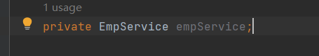
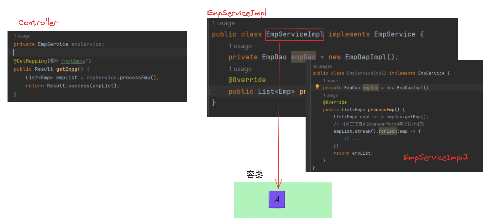
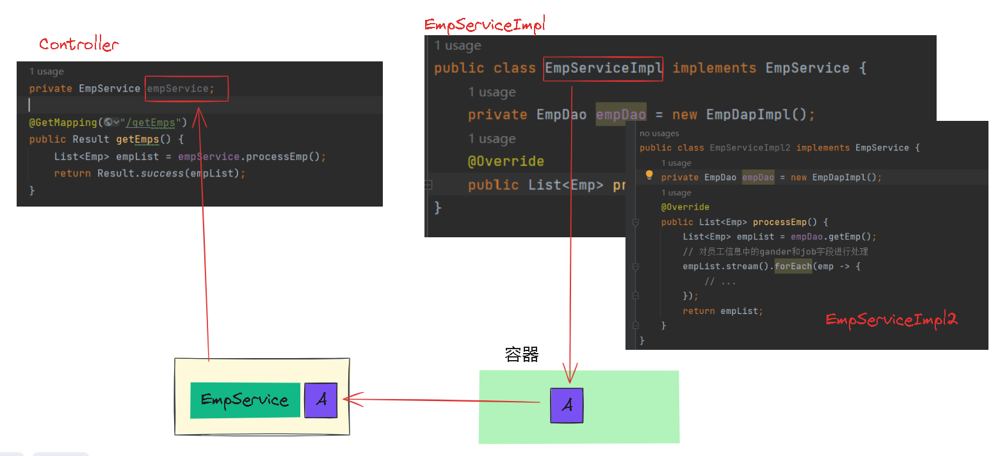
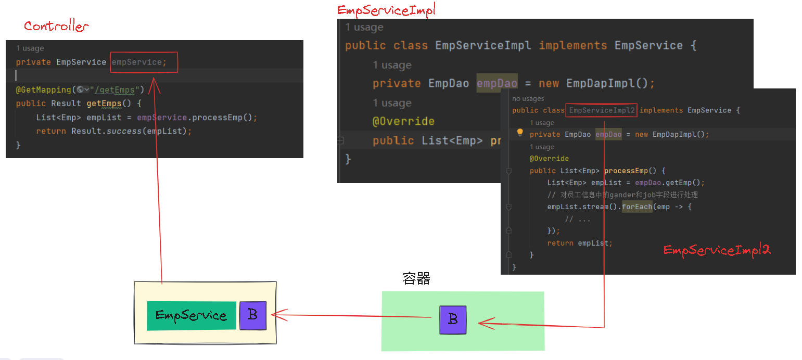
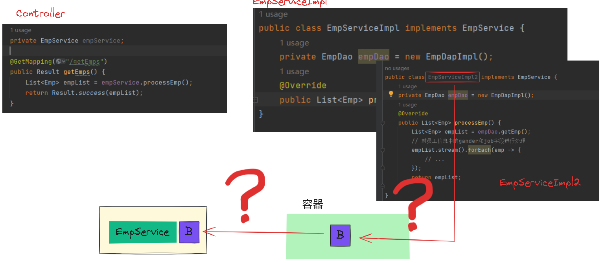
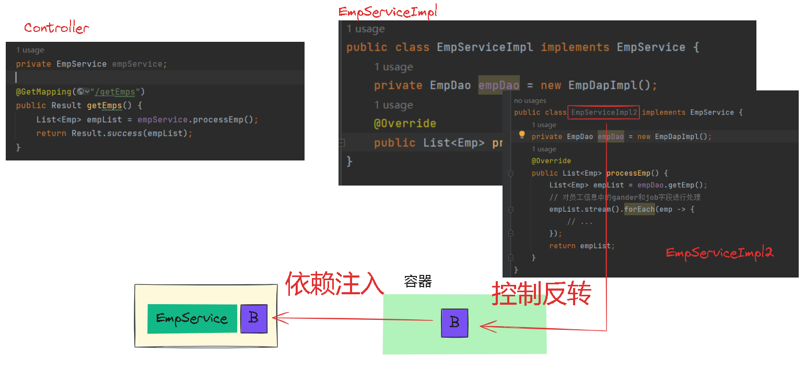

#  内聚和耦合

> - 内聚：软件中各个功能模块内部的功能联系。
> - 耦合：衡量软件中各个层/模块之间的依赖、关联程度。
>
> 内聚指各个功能模块内部的功能联系，比如上文的Service层的是实现类，内部是关于员工信息的逻辑处理，与员工无关的处理不会放在EmpServiceImpl中，那么这个实现类就是内聚程度比较高的也叫高类聚。
>
> 耦合是衡量软件中各个层/模块之间的依赖程度，依赖程度越高，耦合度越高，在上文中Controller层调用了Service层，Controller为了使用Service在内部new了一个Service的对象，我们可以设想一下假如Service的类名发生改变，new的对象也要对应改变，即改变Service的同时也要改变Controller，所以我们称之为Controller与Service的代码耦合了，同理Service与Dao之间也耦合了。
>
> 在软件设计领域有一句话叫做：高类聚，低耦合。意思是模块内部的功能联系越紧密越好，尽可能做到降低层与层(模块与模块)之间的关联，最好是解除耦合。
>
> 解除耦合后层与层之间就不再有关联，即便Service发生改变，Controller也不需要改变，提高了程序的扩展性和灵活性

# 解耦

> 耦合除了上面说到的改类名，还有一种情况就是我另外建了一个新的Service的实现，现在我在Controller中想要使用新的Service，就需要改变实现类把旧的实现类换成新的实现类。
>
> 你去new对象就是在建立联系，所以要想解耦，就不能再new对象，以Controller为例，此处我们不再new EmpServiceImpl()：

> 但是这样empService就是一个空对象，直接运行会报错，如何解决？
>
> 我们可以这样，提供一个容器，这个容器可以存储对象，接下来我创建另一个Service：EmpServiceImpl2来详细说明这个容器，设EmpServiceImpl为A，EmpServiceImpl2为B。
>
> 现在我想用EmpServiceImpl这个实现类，我只需要将A创建出来的对象放到这个容器中：

> 我们的Controller运行时需要EmpService，此时我们可以到容器中去查找EmpService这个类型的对象，A就是EmpService类型的对象，因此我们就找到了需要的对象，然后将A赋值给empService：

> 这样empService就不是一个空对象，程序也能正常运行。接下来当我切换实现类为EmpServiceImpl2，就会基于EmpServiceImpl2创建实现类放到容器中，Controller运行时需要EmpService，就会去容器中查找有没有EmpService类型的对象，B就是EmpService类型的对象，就会把B赋值给empService，就实现了实现类的切换：

> 我们可以发现，即使Service变化了，Controller的代码也没有改变，这就完成了解耦。

# 控制反转&依赖注入

> 但是这种解决方法有两个问题：
>
> 1. 如何把对象交给容器管理
> 2. 容器如何为程序提供它所依赖的资源

> 这就涉及到了spring中非常重要的两个概念：
>
> - 控制反转
> - 依赖注入

> 控制反转：Inverse Of Control简称IOC，对象创建的控制权由应用程序转移到了外部容器，这种思想称为控制反转。反转前由程序控制，反转后由容器控制，容器又叫做IOC容器或者spring容器。
>
> 依赖注入：Dependency Injection简称DI，容器为应用程序提供运行时所需要的依赖资源，称为依赖注入。
>
> Bean对象：IOC容器中创建，管理的对象，称之为bean。