# 衍生注解

> IOC控制反转，上文说过，控制反转就是将对象的控制权交给IOC容器来管控，由IOC来创建和管理这些对象。这些对象也叫Bean对象。
>
> 上文中我们直接在实现类上加上@Component就能创建一个Bean对象，在spring框架中，除了@Component外spring为了更好的标识web应用开发中Bean对象到底归属于那一层，又提供了@Component的衍生注解：

|    注解     |         说明         |                     位置                     |
| :---------: | :------------------: | :------------------------------------------: |
| @Component  |  声明Bean的基础注解  |          不属于以下三类时，用此注解          |
| @Controller | @Component的衍生注解 |             标注在Controller类上             |
|  @Service   | @Component的衍生注解 |              标注在Service类上               |
| @Repository | @Component的衍生注解 | 标注在Dao类上 (由于于Mybatis整合，用的少) |

> 现在我将上文的注解替换为衍生注解：

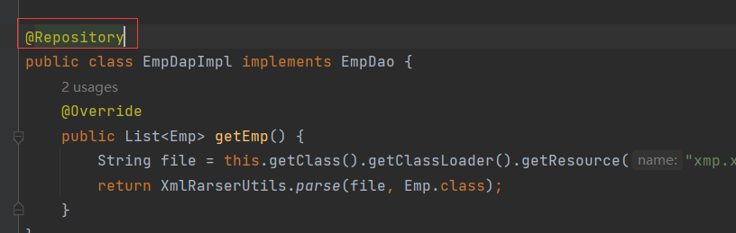

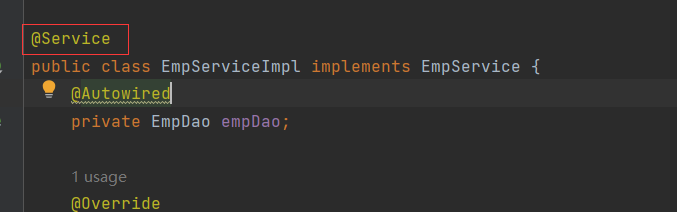

> 这里说一下，对于Controller来说@Controller不只是将Controller交给IOC容器管控也是控制请求与响应的注解，即我们之前就已经接触过@Controller，那个时候就已经将Controller交给IOC容器来管理了，同理@RestController=@Controller+@ResponseBody，@RestController也能将Controller交给IOC容器管控。

# Bean标识

> 在IOC容器中每个Bean都有一个标识，即Bean的名字，在声明Bean时我们可以通过注解属性value来定义Bean的名字，如果未定义Bean也是有名字的，默认是类名首字母小写。我们在控制台查看：

> 看白色的类，白色的类是我们创建的，比如EmpServiceImpl，它的Bean就是类名首字母小写：

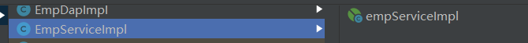

> 如果我指定名字，比如EmpServiceA：

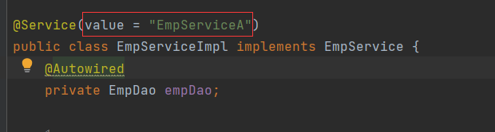

> 再来看Bean，名字已经变成EmpServiceA了：

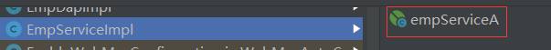

> value是可以省略的：

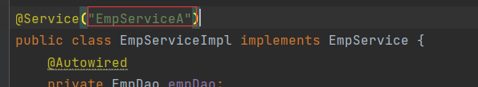

# Bean组件扫描问题

> 上述四个注解，声明的Bean就一定会生效吗？
>
> 不一定，因为这涉及到Bean的组建扫描。
>
> 现在我将Dao层放到Java下，与com.lwn平级：

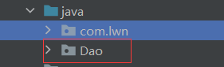

> 运行，报错了：

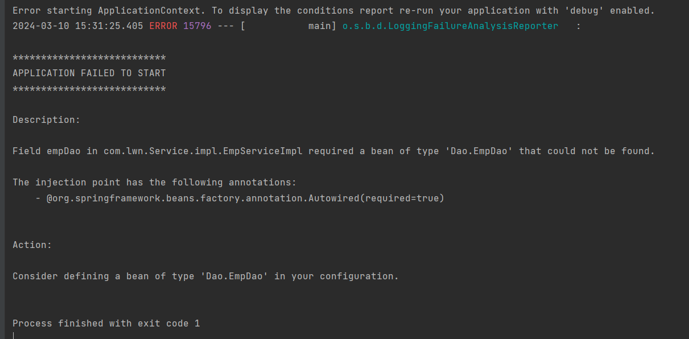

> 看描述信息：EmpServiceImpl required a bean of type 'Dao.EmpDao' that could not be found.
>
> EmpServiceImpl需要一个Dao.EmpDao类型的Bean，但是未找到。即Service在运行时需要一个Dao.EmpDao类型的Bean，但是语法检测没有找到该Bean。
>
> 但是我们已经声明了这个Bean并且加上了@Repository，为什么把Dao层移动后就报错？这就涉及到Bean的组件扫描问题。

# @ComponentScan

> - 四大注解声明的Bean要想生效，还需要被组件扫描注解@ComponentScan扫描。
> - @ComponentScan虽然没有显示配置，但是实际上已经包含在了启动类声明注解@SpringBootApplication中，默认扫描范围是启动类包及其子包。
>
> @SpringBootApplication中的@ComponentScan：

>默认范围是当前包及其子包，@SpringBootApplication所在包是com.lwn，将Dao放到与com.lwn同一级自然不会被扫描到。
>
>解决问题的方法有两种：

## 方法1

> 再次指定@ComponentScan，手动设置包扫描范围。通过属性value或basepackages设置，这两个属性的类型都是数组所以指定时用{}表示，使用value声明范围，value可以省略：

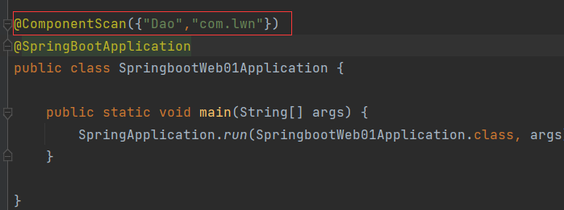

> 使用basepackages声明范围：

> 为什么声明了Dao还要声明com.lwn？因为一旦手动定义了@ComponentScan的范围，就会覆盖原理的范围，如果不加上com.lwn，则范围只有Dao。
>
> 启动成功：

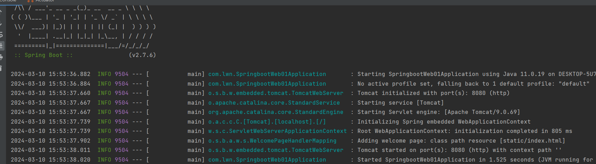

## 方法2

> 回归初心，变成原来的样子，即根据@SpringBootApplication种声明的范围就将Dao放在启动类所在包及其子包下，也就是别随意改动位置：

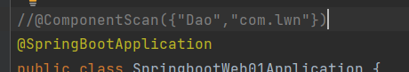

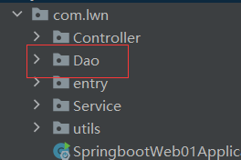

# 注意

> - 上述的四个注解都能声明Bean，但是在springboot集成web开发中声明Controller的Bean只能用@Controller或@RestController
> - 改动@ComponentScan的范围的方法并不推荐，推荐将范围之外的未生效的包放到启动类所在包及其子包下
