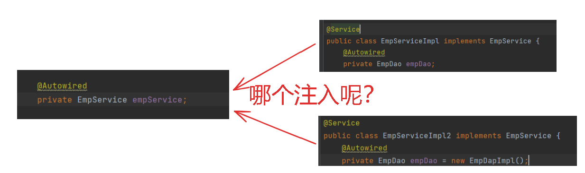
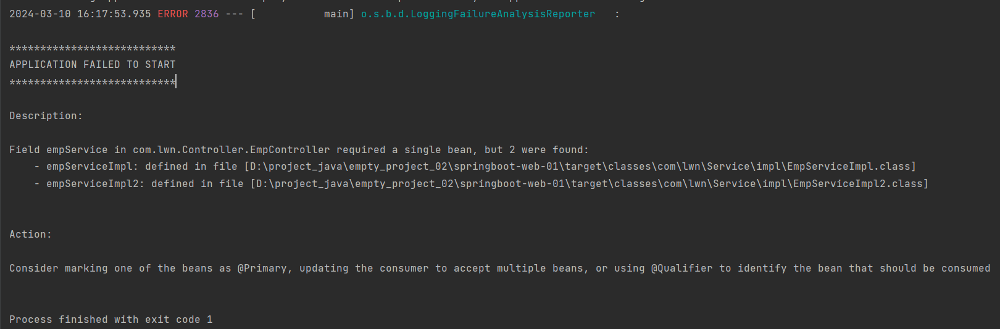
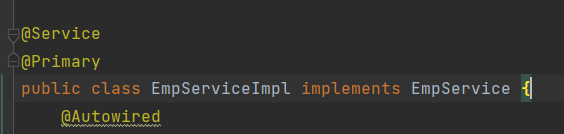
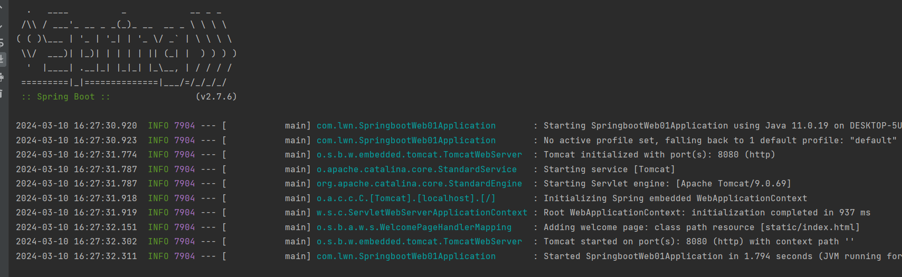
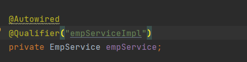
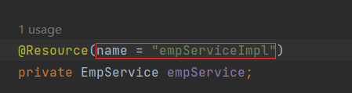
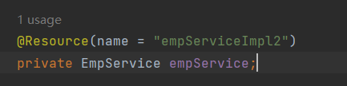
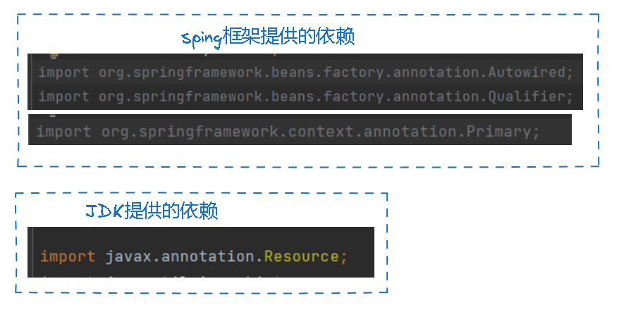

# 按照类型注入

> DI就是自动注入，上文中我们使用@Autowired来注入依赖。
>
> @Autowired默认按照类型来注入，即在IOC中去找这个类型的对象然后注入，比如Controller中注入Service，我将EmpServiceImpl放入IOC容器中，@Autowired到IOC容器中找，找到了EmpService类型的Bean，就是EmpServiceImpl然后赋值给empService。

# 类型注入问题

> 但是Service还有一个实现类EmpServiceImpl2，我将该类也放入IOC容器中，EmpServiceImpl2也是EmpService类型的，@Autowired该将哪个Bean赋值给empService？

> 运行报错：

> 语法检测也错误：
>
> Could not autowire. There is more than one bean of 'EmpService' type.
>
> 不能自动装配，EmpService类型的Bean不止一个。

> @Autowired默认按照类型进行注入，如果遇到多个同类型的Bean就会报错。
>
> 解决方法：
>
> - @Primary
> - @Qualifier
> - @Resource

## @Primary

> @Primary就是设置Bean的优先级，要想哪个Bean生效，我们可以再加上@Primary，加在EmpServiceImpl上就是让EmpServiceImpl生效，加在EmpServiceImpl2上就是让EmpServiceImpl2生效，我给EmpServiceImpl加上@Primary，Controller就会注入EmpServiceImpl，接着就不报错了：

## @Qualifier

> @Autowired配合@Qualifier来解决。
>
> @Qualifier中有属性value，用来指定Bean的名字，之前说过声明Bean时有默认名——类名首字母小写，我将其与@Qualifier连接，@Autowired就知道用哪个Bena了：

> EmpServiceImpl的Bean名是empServiceImpl，这里@Autowired就知道要注入EmpServiceImpl，同理我改成empServiceImpl2，@Autowired就知道要注入EmpServiceImpl2

## @Resource

> @Autowired是按照类型来注入，而@Resource是按照名称来注入，你可以不使用@Autowired而直接使用@Resource来注入。
>
> @Resource没有value属性，而是用name属性来指定Bean的名称：

> 名字是empServiceImpl就是注入EmpServiceImpl，名字改成empServiceImpl2，就注入EmpServiceImpl2：

# 注意

> - @Autowired、@Primary和@Qualifier是spring框架(springframework)中提供的，@Resource是JDK提供的：

