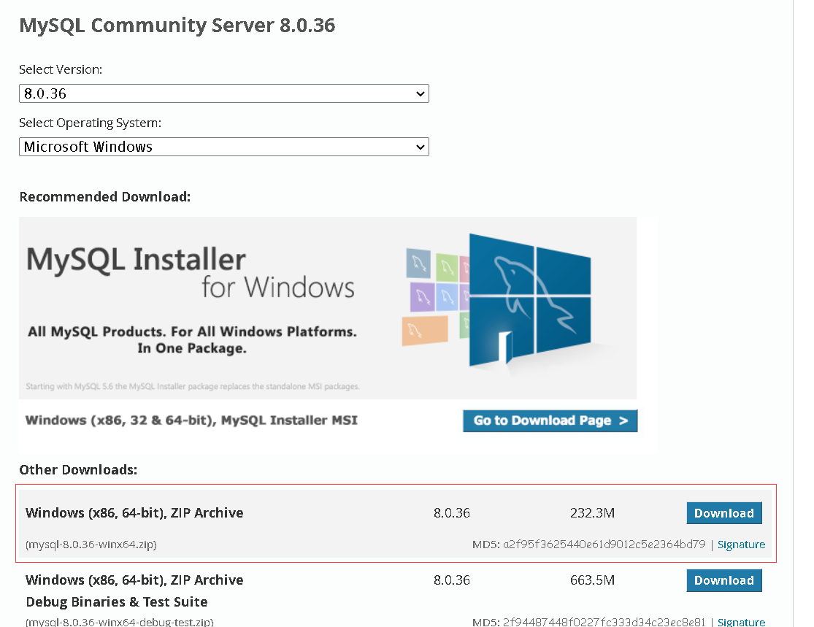
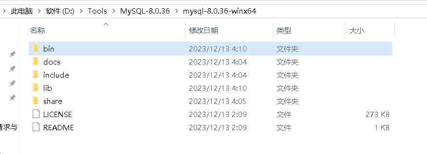
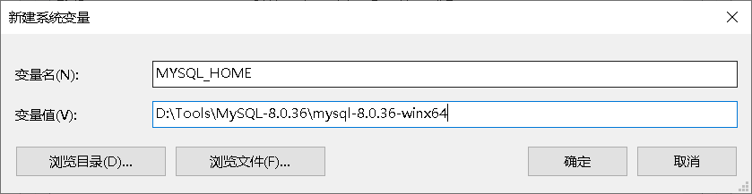
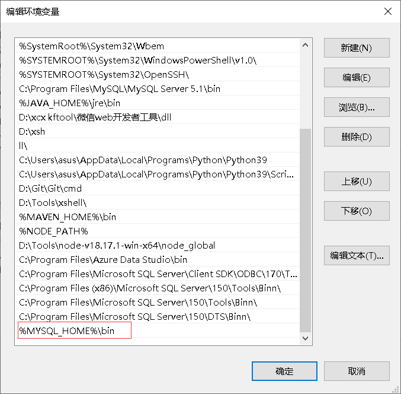
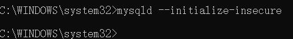
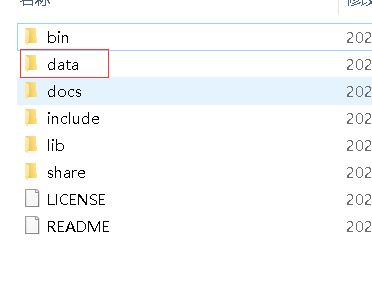
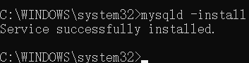
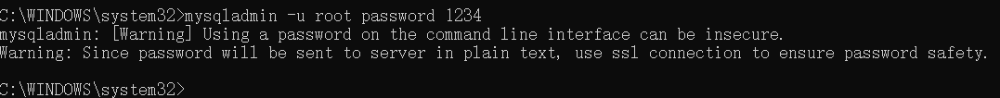
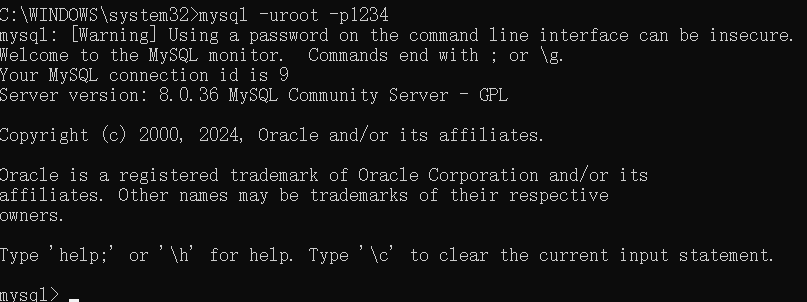
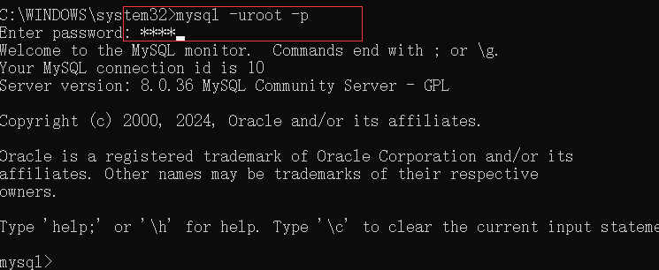

> MySQL现在有两个版本：
>
> - 商业版本：收费，免费试用30天，官方提供技术支持
> - 社区版本：免费，官方不提供任何技术支持
>
> 以下学习我们将以社区版为主。
>
> 官网：https://dev.mysql.com/downloads/mysql/


# 安装

> 访问官网，下载压缩包：




# 解压

> 解压到本地目录，目录不要带中文：




# 配置环境

> 配置环境变量，mysql的bin目录中存放的是一些可执行文件，如果想在任意目录下执行这些指令，就需要配置环境变量。
>
> 新建一个MYSQL_HOME变量，值就是mysql的跟目录：



> 然后在Path变量中添加mysql的bin目录就可以了：




# 检验

> 以管理员运行cmd，输入指令：

```shell
mysql
```


> 出现以上报错信息则安装成功。


# 初始化数据

> 以管理员运行cmd，输入指令：

```shell
mysqld --initialize-insecure
```



> 运行后，就会初始化MySQL数据，在根目录下就会生成一个date目录：



> date目录中存放的就是MySQL中的数据。


# 注册服务

> 将MySQL注册成一个启动服务，以管理员运行cmd，输入指令：

```shell
mysqld -install
```



> 现在电脑上已经安装好了MySQL服务。在服务中查看：


> MySQL已经注册为系统服务，并且设置为开机自启。


# 启动/停止服务

> 启动/停止命令：

```shell
net start mysql	#启动MySQL服务
net stop mysql	#停止MySQL服务
```


# 修改默认账户密码

> 执行命令：

```shell
mysqladmin -u root password 1234
```

> root是MySQL自带的账户，是超级管理员，为root指定密码为1234：



> 出现上述信息则设置成功。


# 登录

> 通过客户端连接MySQL，输入命令：

```shell
mysql -uroot -p1234
```

> -u指定使用哪个用户名，-p指定使用哪个密码：



> 报警告，建议不要把密码显示表示，可以这样登录：




# 卸载

> 以管理员运行cmd，输入命令：

```shell
net stop mysql
```

> 先停止MySQL服务，再移除：

```shell
mysqld -remove mysql
```

> 最后再删除MySQL相关目录及环境变量即可。


# 连接

> 登录时还可以指定-h数据库服务器地址、-P端口号：

```shell
# -h和-P是可选项
mysql -u用户名 -p密码 [-h数据库服务器地址 -P端口号]
```

> 如果不指定，则使用localhost和默认3306作为服务器IP及端口号
