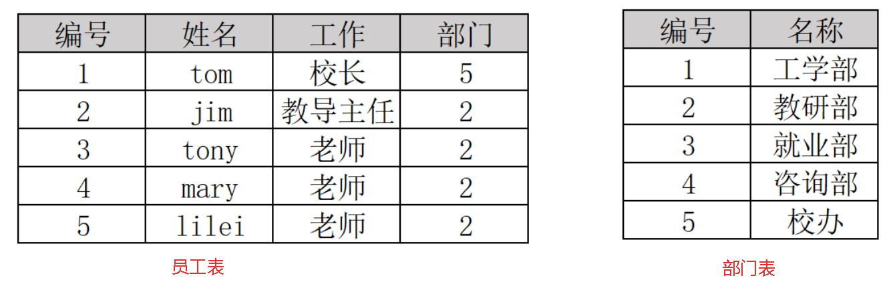
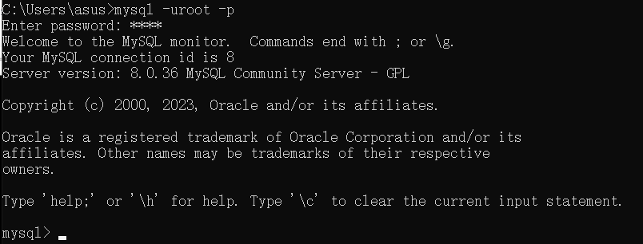
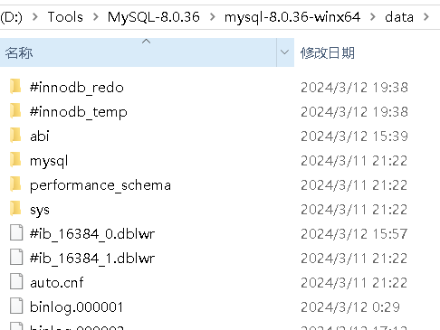
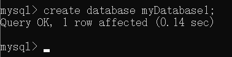
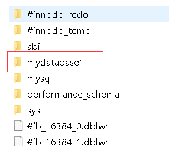
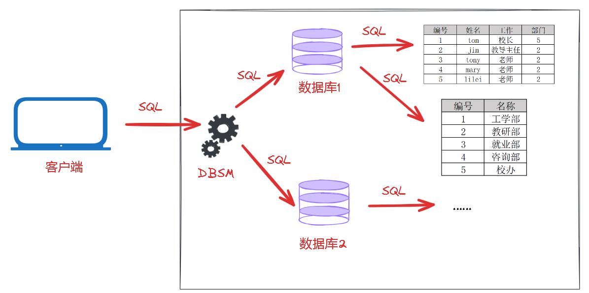

# 关系型数据库

> 关系型数据库：建立在关系模型基础上，由多张相互连接的<font color='red'>二维表</font>组成的数据库。
>
> 二维表是什么东西？看下面两张表：



> 员工表和部门表，分别记录员工的信息和部门的信息，仔细看，这与我们平时使用的excel非常相似，这就是二维表，有行和列的概念。
>
> 在关系型数据库中就是基于这种二维表存储数据，有以下特点：
>
> - 使用表存储数据，格式统一，便于维护
> - 使用SQL语言操作，标准统一，使用方便，可用于复杂查询


# MySQLの数据模型

> 我们在本地安装好了MySQL，我们的主机就作为了一台MySQL数据库服务器，我们要想操作MySQL就需要MySQL的客户端来连接服务器，也就是登录MySQL：

```pow
mysql -uroot -p
```



> 在MySQL服务中内置了一个软件DBMS，DBMS就是数据库管理系统，我们通过这个管理系统就可以操作数据库中的数据。
>
> 比如，我们通过客户端发送一条SQL给DBMS，告诉它我们要创建一个数据库，DBMS就会根据我们的SQL创建一个数据库。这个数据库在磁盘中以文件夹的形式存在。
>
> 就是安装MySQL时初始化数据后生成的文件夹：



> 里面已经有了一些文件夹，这是按照时默认自带的系统数据库。
>
> 下面我创建一个数据库：

```sql
create database myDatabase1;
```



> 生成的myDatabase1目录：



> 建库、健表流程，同时也是MySQL的数据模型：




# SQL

> SQL定义了操作关系型数据库的统一标准，只要是关系型数据库，就能使用SQL操作数据库。


## SQLの通用特性

> - SQL可以单行/多行书写，以；结尾
> - SQL可以使用 空格/缩进 来增强语句的可读性
> - MySQL数据库的SQL语句不区分大小写
> - 注释：
>   1. 单行注释：-- 注释内容 或 # 注释内容(MySQL特有)
>   2. 多行注释：/* 注释内容 */


## 分类

> SQL分成4大类：

| 分类 |            全称             | 说明                                                   |
| ---- | :-------------------------: | ------------------------------------------------------ |
| DDL  |  Data Definiton Languange   | 数据定义语言，用来定义数据库对象(数据库、表、字段)     |
| DML  | Data Mainpulation Languange | 数据操作语言，用来对数据库表中的数据进行增、删、改     |
| DQL  |    Data Query Languange     | 数据查询语言，用来查询数据库中表的记录                 |
| DCL  |   Data Control Languange    | 数据控制语言，用来创建数据库用户、控制数据库的访问权限 |
