> DML是数据操作语言，是对表中数据进行增、删、改操作。


# 添加表数据

> 1、指定字段添加数据：

```sql
insert into 表名(字段1,字段2) values(值1,值2);
```

> 为username、name、gander插入值：


> 但是运行时报错了，因为createTime字段是不填项，添加时我也没有为其指定默认值：


> updateTime也是必填项，添加时也要为其指定值，那么如何在sql中获取当前时间？可以使用函数now()，now()能获取当前日期时间：

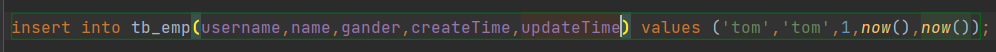

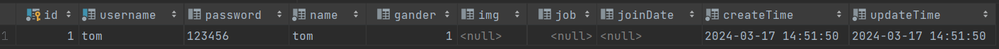

> 2、所有字段插入值：

```sql
insert into 表名 values(值1,值2,...);
```

> 表名中不加字段列表表示给所有字段插入值，但是values中需要给所有字段显示的把值写出来，即使这个字段有默认值，比如这里我没有给password插入值，是因为password有默认值，但还是报错了：

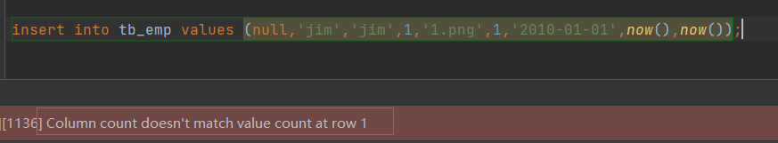

>  Column count doesn't match value count at row 1
>
> 列计数与第1行的值计数不匹配
>
> 这表示，字段列表指定了多少个字段，就需要values中指定多少个数据

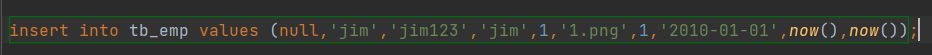

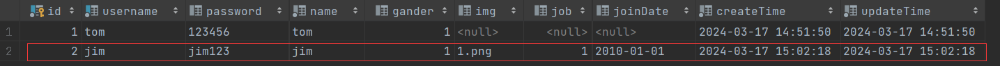

> 3、指定字段批量插入：

```sql
insert into 表名(字段1,字段2) values(值1,值2),(值1,值2),...;
```

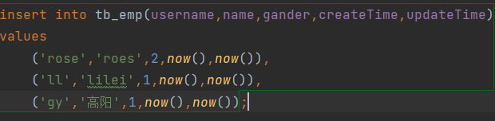

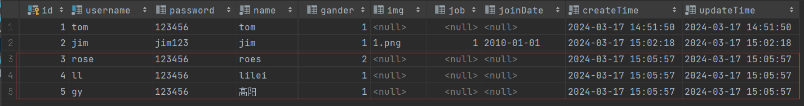

> 4、全字段批量插入：

```sql
insert into 表名 values(值1,值2),(值1,值2),...;
```

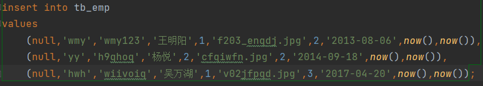

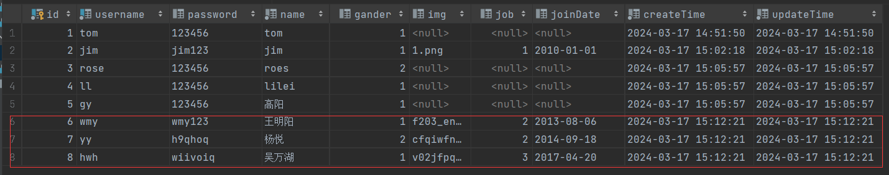


# 修改表数据

```sql
update 表名 set 字段1=值1,字段2=值2,... [where 条件];
```

> 下面我将表中id=1的这一条数据的name改为'张三'：

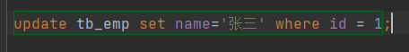

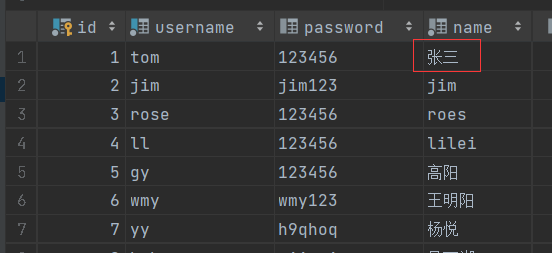

> 但是，不要忘记我们的表中还有修改时间字段，因此在更新数据时要加上这个字段的更新：

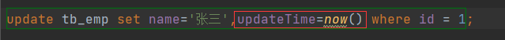

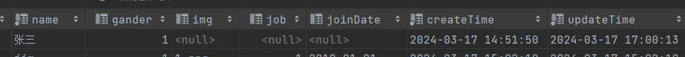

> 更新所有员工的入职时间，所有数据更新因此这里就不需要加条件了：


> 执行时报了一个警告说没有加where是否执行，点击execute即可：

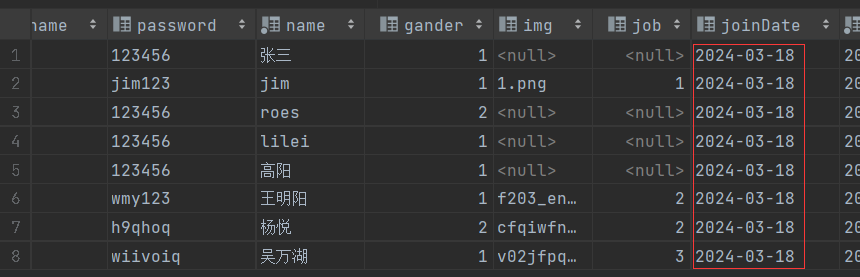

> 针对警告没有加where的情况，即修改字段的所有数据时我们可以where一个恒等式：

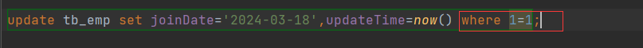


# 删除表数据

```sql
delete from 表名 [where 条件];
```

> 下面，我们删除id=1的员工信息：

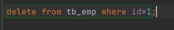

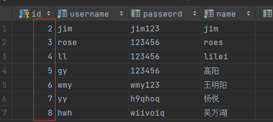

> 删除员工表中的所有数据，不需要加条件了：

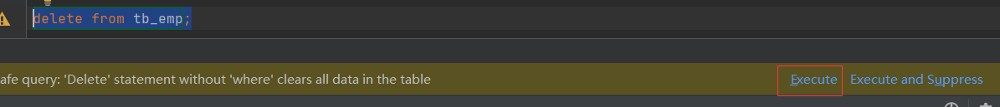

> 同样的警告，没有where是否删除所有，直接execute：

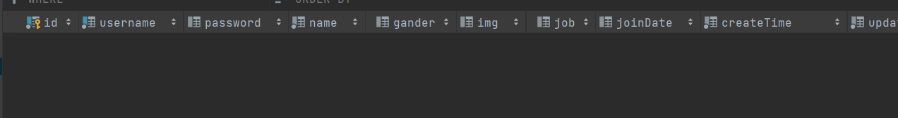

> 当然，也可以用恒等式：

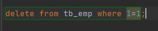


# 注意

> - 插入数据时，插入的值的顺序必须与字段列表中定义的字段顺序一致
> - 插入数据时，一条数据的个数必须与字段列表中定义的字段个数一致
> - 字符串和日期时间数据在插入时需要使用引号''或""
> - 插入的数据大小应该在字段的规定范围内
> - update的条件可有可无，没有条件时修改整张表数据
> - delete的条件可有可无，没有条件时删除整张表数据
> - delete不能删除某个字段的值，我们可以用update把字段的值改成null