# 概述

> 在项目开发中进行数据库设计时，会根据业务需求以及业务模块之间的关系，分析并设计表结构，由于业务之间相互关联，所以各个表结构之间也存在各种关联，基本上分为三种：
>
> - 一对多(多对一)
> - 多对多
> - 一对一


# 一对多

> 员工和部门就是一种一对多的关系，一个部门下有很多员工，而一个员工只对应一部门，在这种关系中，我们把部门称为一的一方，把员工称为多的一方。
>
> 以下是一个简单的部门表结构：
>
> 1. id：部门id，主键，自增
> 2. name：部门名称，长度2-10之间，非空，唯一
> 3. createTime：创建时间
> 4. updateTime：修改时间

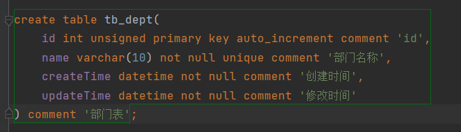

> 接下来，我们还需要将员工表的表结构改变一下，因为在之前设计员工表时，并没有考虑一个字段：归属部门，我们需要给员工表添加一个归属部门的字段，存储部门表的id，这样员工和部门之间就关联起来了：

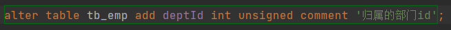

> 有了这个关联，我们就能很清晰的知道一个员工所在部门，只需将deptId和部门表的id做匹配即可。
>
> 上面说过，部门是一的一方，员工是多的一方，一个部门存在多个员工，但是一个员工只能有一个部门，在一对多的关系中我们把一的一方叫做父表，把多的一方叫做子表。
>
> <font color='red'>一对多关系实现：在表中多的一方添加字段，来关联一的一方的主键。</font>


## 外键

> 部门表插入数据：

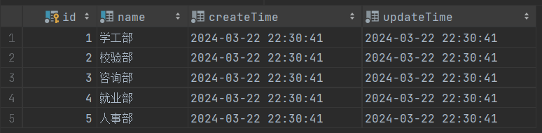

> 员工表关联部门表中的部门id：

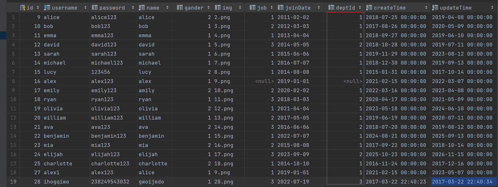

> 我们看最后一条数据，其deptId=3，现在我将部门id=3的部门删除：

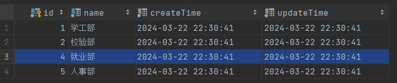

> 再来看员工表，发现该员工依然存在：

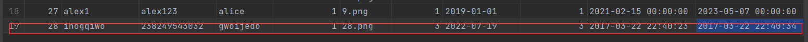

> 这并不合理，我们直接删除了部门，但是还有员工归属于该部门下，此时就出现了数据的不完整、不一致的问题。
>
> 原因是因为两张表在数据库层面，没有建立关联，所以无法保证数据的一致性和完整性。
>
> 简单来说就是两张表相互独立，它们之间没有联系，删除其中一张表的数据不会影响另一张表。
>
> 可是我们之前明明添加了deptId，来存储部门id实现与部门表之间的关联，这里为什么又说没有关联？因为上面的关联只存在于逻辑层面，对我们来说我们是知道它们之间有联系，但是对于数据库层面并没设置关联，即数据库并不知道它们之间有联系。
>
> 这就需要使用外键约束来解决：

```sql
-- 添加外键约束有两种
-- 1、创建表时添加外键约束
create table 表名(
	字段名 数据类型,
    ...
    -- 所有字段罗列完成后添加
    [constraint] [外键名] foreign key(外键字段名) references 主表(字段名)
);

-- 2、建完表后，添加外键
alter table 表名 add constraint 外键名 foreign key(外键字段名) references 主表(字段名);
```

> 我们使用图形化界面创建外键，需要先将删除的部门添加回来，否则会报错：

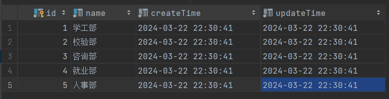

> 选中员工表右键【modify table】>>【foreign keys】：

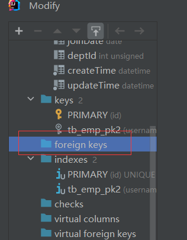

> - name是外键名称
> - traget table是需要关联的主表名称：

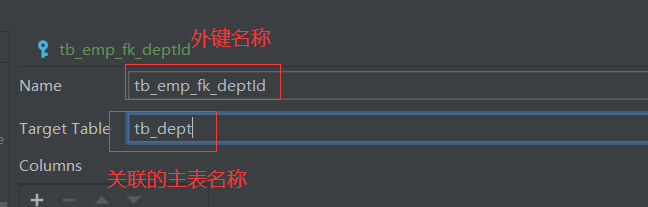

> 添加关联字段
>
> - column name：当前表中需要关联的字段
> - target name：目标表中需要被关联的字段

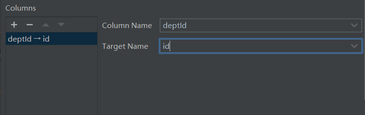

> 现在我再删除id=3的部门：

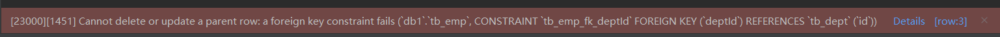

> 现在就会报错，说id=3的部门下有员工信息，要删除需要将deptId=3的员工删干净才行。
>
> foreign key定义的外键，我们叫物理外键。


### 物理外键

> - 概念：使用foreign key定义外键关联另一张表
> - <font color='red'>缺点：</font>
>   - 影响增、删、改的效率(需要检测外键关系)
>   - 仅用于单节点数据库，不适用于分布式、集群场景
>   - 容易引发数据库死锁问题，消耗性能
>
> 对于一些大型项目，需要分布式、集群场景一般不考虑物理外键，甚至有些项目明文禁用物理外键，我们开发时尽量使用逻辑外键：


### 逻辑外键

> - 概念：在业务层逻辑中，解决外键关联
> - 通过逻辑外键，就可以很方便的解决上述问题
>
> 逻辑外键就是上文我提到的，我们不给字段添加物理外键，让两张表的关联存在于逻辑层面，我们自己知道即可，至于数据的一致性和完整性就需要我们用代码实现了。


# 一对一

> 一对一关系比较典型的就是用户和身份证信息的关系，一个用户对应一张身份证，而一张身份证对应一个用户。
>
> 对于这种一对一的关系，经常用于单表的才分，将一张大表拆分成多个小表，如：将一张表的基础字段放在一张表中，将其他字段放在另一张表中，以提升操作效率。
>
> 举个例子，下面有一张用户信息表，字段为：
>
> - id：id
> - name：姓名
> - gander：性别
> - phone：电话号码
> - nationality：民族
> - birthday：生日
> - idcard：身份证号码
> - issued：签发机关
> - expire_begin：身份证有效期开始时间
> - expire_end：身份证有效期结束时间
>
> 像姓名、性别、手机号这些都是用户的基本信息，而民族、生日、身份证号等等都是用户的身份信息。在一个系统中如果对用户的基本信息查询频率特别高，而查询身份信息的频率不高，出于提高查询效率的考虑，我们可以把这张大表拆分成两张小表：用户的基本信息表和身份信息表。这两张表就是一对一的关系，那么在数据库层面如何体现它们的关联关系？
>
> 其实，一对一关系可以看成一种特殊的一对多关系，对于一对多，我们在多的一方添加外键，<font color='red'>对于一对一，我们在任意一方添加外键关联另一方的主键即可。为了保证一对一关系，我们还需要保证外键唯一，即添加unique约束。</font>
>
> 下面我们创建用户基本信息表：

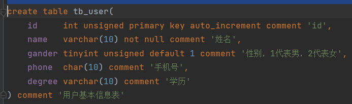

> 插入数据：

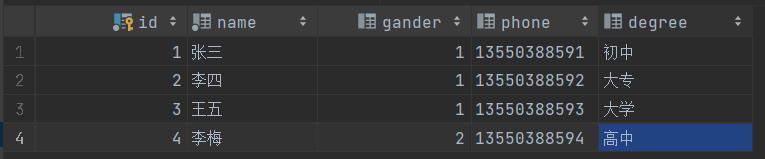

> 创建用户的身份信息表：

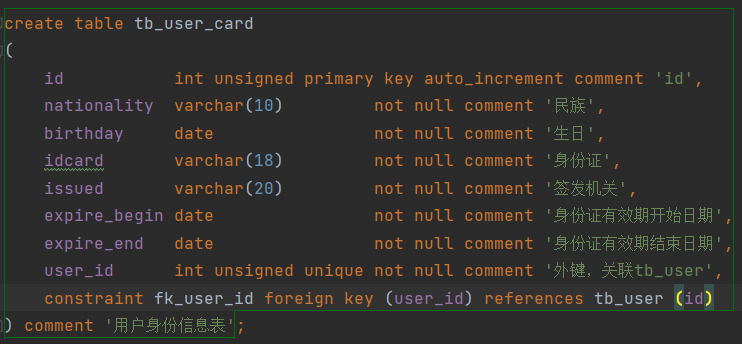

> 插入数据：

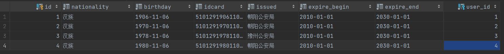

> 如果我要查询张三的身份信息，我只需要找到张三的id，然后在身份信息表中找到user_id与之对应的那条数据即可。


# 多对多

> 常见的多对多关系如学生与课程就是多对多关系，一个学生可以学多个课程，一个课程也可以被多个学生学习。
>
> 下面是一个例子：

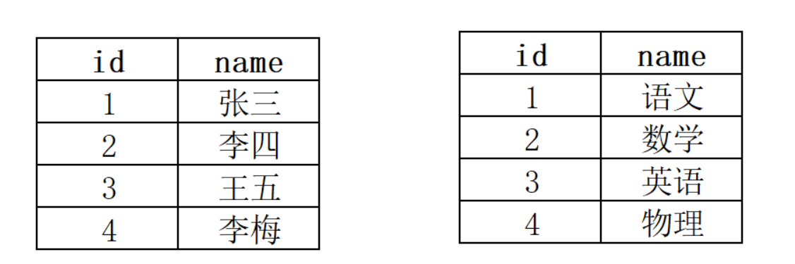

> 学生表和课程表，学生可以学习多门课程，假设张三学了语数外，那么如何与课程表关联?添加一个course_id外键字段然后存1，但是2和3怎么存？

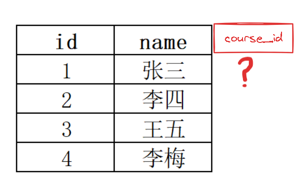

> 同样，课程可以被多个学生学习，添加一个外键字段student_id，我们假设语文被张三和李四学习，那么存入1后2该怎么存？

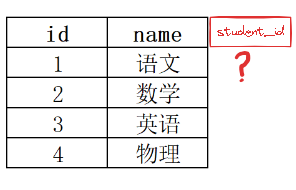

> 你会发现给每个表单独设置外键必不能满足需求，因此我们需要一个中间表声明两个外键来存储学生表和课程表的id：

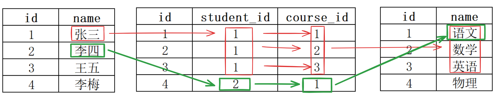

> 学生表：

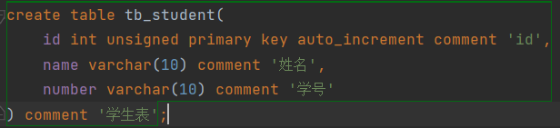

> 插入数据：

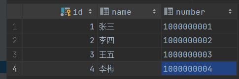

> 课程表：

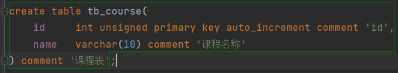

> 插入数据：

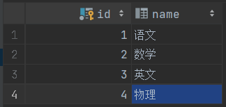

> 中间表：

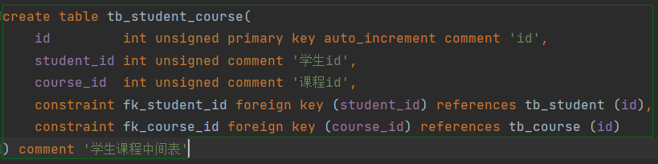

> 插入数据：

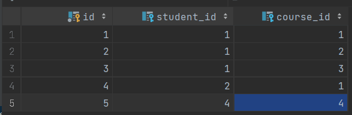


# 案例

> 下面我将以一个外卖项目为例，根据页面原型来设计'分类管理'、'菜品管理'、'套餐管理'的表结构。
>
> 我们所设计的这三个功能是管理端的功能模块，而非用户端，三个模块的主要功能如下：
>
> - 分类管理：管理菜品的类型
> - 菜品管理：管理菜品
> - 套餐管理：管理套餐信息
>
> 后台用户将这些菜品信息管理好后，用户端的用户就能看见这些菜品信息。
>
> 我们创建表结构的思路：
>
> 1. 首先需要根据页面原型分析各个模块涉及到的表结构，以及表结构之间的关系
> 2. 然后再分析各个表结构中具体的字段以及约束
>
> 首先我们看分类管理的页面原型：

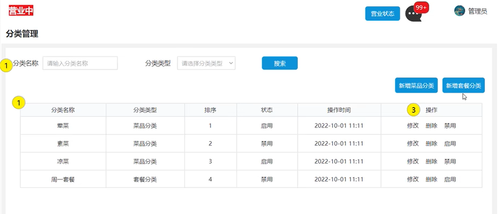

> 在这个表格中，有分类名称、分类类型、状态、操作时间等字段，同时两个按钮分别是新增菜品分类和新增套餐分析，也就是说这张表不仅维护了菜品的分类，也维护了套餐的分类。
>
> 我们先不看菜品管理和套餐管理的页面原型，我们可以推测一下分类和菜品还有套餐之间是什么关系。很明显一个分类下可以有多个菜品，比如荤菜有多道菜，但是一个菜品只能对应一个分类，因此菜品和分类是一对多的关系，菜品是多的一方，分类是一的一方。
>
> 我们看菜品的页面原型：

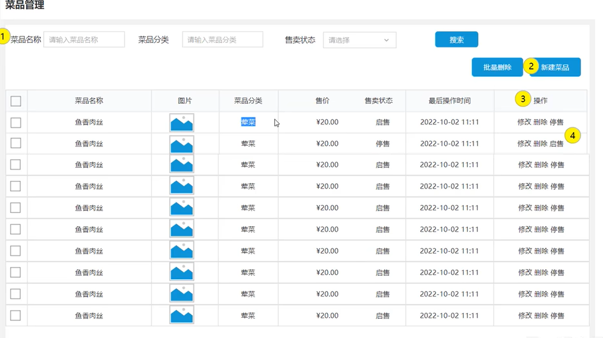

> 这张表中记录了菜品的信息字段，其中有一个字段是菜品分类，该字段就记录菜品的类型。
>
> 进入新增菜品页：

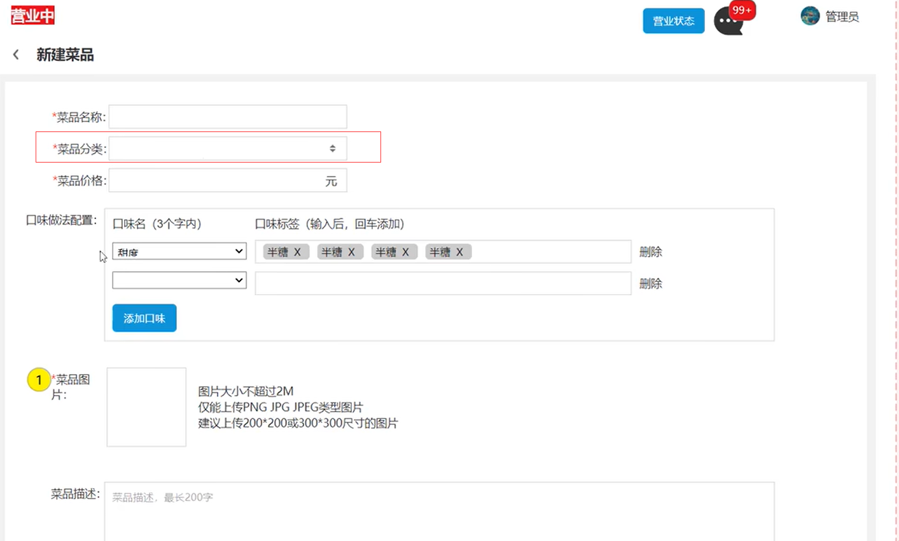

> 可以看到，新增菜品时明确要选择菜品的类型。所以在菜品表中就应该有一个分类的字段记录分类表的id，以此作为外键关联分类表的主键，关系图如下：

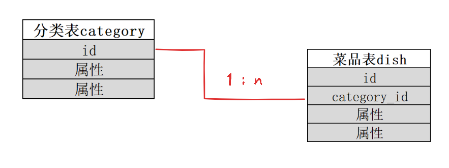

> 然后是分类与套餐的关系，套餐其实是菜品的集合，比如把2或3道菜打一个套餐对外出售。一份套餐只能是一种类型，比如超值午餐套、甜美下午茶套餐等，一种分类下可以有多种套餐，因此套餐和分类也是一对多的关系。关系图如下：

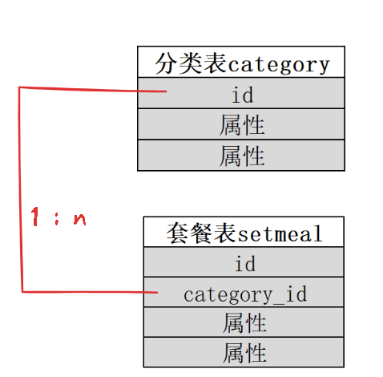

> 以上就是分类表与套餐和菜品之间的关系，我们再来看还有其他关系是我们没有注意到的吗？当然有，上面说过，套餐是多道菜品打包再一起的，因此套餐和菜品之间的关系我们还没有推断过。
>
> 我们来看添加套餐页面，这里添加时套餐菜品这里时需要添加菜品的：

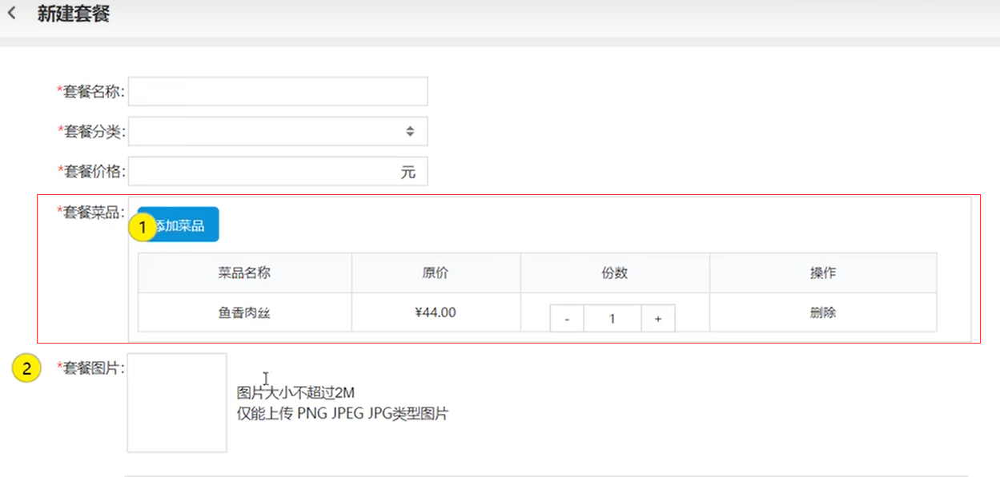

> 我们可以看出一个套餐可以添加多个菜品，反之一个道菜品可以出现在多个套餐中，因此套餐和菜品之间时多对多的关系。多对多中两者之间需要中间表来维护，关系图如下：

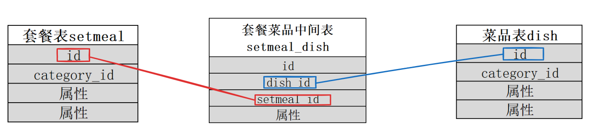

> 三张表的完整关系图如下：

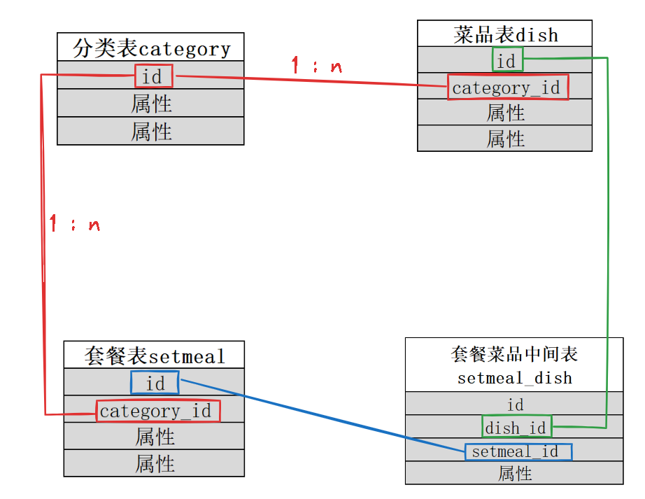

> 下面就结合我们分析的表结构关系来创建相应的表。
>
> 1、我们先完成分类表的创建，结合页面原型：

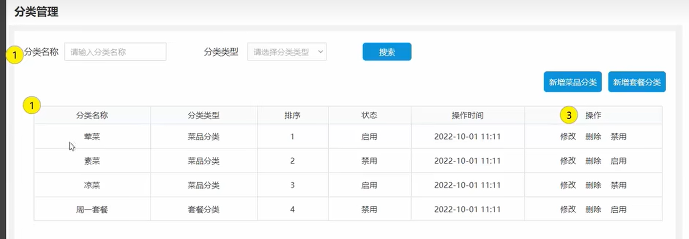

> 从页面中我们可以提炼出字段为：
>
> - 分类名称
> - 分类类型
> - 排序
> - 状态
> - 操作时间
>
> 然后是字段要求：


> 表结构如下：


> 2、菜品表，结合页面原型：

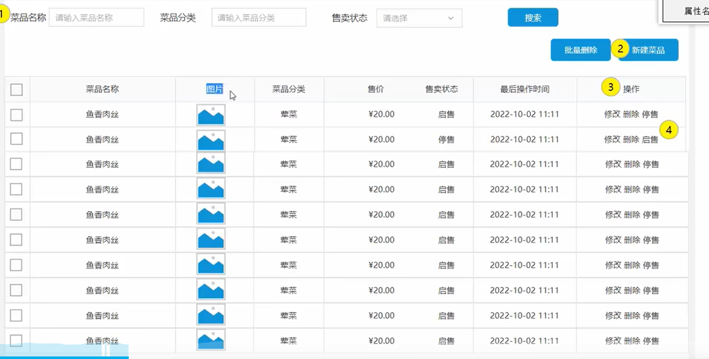

> 字段提炼：
>
> - 菜品名称
> - 图片
> - 菜品分类
> - 售价
> - 售卖状态
> - 最后操作时间
> - 外键关联分类表主键
>
> 字段限制，口味暂不考虑：

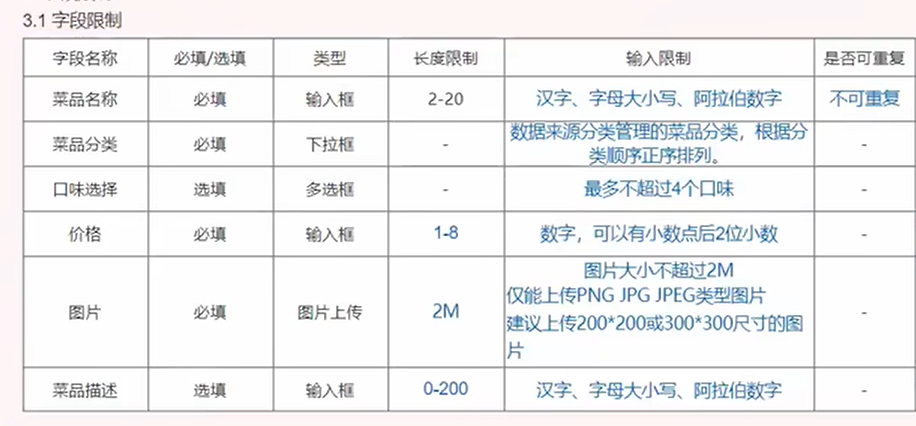

> 表结构如下：

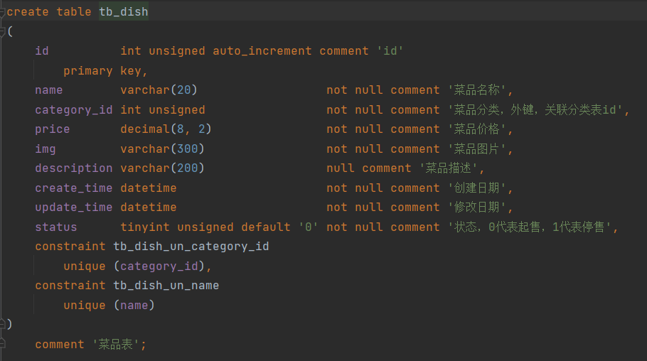

> 3、套餐表，结构页面原型：

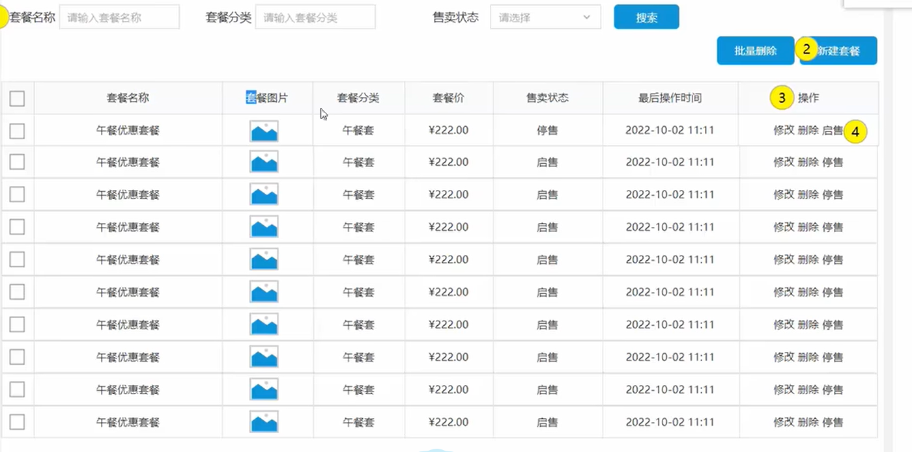

> 字段提炼：
>
> - 套餐名称
> - 套餐图片
> - 套餐类型
> - 套餐价格
> - 售卖状态
> - 最后修改日期
>
> 字段限制：

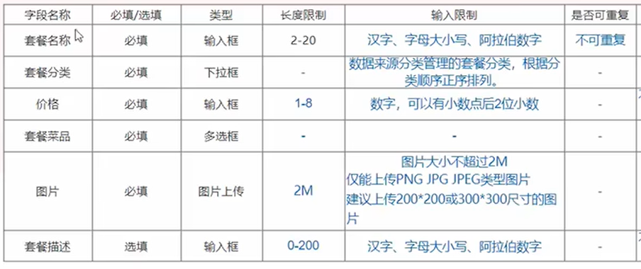

> 表结构如下：


> 4、套餐菜品中间表，字段：
>
> - id
> - 外键，关联套餐表主键
> - 外键，关联菜品表主键
> - 份数，该套餐中该菜品有几份，比如超值午餐套(该套餐)中有菜品红烧肉(该菜品)1份(几分)，菜汤(该菜品)1份(几份)，米饭(该菜品)2份(几份)
>
> 份数是在添加套餐页面中添加菜品时维护的：

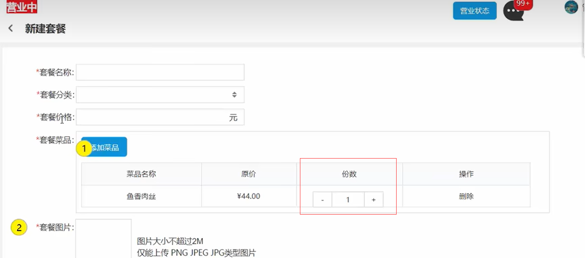

> 份数放在菜品表和套餐表中都不合适，只有放在中间表中最合适。
>
> 表结构如下：

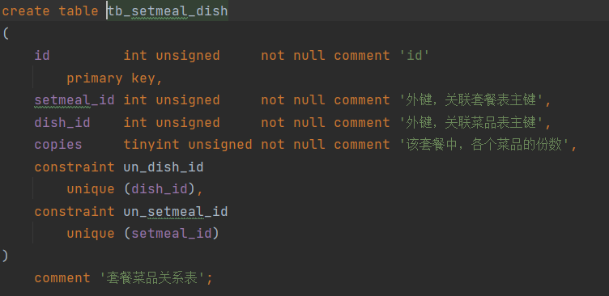

> 以上，4张表的表结构分析和表创建就完成了。