> 右侧【Database】>>【+】>>【Data Source】>>【MySQL】：

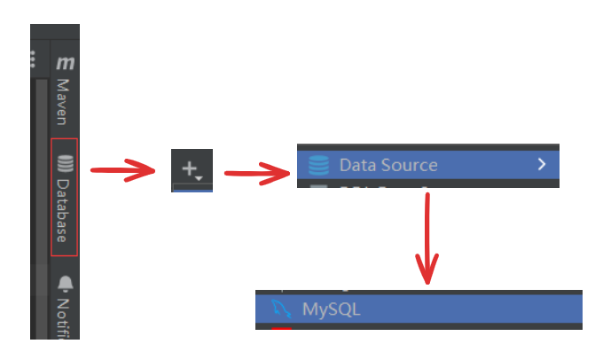

> 输入用户名和密码连接数据库：

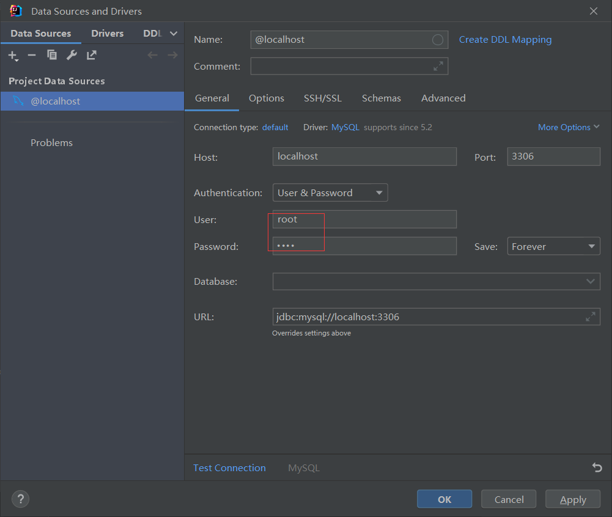

> 如果是第一次连接，需要下载jdbc驱动：Download missing driver files
>
> 点击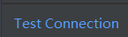测试连接：

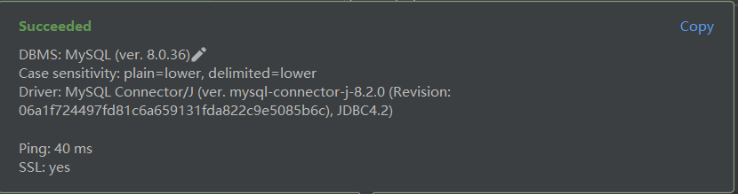

> 连接界面：

> 发现没有数据库，看这里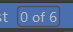，是n or m的形式，表示一共有m个数据库展示了n个，这里是6个数据库展示了0个，所以才没有。

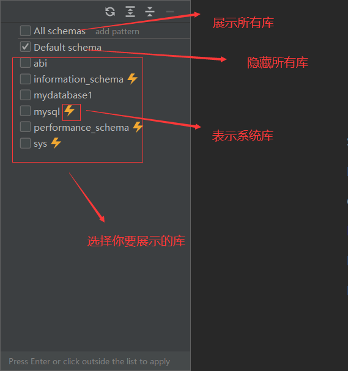

> 点，选择打开控制台，可以执行SQL，运行点：

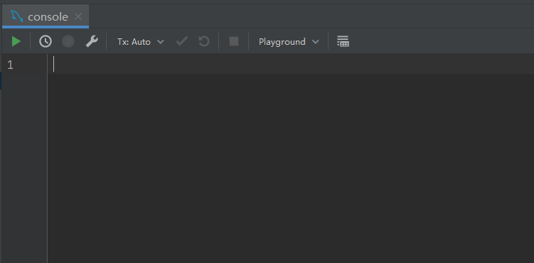

> 切换数据库，右上角：

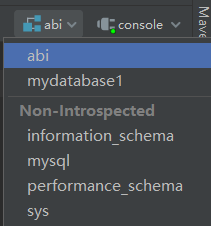

> 打开上次关闭的控制台，右键连接：

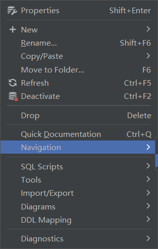

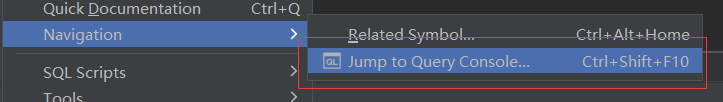

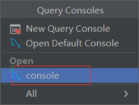

> 控制台重命名，右键控制台：

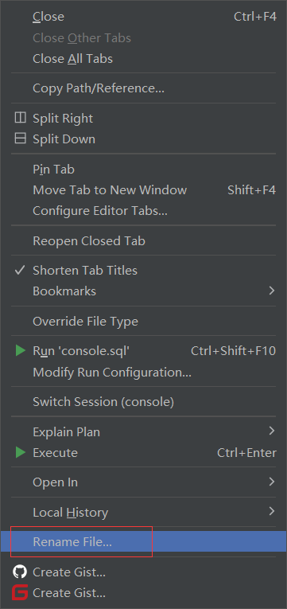

> 关闭连接：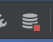

