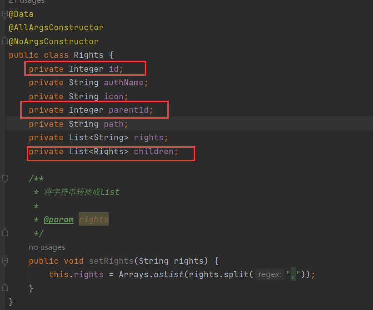

将一个list转换成tree，list中存储实体，这个实体建议有这3个属性：

- id，可以是String，也可以是Integer
- parentId，同id，记录实体的父级id，如果该实体本来就是父级，那么为null(或者0、'0')
- children，为List，存储父节点的子节点，如果父节点无子节点，则为null

如果， 实体存储在数据表中，建议只需要设置id和parentId，不需要设置children。

比如，rights(权限)表：


这张表也就id和parent_id字段。下面以rights实体举例：



将`List<Rights>`转换成Tree结构，最简单的方法，使用嵌套循环：

```java
@GetMapping("/a")
public Object test() {
    List<Rights> rightsList = rightsMapper.select2();
    // 空list
    List<Rights> result = new ArrayList<>();
    // 遍历出父节点
    for (Rights rights : rightsList) {
        // pid=null,为父节点，加入到空list中
        if (rights.getParentId() == null) result.add(rights);

        // 嵌套遍历
        for (Rights r : rightsList) {
            // 子节点pid=父节点id，则将子节点加入到父节点中
            if (r.getParentId() == rights.getId()) {
                // 如果父节点的children=null，则设置为空数组
                if (rights.getChildren() == null) rights.setChildren(new ArrayList<>());
                rights.getChildren().add(r);
            }
        }
    }
    return result;
}
```

结果：

```json
[{
	"id": 2,
	"authName": "用户管理",
	"icon": "icon-user",
	"parentId": null,
	"path": null,
	"rights": null,
	"children": [{
		"id": 3,
		"authName": "用户列表",
		"icon": null,
		"parentId": 2,
		"path": "users",
		"rights": ["view", "add", "edit", "delete"],
		"children": null
	}]
}, {
	"id": 4,
	"authName": "角色管理",
	"icon": "icon-roles",
	"parentId": null,
	"path": null,
	"rights": null,
	"children": [{
		"id": 5,
		"authName": "角色列表",
		"icon": null,
		"parentId": 4,
		"path": "roles",
		"rights": ["view", "add", "edit", "delete"],
		"children": null
	}]
}, {
	"id": 6,
	"authName": "商品管理",
	"icon": "icon-goods",
	"parentId": null,
	"path": null,
	"rights": null,
	"children": [{
		"id": 7,
		"authName": "商品列表",
		"icon": null,
		"parentId": 6,
		"path": "goods",
		"rights": ["view", "add", "edit", "delete"],
		"children": [{
			"id": 9,
			"authName": "aaa",
			"icon": null,
			"parentId": 7,
			"path": "goods/aaa",
			"rights": ["view", "add", "edit", "delete"],
			"children": null
		}]
	}, {
		"id": 8,
		"authName": "商品种类",
		"icon": null,
		"parentId": 6,
		"path": "types",
		"rights": ["view", "add", "edit", "delete"],
		"children": null
	}]
}]
```

时间复杂度为O(n**2)，n为rightsList的长度。

第二种方法，使用递归

```java
public Object test() {
    List<Rights> result = rightsMapper.select2();
	// 准备一个空list
    List<Rights> rightsList = new ArrayList<>();
    // 循环，找出父节点
    for (Rights rights : result) {
        if (Objects.equals(rights.getParentId(), null)) {
            /*
            将父节点和list传入，查找父节点的子节点
            若没找到，findChildren直接返回父节点，
            若找到，findChildren返回包含子节点的父节点
            最后将父节点加到空list中
            */ 
            rightsList.add(findChildren(rights, result));
        }
    }
    return rightsList;
}

// 传入父节点和整个list
public Rights findChildren(Rights parent, List<Rights> list) {
    // 遍历list
    for (Rights rights : list) {
        // pid = id，说明该父节点有子节点
        if (Objects.equals(rights.getParentId(), parent.getId())) {
            // 若父级的children为null，赋值为空list
            if (parent.getChildren() == null) parent.setChildren(new ArrayList<>());
            // 将子级加入到父级中，然后递归调用自己，将子级作为父级去找子级的子级
            parent.getChildren().add(findChildren(rights, list));
        }
    }
    /*
    遍历完list，如果没有发现节点有子级，说明节点没有子节点，直接返回该节点
    如果有子节点，已经将子节点加入到该父节点中了，也是直接返回
    */ 
    return parent;
}
```

时间复杂度为O(n**2)，n为result的长度

第三种，使用stream流加递归的方式：

```java
public Object test() {
    List<Rights> rightsList = rightsMapper.select2();
    return listToTree(null, rightsList);
}


public List<Rights> listToTree(Integer id, List<Rights> list) {
    // 根据传入的父节点id，筛选出子节点，如果传入的是null，则筛选出父节点
    List<Rights> result = list.stream().filter(rights -> Objects.equals(rights.getParentId(), id))
        /*
        map将每个元素映射成新的对像。过滤后的List<Rights>中只包含根节点(pid=null)的Rights
        即map将这些Rights映射成新的Rights，映射的方式就是map()中定义的lambda，这里是将根节点
        进行递归，查找子节点，并填充到根节点
        */
        .map(parent -> {
            /*
            递归调用，传入根节点的id，如果根节点有子节点，那么filter后会过滤出子节点，然后将子节点填充到根节点中
            如果根节点没有子节点，那么filter后会过滤掉根节点，
            */ 
            parent.setChildren(listToTree(parent.getId(), list));
            // 返回节点，因为map要映射成新的对象，你得给map返回东西
            return parent;
            // collect(Collectors.toList())根据stream中的处理，得到list
        }).collect(Collectors.toList());
    return result;
}
```

- 在流处理操作中，`filter` 操作的时间复杂度为 O(n)，`map` 操作的时间复杂度为 O(1)，`collect` 操作的时间复杂度为 O(m)。
- 递归调用的时间复杂度为 O(h)，其中 h 是树的高度。

整个方法的时间复杂度可以近似为 O(n + m + h)。与 O(n^2) 相比，当输入规模较大时，O(n + m + h) 通常会比 O(n^2) 更快。

优化，使用HashMap，构建一个以 `parentId` 为键、以子节点列表为值的映射（HashMap），然后递归构建树。这将把查找子节点的时间复杂度从 O(n) 降低到 O(1)，整体时间复杂度降低到 O(n)。

首先看一下映射之后的数据

```java
// 这种方法必须确保parentId不为null，因为HashMap的key不能为null。如果是根节点，数据表中可将parentId设为0或"0"

List<Rights> rights = rightsMapper.select2();
// 构建以 parentId 为键，子节点列表为值的映射
Map<Integer, List<Rights>> childrenMap = list.stream()
    /*
    groupingBy分组，Rights::getParentId方法引用，引用getParentId方法获取pid，然后按照pid进行分组，把pid相同的节点作为同  	一个pid(key)的value
    */
    .collect(Collectors.groupingBy(Rights::getParentId));
```

结果：

```json
{
  "0": [
    {
      "id": 2,
      "authName": "用户管理",
      "icon": "icon-user",
      "parentId": 0,
      "path": null,
      "rights": null,
      "children": null
    },
    {
      "id": 4,
      "authName": "角色管理",
      "icon": "icon-roles",
      "parentId": 0,
      "path": null,
      "rights": null,
      "children": null
    },
    {
      "id": 6,
      "authName": "商品管理",
      "icon": "icon-goods",
      "parentId": 0,
      "path": null,
      "rights": null,
      "children": null
    }
  ],
  "2": [
    {
      "id": 3,
      "authName": "用户列表",
      "icon": null,
      "parentId": 2,
      "path": "users",
      "rights": [
        "view",
        "add",
        "edit",
        "delete"
      ],
      "children": null
    }
  ],
  "4": [
    {
      "id": 5,
      "authName": "角色列表",
      "icon": null,
      "parentId": 4,
      "path": "roles",
      "rights": [
        "view",
        "add",
        "edit",
        "delete"
      ],
      "children": null
    }
  ],
  "6": [
    {
      "id": 7,
      "authName": "商品列表",
      "icon": null,
      "parentId": 6,
      "path": "goods",
      "rights": [
        "view",
        "add",
        "edit",
        "delete"
      ],
      "children": null
    },
    {
      "id": 8,
      "authName": "商品种类",
      "icon": null,
      "parentId": 6,
      "path": "types",
      "rights": [
        "view",
        "add",
        "edit",
        "delete"
      ],
      "children": null
    }
  ],
  "7": [
    {
      "id": 9,
      "authName": "aaa",
      "icon": null,
      "parentId": 7,
      "path": "goods/aaa",
      "rights": [
        "view",
        "add",
        "edit",
        "delete"
      ],
      "children": null
    }
  ]
}
```

```java
public Object test1() {
    List<Rights> rights = rightsMapper.select2();
	// 从根节点开始，因此pid=0
    return listToTree(0, rights);
}

public List<Rights> listToTree(Integer id, List<Rights> list) {
    // 构建以 parentId 为键，子节点列表为值的映射
    Map<Integer, List<Rights>> childrenMap = list.stream()
        .collect(Collectors.groupingBy(Rights::getParentId));

    // 递归构建树结构
    return buildTree(id, childrenMap);
}

private List<Rights> buildTree(Integer parentId, Map<Integer, List<Rights>> childrenMap) {
    /*
        * 根据传入的pid作为key获取对应的子节点列表
        * getOrDefault获取key对应的value，第二个参数是默认值，如果key存在，返回key的value，否则返回默认值
        * Collections.emptyList()设置一个空list
        * */
    List<Rights> children = childrenMap.getOrDefault(parentId, Collections.emptyList());

    // 为每个子节点递归设置其子节点，一开始传入的pid=0，即最先从根节点list开始遍历
    for (Rights child : children) {
        child.setChildren(buildTree(child.getId(), childrenMap));
    }
    // 返回节点节点list
    return children;
}
```

举例，上面的映射中，key=0的键，对应的是根节点list，其中有3个根节点，简化为[2,4,6]，然后遍历[2,4,6]，首先是2，拿到2的id=2，将id=2以及完整的映射递归传入自身，也就是去完整的映射中查找key=2的键，这个键对应的就是id=3这个节点list，简化为[3]。然后遍历3的节点list，继续递归3，3没有子节点，返回3，然后将返回的3节点存入2的子节点中，然后继续遍历4、6循环往复直到4和6的所有子节点都存入其中，再将[2,4,6]返回，此时的[2,4,6]已经包含了子节点了。

封装成工具类：

```java
package com.lwn.utils;

import java.util.List;
import java.util.Map;
import java.util.stream.Collectors;

/**
 * list转换成tree的工具类
 */
public class TreeUtils {
    // 定义一个接口，确保传入的类型包含getId、getParentId和setChildren方法
    public interface TreeNode<T> {
        Comparable getId();

        Comparable getParentId();

        void setChildren(List<T> children);
    }

    /**
     * 创建HashMap，通过pid进行分组，将同一组的节点整合为list
     * pid作为key，节点list作为value
     *
     * @param pid  节点的父节点id，只能接收String和Integer类型
     * @param list 需要转换成tree的list
     * @param <T>
     * @return 转换成tree后的list
     */
    public static <T extends TreeNode<T>> List<T> listToTree(Comparable pid, List<T> list) {
        Map<Comparable, List<T>> map = list.stream().collect(Collectors.groupingBy(TreeNode::getParentId));

        return buildTree(pid, map);
    }

    /**
     * 通过pid得到对应节点list，遍历list，递归将节点的子节点填充到自己
     * 返回包含子节点的节点list
     *
     * @param pid 节点的父节点id，只能接收String和Integer类型
     * @param map 完整的pid与节点list的映射
     * @param <T>
     * @return 转换成tree后的list
     */
    public static <T extends TreeNode<T>> List<T> buildTree(Comparable pid, Map<Comparable, List<T>> map) {
//        List<T> list = map.getOrDefault(pid, Collections.emptyList());
        List<T> list = map.getOrDefault(pid, null);
        if (list != null) {
            for (T t : list) {
                t.setChildren(buildTree(t.getId(), map));
            }
        }
        return list;
    }
}
```

使用时，需要实体类继承TreeNode接口：


