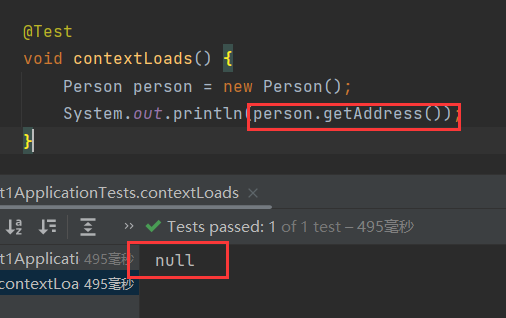
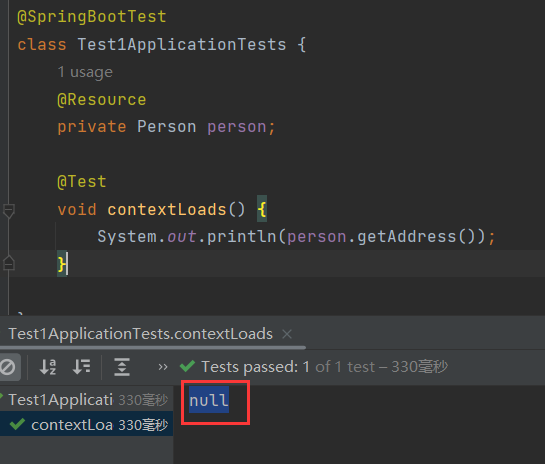
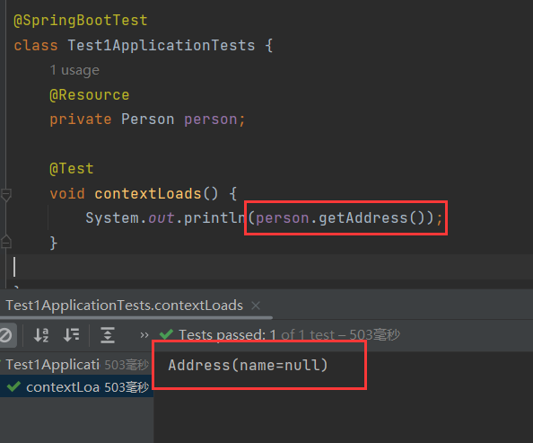
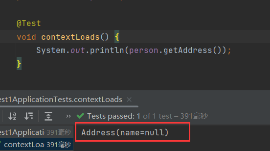
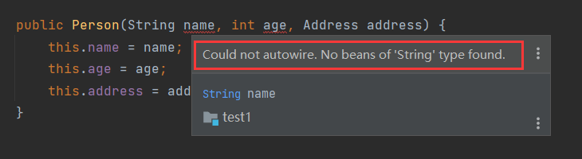
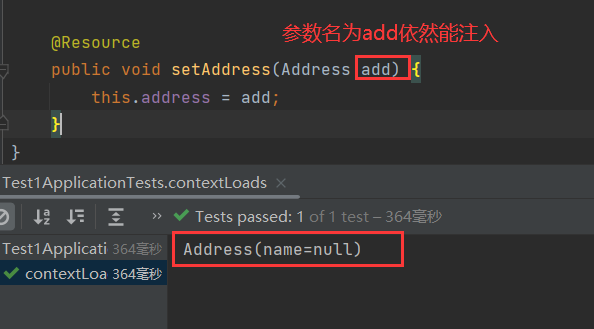
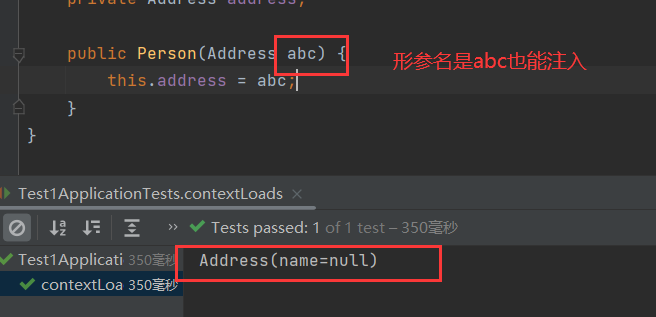

# 1 区别

`Bean`和普通对象一个较大的区别就是，普通对象其内部的引用型属性，再创建普通对象时，如果没有初始化，那么其属性为`null`，比如这种情况：

有一个`Person`：

```java
public class Person {
    private String name;
    private int age;
    private Address address;
}
```

其内部的属性`address`是另一个对象`Address`：

```java
public class Address {
    private String name;
    private ...;
}
```

创建`Person`，用无参构造创建，`Person`内部的属性为默认值：



但是`Bean`不一样，如果`Person`声明为`Bean`，那么spring容器在创建这个`Bean`时会尝试去注入它内部的属性，前提是IOC中有对应类型的`Bean`。

将`Person`和`Address`声明为`Bean`：

```java
@Data
@Component
public class Person {
    private String name;
    private int age;
    private Address address;
}

@Data
@Component
public class Address {
    private String name;
}
```

这时再来获取`Person`内部的属性：



依然是`null`，这是因为没有触发自动注入，上面的说明不是很清楚，准确来说spring创建`Bean`注入内部的属性时需要我们明确的指出这个属性需要自动注入，spring才会去尝试注入。

能触发自动注入的方式有以下几种：

- 通过自动注入的注解：`@Autowired`、`@Resource`等。
- 通过构造。
- 通过`setter()`和自动注入的注解。

第一种方式经常在使用，很常见，下面演示第二种和第三种：

为`address`创建构造：

```java
@Data
@Component
public class Person {
    private String name;
    private int age;
    private Address address;

    public Person(Address address) {
        this.address = address;
    }
}
```

这样就会触发自动注入的行为，spring就会在IOC中找到`Address`类型的`Bean`，然后注入到`address`中：



第三种方式为`address`创建`setter()`，并声明自动注入的注解：

```java
public class Person {
    private String name;
    private int age;
    private Address address;

    @Resource
    public void setAddress(Address address) {
        this.address = address;
    }
}
```

这样也会触发自动注入的行为：



使用这3中方式的前提是自生首先得是`Bean`，同时IOC中也需要有被注入的类型。

在使用第二种方式时，如果不止注入`address`，还要注入另外两个属性就会报错：



在IOC中找不到`String`类型的`Bean`，也就没法注入。

另外，我们知道`Bean`的名字默认是类名首字母小写，那么在使用方法二和三的使用，如果形参名和`Bean`名不一样，能注入吗？

答案是能的：





可见注入看的是类型，而不是`Bean`名称。


# 2 总结

在spring创建`Bean`时，我们能控制spring是否触发自动注入的行为，有3种方式：

1. 通过自动注入注解：`@Autowired`、`@Resource`等。
2. 通过构造。
3. 通过`setter`和自动注入注解。

注入的前提是IOC中有被注入的类型。