> 有一个接口A，现在我要创建A的实例，那么我就创建实现类B实现A，然后实例化B的实例来创建A的实例：

```java
package com.lwn.mapper;
// A接口
public interface A {
    // A的抽象方法aMethod1
    public void aMethod1();
}
```

> 然后创建B来实现A：

```java
package com.lwn;

import com.lwn.mapper.A;

public class B implements A {
    @Override
    public void aMethod() {
        // 方法体具体实现
        System.out.println("B实现了A的aMethod方法");
    }
}
```

> 然后创建B的实例，进而创建了A的实例：

```java
@Test
public void test3(){
    A a = new B();
    // 现在我可以调用aMethod方法
    // 这个方法具体实现是由B来实现的
	a.aMethod();
}
```

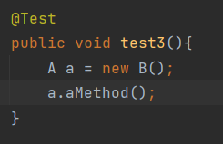

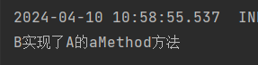

> 但是这种方法比较繁琐，我仅仅只是创建一个A的实例就需要创建B然后通过实例化B来创建，假如我在场景中只使用一次A的实例，那么我还要为了这一次使用去创建B，不觉得很麻烦吗？，因此我们可以使用内部类来省略创建B类的过程，我直接在要使用的地方定义内部类来实例化A：

```java
@Test
public void test3(){
    new A(){
        @Override
        public void aMethod() {
            // 实现方法体
            System.out.println("由匿名类来实现A的aMethod方法");
        }
    };
}
```

> 我们可以直接把这个实例赋值给A类变量，这样就拿到了A的实例：

```java
@Test
public void test3(){
    A a = new A(){
        @Override
        public void aMethod() {
            // 实现方法体
            System.out.println("由匿名类来实现A的aMethod方法");
        }
    };
    a.aMethod();
}
```

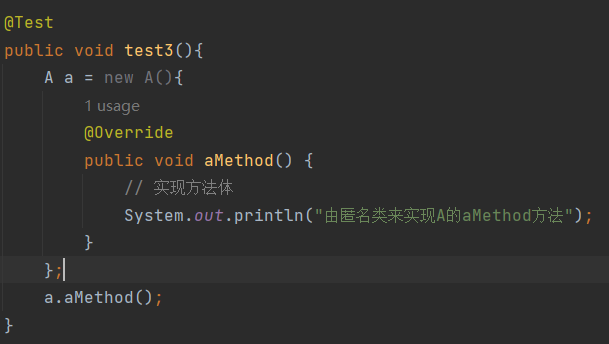

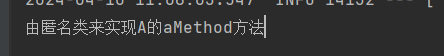

> 可是我觉得使用内部类还是不够简洁，那么我们可以使用lambda表达式来对匿名类进行优化，使代码变得简洁：

```java
@Test
public void test3(){
    A a = () -> {
        System.out.println("使用lambda表达式实现A的aMethod方法");
    };
    a.aMethod();
}
```

> lambda表达式：(形参名列表) -> {方法具体实现}，你可以这样来看，将(形参名列表)中'形参名列表'替换掉抽象方法中的形参列表的形参名，将{方法具体实现}作为抽象方法的具体实现，这里以aMethod方法为例，() -> {System.out.println("使用lambda表达式实现A的aMethod方法");}，将()中的形参名替换为aMethod方法中的形参名，aMethod中没有形参，即不需要替换参数，因此()中不用给形参名，将{System.out.println("使用lambda表达式实现A的aMethod方法");}作为aMethod方法的方法体，最终的形成过程如下：

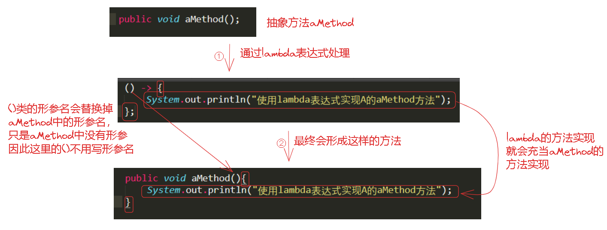

> 这里举一个有形参的抽象方法的lambda实现：

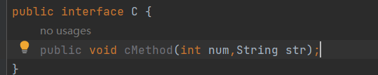

> 抽象方法cMethod()有两个参数一个是int，一个是String，因此在定义lambda时也要有两个参数名：

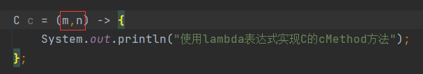

> 最终形成的方法是：

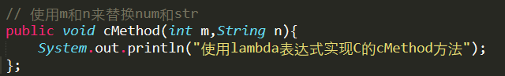

> 可以看到这里我就是用m和n来替换了原方法中的num和str参数名。这里我一直强调参数名是因为，这里是真的是一个参数名，就跟我们定义方法一样：
>
> 方法名(形参类型 形参名称,...)，这里的参数名就是形参名称。实际上Lambda 表达式的参数列表中不允许直接写入具体的值，也就是写成这样会报错：

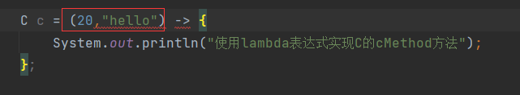

> 因为要拿这个参数名来替换原来的参数名，如果是具体值你觉得替换成这样合适吗：

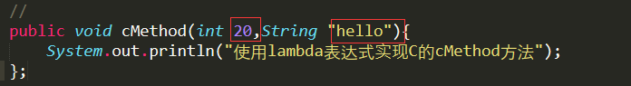

> 方法体内可以使用这些参数，也可以不使用：

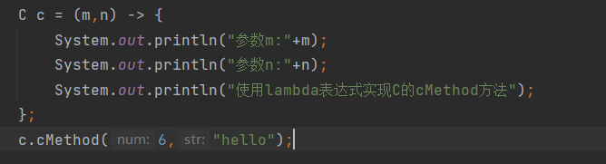

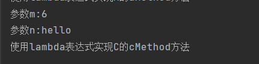

> ()中定义的参数名是随意的，可以与原来的参数名一致，但是要保证参数个数一样。
>
> 但是使用lambda表达式需要要求接口是一个函数式接口，也就是只有一个抽象方法，这很好理解，lambda表达式是内部类的优化简写，是语法糖，本质上是对接口的实现，如果该接口有多个抽象方法，那么其实现就得实现所有抽象方法，以lambda表达式的语法来看显然只能实现一个抽象方法，因此要保证接口只有一个抽象方法。
>
> 如果一个方法的形参是一个接口的实现，因为lambda表达式本质上是对接口的实现，我们可以用lambda来作为这个参数：

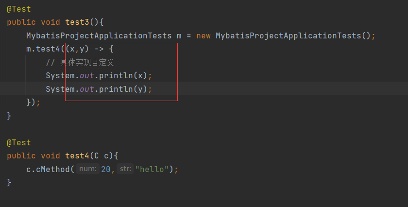

> test4方法接收一个C的实例，因此在调用test4方法时，我在形参列表中用lambda表达式定义了该实例。
>
> test4内部负债调用该接口方法。
>
> 注意
>
> - lambda表达式只是对接口的实现，也就是说其本身不会调用任何方法，这里很容易理解成：对于()->{具体实现}这里会执行{具体实现}这部分内容，但其实不会。要想执行{具体实现}，就需要调用接口的方法。
>
> - lambda只对函数式接口进行实现，同时lambda表达式也是该函数式接口的实例，即它即实现了函数式接口，也实例化了函数式接口。
>
> - 如果一个方法A的形参是一个函数式接口类型B，假设形参为b，那么要执行lambda表达式的方法体就需要在A中使用a来调用B的抽象方法，比如：
>
>   void A(B b) { b.method() }
>
> - 如果是有参的lambda表达式，而且在方法体中需要用到这个参数，那么需要在用到接口的方法中定义参数，比如：
>
>   接口A：
>
>   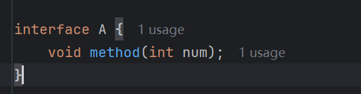
>
>   方法t用到接口A：
>
>   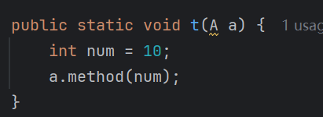
>
>   如果lambda表达式中的方法体中要用到参数，需要在t中定义参数并传入method：
>
>   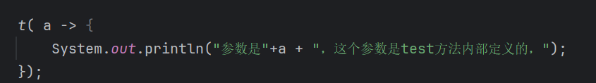
>
>   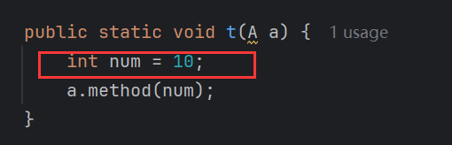