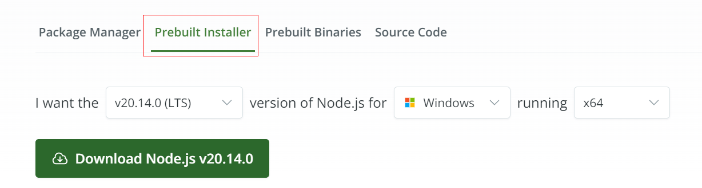
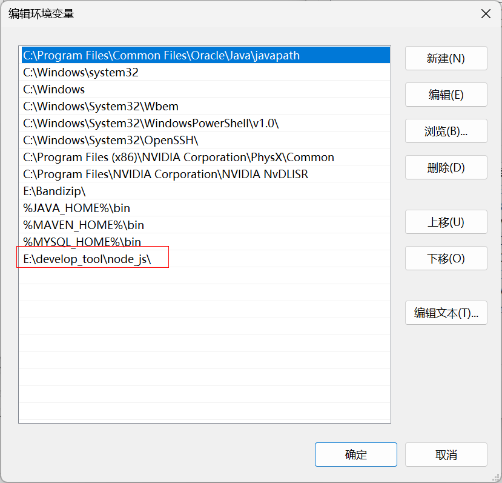
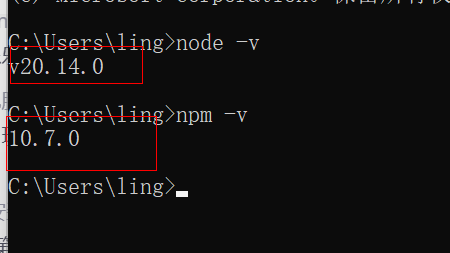
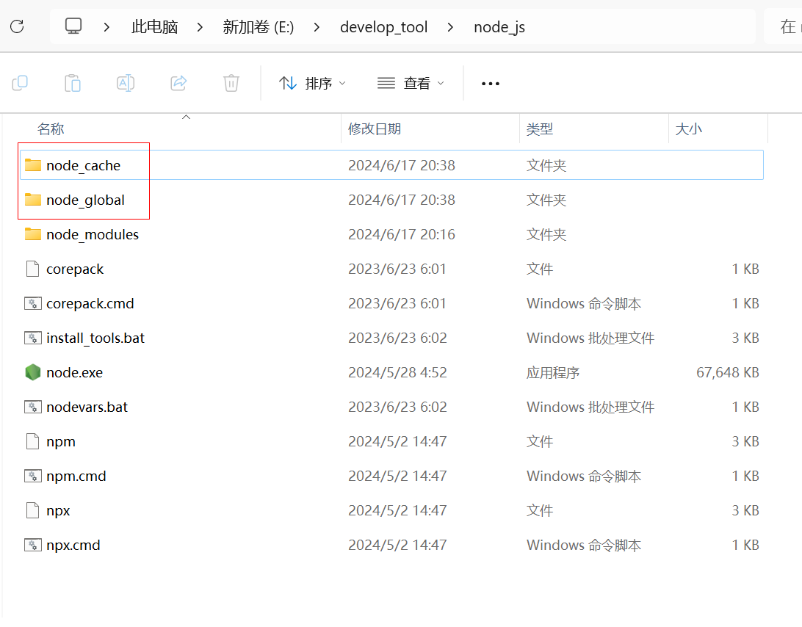
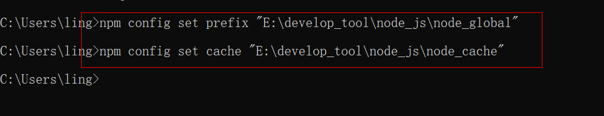
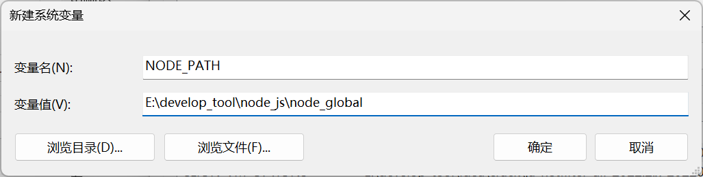
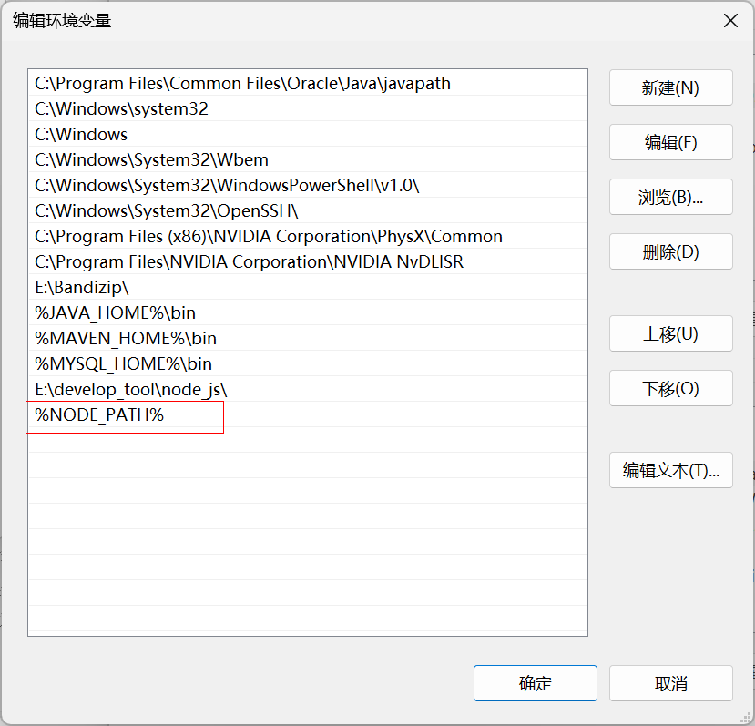

# 下载

网址：https://nodejs.org/zh-cn/download/

选择预安装程序：




# 安装

下载完成后，双击安装包，开始安装，使用默认配置安装一直点next即可，安装路径默认在C:\Program Files下，也可以自定义修改


下图根据本身的需要进行，我选择了默认`Node.js runtime`，而后Next

- Node.js runtime ：表示运行环境

- npm package manager：表示npm包管理器

- online documentation shortcuts ：在线文档快捷方式
- Add to PATH：添加到环境变量


以下图框中所示，我没有选中，而是直接next：


点击Install，进行安装：


点击finish，完成安装：


# 配置环境变量

将nodejs的安装目录配置在Path中：




# 测试

cmd输入`node -v`和`npm -v`出现版本号说明环境变量配置成功：



最新的nodejs会自动安装npm


# 环境配置

打开node的安装目录，新建两个文件夹`node_global`和`node_cache`：



打开cmd(以管理员)，输入以下命令：

```bash
# node_global的路径
npm config set prefix "E:\develop_tool\node_js\node_global"
# node_cache的路径
npm config set cache "E:\develop_tool\node_js\node_cache"
```



这两条命令是用来配置 npm（Node Package Manager）的。它们分别设置 npm 的全局安装目录和缓存目录。下面是每条命令的详细解释：

1. `npm config set prefix "E:\develop_tool\node_js\node_global"`

   这条命令设置 npm 的全局安装路径。默认情况下，npm 会将全局安装的包（例如命令行工具）放在全局目录中。通过这条命令，你可以将全局安装路径更改为你指定的目录（在这里是 `E:\develop_tool\node_js\node_global`）。

2. `npm config set cache "E:\develop_tool\node_js\node_cache"`

   这条命令设置 npm 的缓存目录。npm 会在安装包时将包的文件缓存起来，以便在下一次安装时加快速度，减少网络请求。通过这条命令，你可以将缓存目录更改为你指定的目录（在这里是 `E:\develop_tool\node_js\node_cache`）。

将`node_global`添加到环境变量，这一步对于在命令行中全局访问安装的工具（如 Vue CLI）是必要的。






# 配置下载源镜像

```bash
# 淘宝的镜像
npm config set registry "http://registry.npm.taobao.org"
```

