一般在项目中，常用的时间类型有Date、LocalDate、LocalDateTime。

对于同一日期，不同类型表现的格式不同。比如2024-01-01

Date类型表示格式：

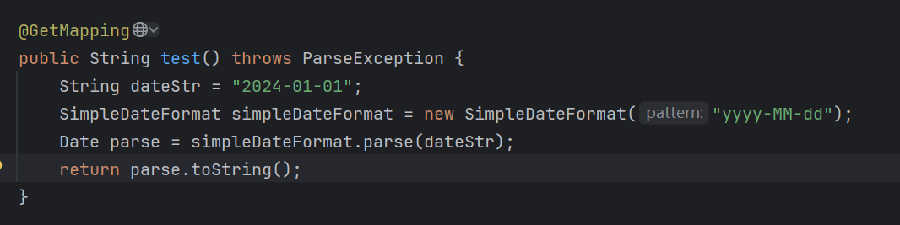

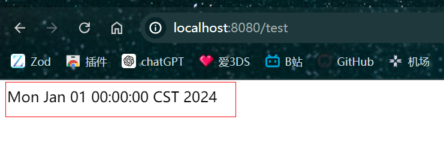

LocalDate类型表示格式：

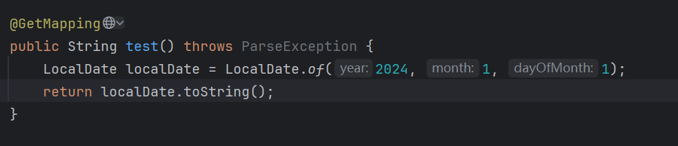

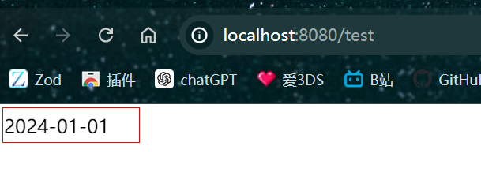

可以看出，对于常见的yyyy-MM-dd的形式，LocalDate类型的日期直接就是这种形式。

上面的两种方式是直接将日期字符串响应给前端页面，如果我们将日期封装到一个对象中，并将对象响应给前端，页面中的日期格式是什么样的呢？

定义一个对象：

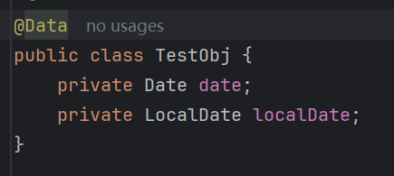

将Date和LocalDate封装到改对象中并响应：

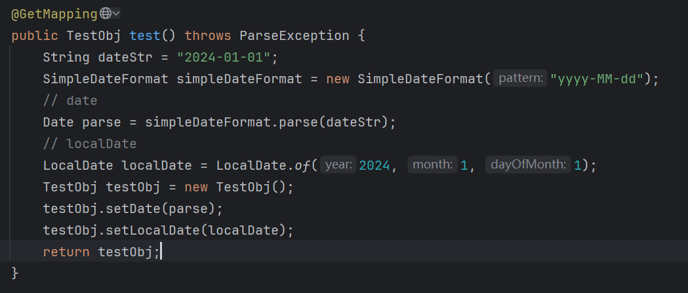

响应：

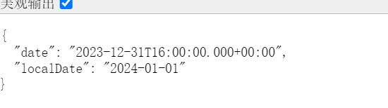


LocalDate与之前的字符串响应没有什么不同，但是Date却改变了，字符串响应的内容是

`Mon Jan 01 00:00:00 CST 2024`。

而封装成对象后响应的内容是

`2023-12-31T16:00:00.000+00:00`

为什么两种方式响应的结果不一致？这是因为@ResponseBody，@ResponseBody对于响应字符串，会直接将字符串响应给页面，因此字符串原来长什么样，响应的就是什么样，但是如果要响应对象，@ResponseBody内部会采用序列化JSON的策略，会先将对象转换成JSON字符串，然后再将JSON字符串响应给页面，问题就出在转换成JSON字符串这一步上。@ResponseBody采用的JSON序列化工具是jackson，而jackson会将日期类型的数据转换为ISO 8601格式(简单理解就是yyyy-MM-dd、yyyy-MM-dd hh:mm:ss)。所以`Mon Jan 01 00:00:00 CST 2024`才会被解析为`2023-12-31T16:00:00.000+00:00`。

如果我想让Date以yyyy-MM-dd的格式显示，解决方法有两种：

方法1：

配置全局日期格式

```yml
spring:
  jackson:
    date-format: yyyy-MM-dd
    time-zone: GMT+
```


响应：

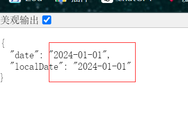

方法2：

使用@JsonFormat注解

```java
@JsonFormat(shape = JsonFormat.Shape.STRING, pattern = "yyyy-MM-dd", timezone = "GMT+8")
```

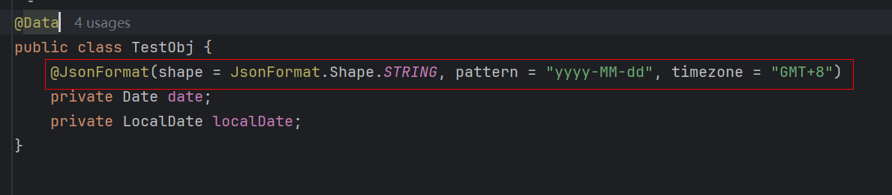

响应：

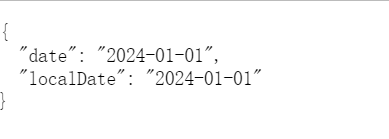


日期时间类型：

还是先来看一下Date和LocalDateTime的日期时间字符串形式：

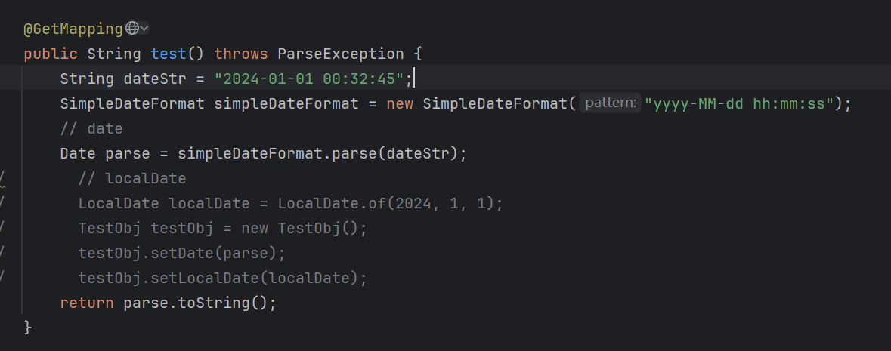

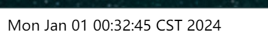

然后是LocalDateTime：

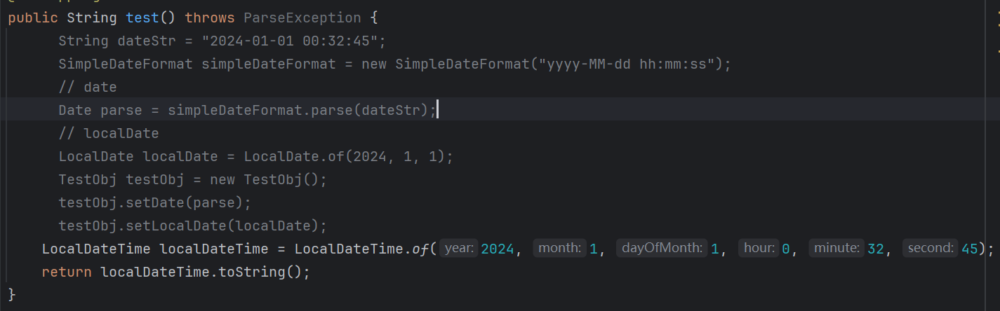


再来看一下对象情况下的格式：

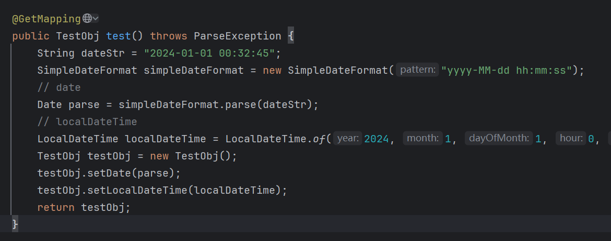

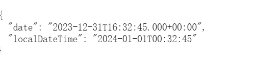

Date的对象格式和字符串格式依旧不同，LocalDateTime还是与字符串格式一致。同过对比我们可以确定LocalDate和LocalDateTime使用的就是ISO 8601格式。因为它们的字符串格式和对象格式的日期格式是一致的。如果我想要date和LocalDateTime应用yyyy-MM-dd hh:mm:ss格式，同样的解决方法：

方法1：

配置全局日期格式：

```yml
spring:
  jackson:
    date-format: yyyy-MM-dd hh:mm:ss
    time-zone: GMT+8
```

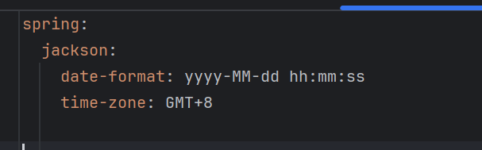

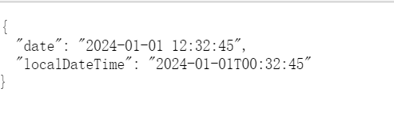

LocaDateTime没有应用这个样式。

方法2：

@JsonFormat注解

```java
@JsonFormat(shape = JsonFormat.Shape.STRING, pattern = "yyyy-MM-dd hh:mm:ss", timezone = "GMT+8")
```

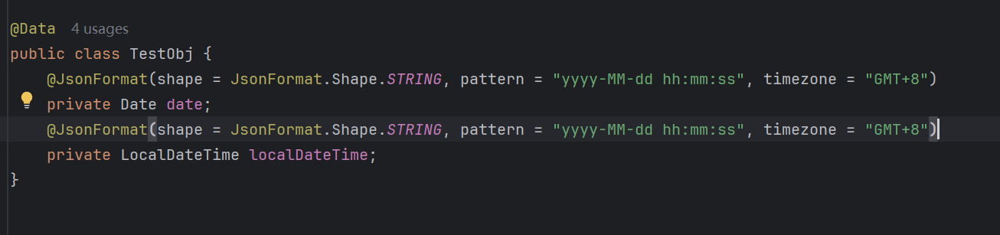

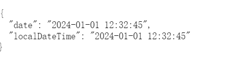

都应用上了。

由于对象会JSON化的缘故，因此我们返回日期给前端的时间，都是ISO 8601格式的日期，前端可以自己格式化为yyyy-MM-dd、yyyy-MM-dd hh:mm:ss，但是我们也可以在实体对象的日期属性上定义@JsonFormat来格式化，就不用麻烦前端了。

在数据库中date和datetime的格式是yyyy-MM-dd和yyyy-MM-dd hh:mm:ss

无论是Date还是LocalDate或LocalDateTime，只要是时间，且存入数据中，都是以数据库的日期格式为存储的，不管日期之前的格式是什么样，需要将日期的java格式转换成数据库的日期格式，这一步mybatis等框架已经替我们完成了，同样的mybatis等框架在读取数据库的日期时会将其转换为java中的日期类型。

比如，一个Date，它的格式不是yyyy-MM-dd，也能直接存入数据库中，且格式是yyyy-MM-dd，因为mybatis已经帮我们自动转换了。

