# 紧凑包空间

> 创建包时，会出现下级包省略，名字出现在上级包中以上级包点下级包的形式存在的情况，常见的包就是com.xxx，如：

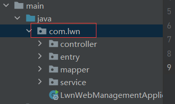

> 这是由于idea开启了紧凑包空间策略，让项目视图中的包结构更加紧凑，以减少视图中的空间占用。
>
> 关闭方法：>>【Tree Appearance】>>【Compact Middle Packages】，取消勾选：

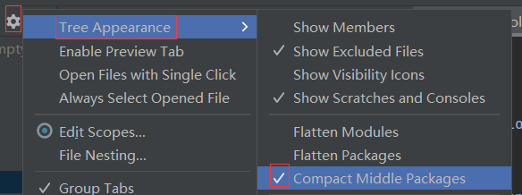

> 效果：

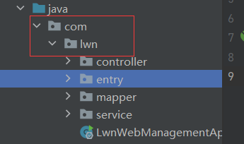

新版本：

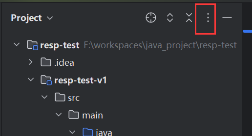

# 直接执行测试类

> 小技巧，测试类与springboot的环境无关，因此可以将@SpringBootTest注解注释掉，从而直接执行测试类，避免了先加载springboot后再执行测试类这段等待时间。

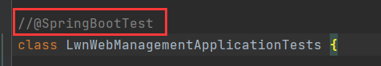

# springboot打包问题

> springboot进行打包时，需要引入插件：spring-boot-maven-plugin。

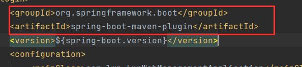

> 但是我们一般不用手动引入，因为基于官方骨架创建的项目会自动引入。
>
> 打包好后运行，如果出现这个错误：

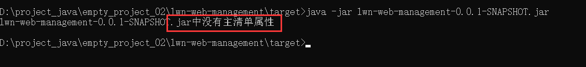

> 表示没有主清单属性。
>
> 我们打包成jar后在jar中有一个这个文件：MANIFEST.MF(清单文件)，

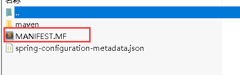

> 正常的清单文件中包含很多的信息，像这样：

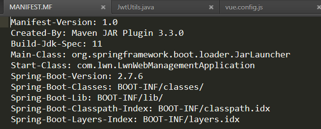

> 不正常的清单文件像这样：

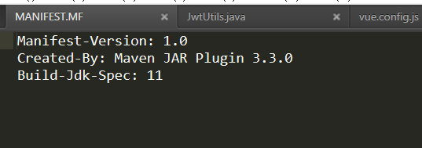

> 我们可以发现，不正常的清单文件缺失了很多的信息，其中就包括主类的信息。
>
> 主类（Main Class）的信息是一个关键的元素，它告诉JVM运行哪一个类的main方法作为程序的入口点。如果spring-boot-maven-plugin被跳过了，那么这个清单文件可能不会被正确地生成，主类的信息也就不会被加入到清单文件中。这就是为什么当你尝试运行JAR文件时，你会看到 "没有主清单属性" 的错误。
>
> 解决方法是将<skip>true</skip>注释掉：

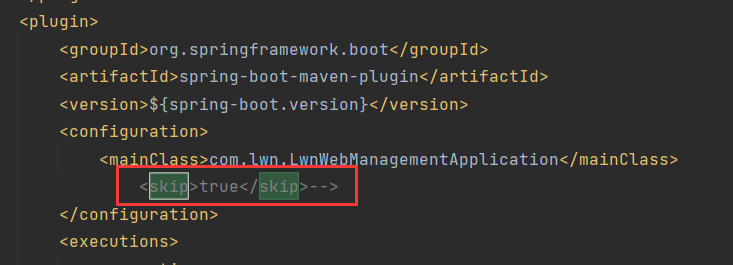

> 因为在spring-boot-maven-plugin的配置中设置 <skip>true</skip> 时，实际上是告诉Maven在执行构建生命周期时跳过这个插件的运行。此插件负责将你的项目打包成一个可执行的JAR文件，其中包含了一个正确的清单文件（MANIFEST.MF）以及所有的项目依赖项。如果跳过自然就生成一个不正常的清单文件。