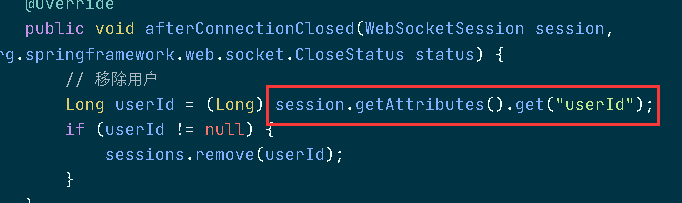
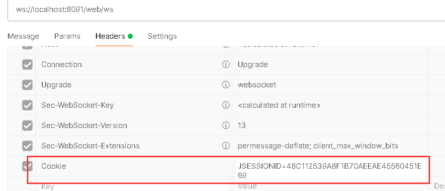

# 实现思路

1. **后端（Spring Boot）**
   - 在 `add` 方法中插入消息数据后，使用 WebSocket 发送通知给对应的接收人。
2. **前端**
   - 建立 WebSocket 连接，监听后端推送的消息，并弹出通知或更新 UI。


# 后端实现

## 添加 WebSocket 依赖

```xml
<dependency>
    <groupId>org.springframework.boot</groupId>
    <artifactId>spring-boot-starter-websocket</artifactId>
</dependency>
```


## 创建 WebSocket 服务器

创建 `WebSocketServer`，用于管理用户的 WebSocket 连接：

```java
import org.springframework.stereotype.Component;
import org.springframework.web.socket.TextMessage;
import org.springframework.web.socket.WebSocketSession;
import org.springframework.web.socket.handler.TextWebSocketHandler;

import java.io.IOException;
import java.util.concurrent.ConcurrentHashMap;

@Component
public class WebSocketServer extends TextWebSocketHandler {

    // 存储用户的 WebSocket 连接（key：用户ID，value：WebSocketSession）
    private static final ConcurrentHashMap<Long, WebSocketSession> sessions = new ConcurrentHashMap<>();

    // 建立连接后执行
    @Override
    public void afterConnectionEstablished(WebSocketSession session) {
        // 获取用户ID（假设客户端在连接时带有用户ID参数）
        Long userId = (Long) session.getAttributes().get("userId");
        if (userId != null) {
            sessions.put(userId, session);
        }
    }

    @Override
    public void handleTextMessage(WebSocketSession session, TextMessage message) {
        // 这里可以处理前端发送的消息
    }

    @Override
    public void afterConnectionClosed(WebSocketSession session, org.springframework.web.socket.CloseStatus status) {
        // 移除用户
        Long userId = (Long) session.getAttributes().get("userId");
        if (userId != null) {
            sessions.remove(userId);
        }
    }

    // 发送消息给指定用户
    public void sendMessageToUser(Long userId, String message) throws IOException {
        WebSocketSession session = sessions.get(userId);
        if (session != null && session.isOpen()) {
            session.sendMessage(new TextMessage(message));
        }
    }
}
```


### afterConnectionEstablished()执行时机及次数

`afterConnectionEstablished()`在 **WebSocket 连接建立成功后** 由 Spring 自动调用。

- 当客户端（浏览器、APP等） **成功连接到 WebSocket 服务器** 时，该方法会被执行。

- 这个方法的典型用途是 **保存 WebSocket 连接**，比如将 `session` 存入 `ConcurrentHashMap`，以便后续向指定用户推送消息。

`fterConnectionEstablished()` **在每次客户端建立 WebSocket 连接时都会执行一次**，即：

- **每个客户端连接一次，就会执行一次**。
- **同一个用户如果断开后重新连接，仍然会执行一次**。

```java
用户A打开网页，建立 WebSocket 连接 -> afterConnectionEstablished() 执行一次。
用户A刷新网页，WebSocket 重新建立 -> afterConnectionEstablished() 再执行一次。
用户B打开网页，建立 WebSocket 连接 -> afterConnectionEstablished() 执行一次。
```

如果服务器有多个 WebSocket 连接（比如多个用户或者一个用户在多个设备登录），`afterConnectionEstablished()` 会 **针对每个连接执行一次**。


### `handleTextMessage()`执行时机及次数

**客户端通过 WebSocket 发送消息时，执行一次**

例如前端使用 `socket.send("Hello Server")`，后端的 `handleTextMessage()` 方法就会被触发执行一次。

**每发送一条消息，就执行一次**

如果前端连续发送多条消息，比如：

```javascript
socket.send("消息1");
socket.send("消息2");
```

那么`handleTextMessage()` 在后端会被调用两次，每次处理一条消息。


### `afterConnectionClosed()`执行时机及次数

`afterConnectionClosed()` 在 **WebSocket 连接关闭时** 被触发执行，通常用于**清理资源**，比如：

- 从在线用户列表中移除 WebSocket 连接
- 记录日志
- 释放相关资源

`afterConnectionClosed()` **在以下情况触发执行**：

| 触发场景                          | 说明                                                    |
| --------------------------------- | ------------------------------------------------------- |
| **客户端主动关闭 WebSocket**      | 客户端调用 `socket.close()` 关闭连接                    |
| **客户端刷新/关闭页面**           | 刷新浏览器页面 (`F5`)、关闭网页或浏览器                 |
| **网络异常导致断开**              | 断网、服务器崩溃、设备进入休眠状态等                    |
| **服务器主动断开 WebSocket 连接** | 服务器调用 `session.close()` 关闭连接                   |
| **WebSocket 连接超时**            | 如果服务器设置了 WebSocket 连接超时，达到时间后自动断开 |

------

## 配置握手拦截器

握手拦截器即**WebSocket 握手拦截器**，这个拦截器的作用是从 HTTP 握手请求（比如 URL 参数、Header）中提取信息（如`userId`），并将这些信息存入 `WebSocketSession`的属性中，使后续代码可以通过 `session.getAttributes()` 获取到这些参数。

就比如上述的示例中在`afterConnectionClosed()`中就通过`getAttributes()`来获取`userId`：




### 为什么需要它？

- **WebSocket 协议本身不直接支持 URL 参数解析**，比如 `ws://xxx/ws?userId=123` 中的 `userId=123` 不会自动传递到你的 `WebSocketSession` 中。
- **HandshakeInterceptor** 的作用就是在握手阶段拦截请求，提取参数并存入 `attributes`，这样后续代码才能拿到参数。


### 创建拦截器

新建一个 Java 类（如 `UserIdHandshakeInterceptor`），实现 `HandshakeInterceptor` 接口：

```java
import org.springframework.http.server.ServerHttpRequest;
import org.springframework.http.server.ServerHttpResponse;
import org.springframework.http.server.ServletServerHttpRequest;
import org.springframework.web.socket.WebSocketHandler;
import org.springframework.web.socket.server.HandshakeInterceptor;
import java.util.Map;

public class UserIdHandshakeInterceptor implements HandshakeInterceptor {

    // 握手前的处理（关键代码）
    @Override
    public boolean beforeHandshake(ServerHttpRequest request, ServerHttpResponse response,
                                   WebSocketHandler wsHandler, Map<String, Object> attributes) {
        // 从HTTP请求中提取userId参数
        if (request instanceof ServletServerHttpRequest) {
            ServletServerHttpRequest servletRequest = (ServletServerHttpRequest) request;
            String userId = servletRequest.getServletRequest().getParameter("userId");
            attributes.put("userId", userId); // 存入WebSocketSession属性
        }
        return true; // 返回true表示允许握手
    }

    // 握手后的处理（一般无需操作）
    @Override
    public void afterHandshake(ServerHttpRequest request, ServerHttpResponse response,
                               WebSocketHandler wsHandler, Exception exception) {
    }
}
```


### 拦截会话

直接将参数通过URL传递是一种不安全的方式，容易被篡改和窃取。如果想要获取一个唯一标识，可以通过session，一般我们会将用户的id存储在session中，而在握手拦截器中可以拦截session，这样我们能从session中获取对应的id：

```java
import org.springframework.http.server.ServerHttpRequest;
import org.springframework.http.server.ServerHttpResponse;
import org.springframework.http.server.ServletServerHttpRequest;
import org.springframework.web.socket.WebSocketHandler;
import org.springframework.web.socket.server.HandshakeInterceptor;
import java.util.Map;

public class UserIdHandshakeInterceptor implements HandshakeInterceptor {

    // 握手前的处理（关键代码）
    public boolean beforeHandshake(ServerHttpRequest request, ServerHttpResponse response, WebSocketHandler wsHandler,
                                   Map<String, Object> attributes) {
        if (request instanceof ServletServerHttpRequest) {
            ServletServerHttpRequest servletRequest = (ServletServerHttpRequest) request;

            // 可以选择将id作为参数传递，但这样不安全
            // String userId = servletRequest.getServletRequest().getParameter("userId");
            // 所以，我选择从会话中获取id
            HttpSession session = servletRequest.getServletRequest().getSession(false);
            if (Objects.isNull(session)) {
                log.error("会话过期，ws连接关闭");
                return false;
            }
            UserInfoSessionDto userinfo = (UserInfoSessionDto) session.getAttribute(Constant.USERINFO_SESSION_KEY);

            attributes.put("userId", userinfo.getUserId()); // 存入WebSocketSession属性
        }
        return true; // 返回true表示允许握手
    }
}
```

`getSession(false)`中的`false`表示如果之前有会话返回之前的会话，否则返回`null`，为`true`表示之前如果没用会话的话，创建一个新会话。因为当前的场景必须是登录成功后如果没用会话不能返回新会话，所以用`false`。


## WebSocket 配置

创建 `WebSocketConfig` 进行配置：

> **一定要声明`@EnableWebSocket`启用**

```java
import org.springframework.context.annotation.Configuration;
import org.springframework.web.socket.config.annotation.EnableWebSocket;
import org.springframework.web.socket.config.annotation.WebSocketConfigurer;
import org.springframework.web.socket.config.annotation.WebSocketHandlerRegistry;

@Configuration
@EnableWebSocket
public class WebSocketConfig implements WebSocketConfigurer {

    @Resource
    private final WebSocketServer webSocketServer;
    @Resource
    private final UserIdHandshakeInterceptor userIdHandshakeInterceptor;

    @Override
    public void registerWebSocketHandlers(WebSocketHandlerRegistry registry) {
        registry.addHandler(webSocketServer, "/ws")
            	.addInterceptors(userIdHandshakeInterceptor) // 添加拦截器
            	.setAllowedOrigins("*");
    }
}
```

这样，WebSocket 服务器就可以在 `/ws` 这个 URL 监听 WebSocket 连接。`setAllowedOrigins("*")`表示允许所有URL跨域。可以允许多个URL，用逗号隔开，如：

```java
setAllowedOrigins("http://localhost:8080", "http://localhost:8081");
```

URL只需要给定域名和端口，不要加路径（如 `http://localhost:8080/app` 是无效的）。

另外如果我们还配置了HTTP请求的跨域，那么HTTP请求的跨域不会影响websocket的跨域，websocket的跨域仍然要配置(反之亦然)。两个配置是相互独立的，不是说一方配置了跨域另一方就不需要配置了。毕竟HTTP和websocket是不同的协议(`http://`和`ws://`)。


## 在 `add` 方法中推送消息

修改消息的 `add` 方法，在插入消息后给接收人推送通知：

```java
import org.springframework.stereotype.Service;
import java.io.IOException;
import java.util.Date;

@Service
public class UserMessageService {
    @Resource
    private final UserMessageMapper userMessageMapper;
    @Resource
    private final WebSocketServer webSocketServer;	// 注入ws服务

    public void add(UserMessage userMessage) {
        Date date = new Date();
        userMessage.setCreateTime(date);
        userMessage.setUpdateTime(date);
        userMessageMapper.insert(userMessage);

        // 发送 WebSocket 消息
        Long receiverId = userMessage.getReceiverId();
        String message = "您收到一条新消息：" + userMessage.getContent();
        try {
            webSocketServer.sendMessageToUser(receiverId, message);	// 调用send方法发送消息
        } catch (IOException e) {
            e.printStackTrace();
        }
    }
}
```


# 前端实现

在 Vue3 前端，建立 WebSocket 连接：

```vue
<script setup>
import { ref, onMounted, onUnmounted } from "vue";

const message = ref("");
let socket = null;

const socketInit = () => {
    socket = new WebSocket("ws://localhost:8080/ws");	// 连接到/ws

    socket.onopen = () => {
        console.log("WebSocket 连接成功");
        // TODO
    };

    socket.onmessage = (event) => {
        message.value = event.data;
        // TODO
    };

    socket.onclose = () => {
        console.log("WebSocket 连接关闭");
    };
};
    
const socketClose = () => {
    if (socket) {
        socket.close();
    }
}

onMounted(() => {
    socketInit();
});

onUnmounted(() => {
  	socketClose();
});
</script>

<template>
  <div>
    <h3>WebSocket 消息推送</h3>
    <p v-if="message">收到消息: {{ message }}</p>
  </div>
</template>
```


# ws连接时获取的`Session`为`null`

上面我说过，直接从session中获取用户的id，这么做有个前提就是session必须存在，但是直接使用postman或浏览器发起ws连接时，通常不会携带JSESSIONID，我们都知道服务器如何获取会话都是靠浏览器发送的JSESSIONID来找到会话的，如果没有这个Cookie请求头携带JSESSIONID的话，服务器就找不到会话对象。

所以在使用postman工具建立ws连接时，需要在请求头中手动添加Cookie项：



而浏览器则更加特殊，我们建立ws连接时：

```js
socket = new WebSocket("ws://localhost:8080/ws");	// 连接到/ws
```

在`WebSocket` 中**不支持手动添加 `Cookie` 头**，不像 `fetch` 或 `XMLHttpRequest`那样：

```js
// 这种方式 WebSocket 不支持
const socket = new WebSocket("ws://localhost:8091/web/ws", {
    headers: { "Cookie": document.cookie } // ❌ 不支持
});
```

也就是说没法像postman那样通过Cookie头携带JSESSIONID。

而客户端若将JSESSIONID发送给服务器通常有两种方式：前端和后端同源 && 请求参数携带JSESSIONID。

**前端和后端同源**

前端和后端同源的话，浏览器会自动携带Cookie。

**请求参数携带JSESSIONID**

如下：

```js
socket = new WebSocket("ws://localhost:8080/ws?JSESSIONID=XXXX");	// 连接到/ws
```

不过这么做可能会导致JSESSIONID被篡改。

因为目前的项目都是前后端分离的场景，所以第一种方案不作考虑，如果要使用第二种，为了防止篡改可以对参数进行加密，比如JWT，对称加密，非对称加密，哈希加密等。

其实我们的目标就是获取userId，不如直接传递userId，对userId进行加密。