# 1 项目模块结构

项目分为前端和后端，整个项目分为4个模块：

- job
- admin
- web
- common

其中，job为根模块，主要用于管理其他3个模块。

admin主要管理后端的请求，以及后端特有的业务。

web主要管理前端的请求，以及前端特有的业务。

common是公共模块，前端和后端都能访问这个模块，比如一些公共的工具业务逻辑，公共的数据库操作等就放在这个模块中。

本次的演示使用maven进行项目创建，搭建出springboot项目，不使用springboot的脚手架创建。


# 2 搭建项目模块

## 2.1 搭建根模块job

首先创建根模块，创建的模板选择`maven-archetype-site`：

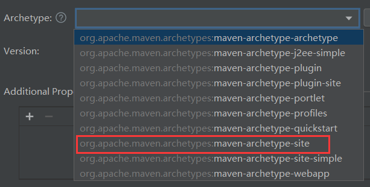

指定坐标：

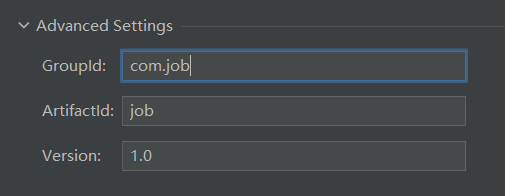

等待项目创建，创建完毕后生成的pom：

```xml
<project xmlns="http://maven.apache.org/POM/4.0.0" xmlns:xsi="http://www.w3.org/2001/XMLSchema-instance"
  xsi:schemaLocation="http://maven.apache.org/POM/4.0.0 http://maven.apache.org/xsd/maven-4.0.0.xsd">
  <modelVersion>4.0.0</modelVersion>

  <groupId>com.job</groupId>
  <artifactId>job</artifactId>
  <version>1.0</version>

  <name>Maven</name>
  <url>http://maven.apache.org/</url>
  <inceptionYear>2001</inceptionYear>

  <distributionManagement>
    <site>
      <id>website</id>
      <url>scp://webhost.company.com/www/website</url>
    </site>
  </distributionManagement>

  <properties>
    <project.build.sourceEncoding>UTF-8</project.build.sourceEncoding>
  </properties>

  <build>
    <plugins>
      <plugin>
        <artifactId>maven-site-plugin</artifactId>
        <configuration>
          <locales>en,fr</locales>
        </configuration>
      </plugin>
    </plugins>
  </build>
</project>
```

修改，保留以下内容：

```xml
<project xmlns="http://maven.apache.org/POM/4.0.0" xmlns:xsi="http://www.w3.org/2001/XMLSchema-instance"
  xsi:schemaLocation="http://maven.apache.org/POM/4.0.0 http://maven.apache.org/xsd/maven-4.0.0.xsd">
  <!-- 模块版本，保留 -->
  <modelVersion>4.0.0</modelVersion>

  <!-- 当前项目的坐标，保留 -->
  <groupId>com.job</groupId>
  <artifactId>job</artifactId>
  <version>1.0</version>

  <!-- 修改项目名 -->
  <name>job</name>

  <!-- 属性，保留字符集 -->
  <properties>
    <project.build.sourceEncoding>UTF-8</project.build.sourceEncoding>
  </properties>

</project>
```

修改完后，重新编译pom：

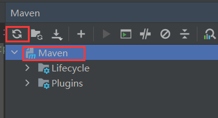

因为根模块只做依赖管理，因此源目录可以删除，我选择删除：

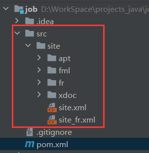


## 2.2 搭建公共模块common

在job目录中创建子模块，同样创建maven工程，但是创建模板选择`maven-archetype-quickstart`：

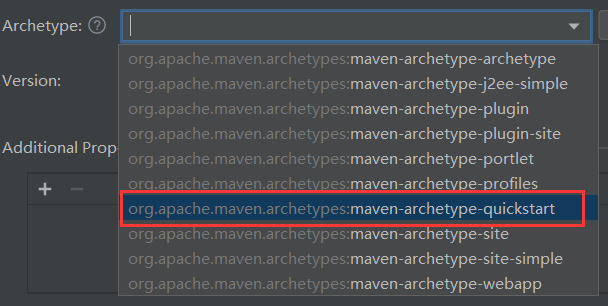

指定坐标，组织名继承至根模块，一般不动，主要修改模块名，IDEA的智能识别能识别模块名，因此这里完全不需要动：

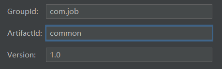

等待创建完成，生成的pom如下：

```xml
<project xmlns="http://maven.apache.org/POM/4.0.0" xmlns:xsi="http://www.w3.org/2001/XMLSchema-instance"
         xsi:schemaLocation="http://maven.apache.org/POM/4.0.0 http://maven.apache.org/xsd/maven-4.0.0.xsd">
    <modelVersion>4.0.0</modelVersion>
    <parent>
        <groupId>com.job</groupId>
        <artifactId>job</artifactId>
        <version>1.0</version>
    </parent>

    <artifactId>common</artifactId>
    <packaging>jar</packaging>

    <name>common</name>
    <url>http://maven.apache.org</url>

    <properties>
        <project.build.sourceEncoding>UTF-8</project.build.sourceEncoding>
    </properties>

    <dependencies>
        <dependency>
            <groupId>junit</groupId>
            <artifactId>junit</artifactId>
            <version>3.8.1</version>
            <scope>test</scope>
        </dependency>
    </dependencies>
</project>
```

因为是job的子模块，因此会生成父模块坐标：

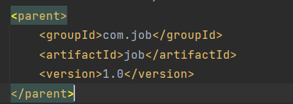

然后修改pom，保留以下内容：

```xml
<project xmlns="http://maven.apache.org/POM/4.0.0" xmlns:xsi="http://www.w3.org/2001/XMLSchema-instance"
         xsi:schemaLocation="http://maven.apache.org/POM/4.0.0 http://maven.apache.org/xsd/maven-4.0.0.xsd">
    <modelVersion>4.0.0</modelVersion>
    <parent>
        <groupId>com.job</groupId>
        <artifactId>job</artifactId>
        <version>1.0</version>
    </parent>

    <artifactId>common</artifactId>
    <packaging>jar</packaging>

    <name>common</name>

    <properties>
        <project.build.sourceEncoding>UTF-8</project.build.sourceEncoding>
        <!-- 指定java版本，同时其他标签可以通过${}引用 -->
        <java.version>11</java.version>
		<!-- 表示项目源码使用的jdk版本是11 -->
        <maven.compiler.source>${java.version}</maven.compiler.source>
        <!-- 表示项目打包后字节码使用的jdk版本是11 -->
        <maven.compiler.target>${java.version}</maven.compiler.target>
    </properties>
    
    <dependencies>
        <dependency>
            
        </dependency>
    </dependencies>
</project>
```

指定编译和打包的版本，同jdk版本。

然后删除测试目录：

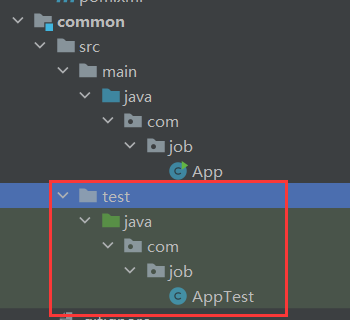

删除类【App】：


在main下创建resources资源目录：

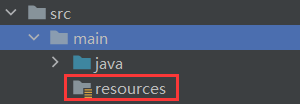


## 2.3 搭建后端模块admin

同样创建maven项目，同样使用`maven-archetype-quickstart`模板，然后坐标这些如法炮制，这里不演示。创建完后修改pom为：

```xml
<project xmlns="http://maven.apache.org/POM/4.0.0" xmlns:xsi="http://www.w3.org/2001/XMLSchema-instance"
         xsi:schemaLocation="http://maven.apache.org/POM/4.0.0 http://maven.apache.org/xsd/maven-4.0.0.xsd">
    <modelVersion>4.0.0</modelVersion>
    <parent>
        <groupId>com.job</groupId>
        <artifactId>job</artifactId>
        <version>1.0</version>
    </parent>

    <artifactId>admin</artifactId>
    <packaging>jar</packaging>

    <name>admin</name>

    <properties>
        <project.build.sourceEncoding>UTF-8</project.build.sourceEncoding>
        <java.version>11</java.version>
        <maven.compiler.source>${java.version}</maven.compiler.source>
        <maven.compiler.target>${java.version}</maven.compiler.target>
    </properties>

    <dependencies>
        <dependency>
            <groupId>com.job</groupId>
            <artifactId>common</artifactId>
            <version>1.0</version>
        </dependency>
    </dependencies>
</project>
```

引用common的依赖，在maven依赖中查看：

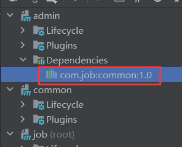

然后删除测试目录，【App】，创建资源目录。


## 2.4 搭建前端模块web

如法炮制，这里主要展示修改后的pom：

```xml
<project xmlns="http://maven.apache.org/POM/4.0.0" xmlns:xsi="http://www.w3.org/2001/XMLSchema-instance"
         xsi:schemaLocation="http://maven.apache.org/POM/4.0.0 http://maven.apache.org/xsd/maven-4.0.0.xsd">
    <modelVersion>4.0.0</modelVersion>
    <parent>
        <groupId>com.job</groupId>
        <artifactId>job</artifactId>
        <version>1.0</version>
    </parent>

    <artifactId>web</artifactId>
    <packaging>jar</packaging>

    <name>web</name>

    <properties>
        <project.build.sourceEncoding>UTF-8</project.build.sourceEncoding>
        <java.version>11</java.version>
        <maven.compiler.source>${java.version}</maven.compiler.source>
        <maven.compiler.target>${java.version}
    </properties>

    <dependencies>
        <dependency>
            <groupId>com.job</groupId>
            <artifactId>common</artifactId>
            <version>1.0</version>
        </dependency>
    </dependencies>
</project>
```


# 3 改造为springboot项目

## 3.1 引入springboot项目依赖

经过以上步骤后，项目的结构已经搭建好了，但是现在的项目是maven项目，我们需要改造为springboot项目。

改造为springboot项目，就需要引入springboot的依赖，在根模块中引入依赖，这样整个项目都能作用：

依赖：

```xml
<groupId>org.springframework.boot</groupId>
<artifactId>spring-boot-starter-parent</artifactId>
<version>版本</version>
```

xml：

```xml
<project xmlns="http://maven.apache.org/POM/4.0.0" xmlns:xsi="http://www.w3.org/2001/XMLSchema-instance"
         xsi:schemaLocation="http://maven.apache.org/POM/4.0.0 http://maven.apache.org/xsd/maven-4.0.0.xsd">
    <modelVersion>4.0.0</modelVersion>
	<!-- 引入springbooot项目依赖，让maven项目变成springboot项目 -->
    <parent>
        <groupId>org.springframework.boot</groupId>
        <artifactId>spring-boot-starter-parent</artifactId>
        <version>2.7.6</version>
    </parent>

    <groupId>com.job</groupId>
    <artifactId>job</artifactId>
    <version>1.0</version>
    <packaging>pom</packaging>

    <name>job</name>

    <modules>
        <module>admin</module>
        <module>common</module>
        <module>web</module>
    </modules>


    <properties>
        <project.build.sourceEncoding>UTF-8</project.build.sourceEncoding>
    </properties>
</project>
```

## 3.2 引入springboot的web依赖测试

现在job已经引入springboot依赖，其他3个模块是他的子模块，自然能继承springboot的依赖。整个项目已经变成springboot项目，现在我们在common模块中引入springboot的web依赖进行测试：

依赖：

```xml
<groupId>org.springframework.boot</groupId>
<artifactId>spring-boot-starter-web</artifactId>
```

由于job中引入的springboot依赖中指定了版本，此处继承至job，因此没有指定版本。

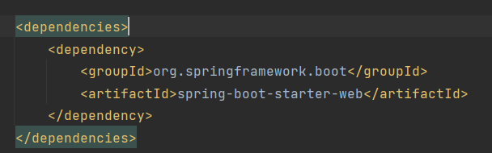

admin和web包通过依赖传递也引入了web依赖：

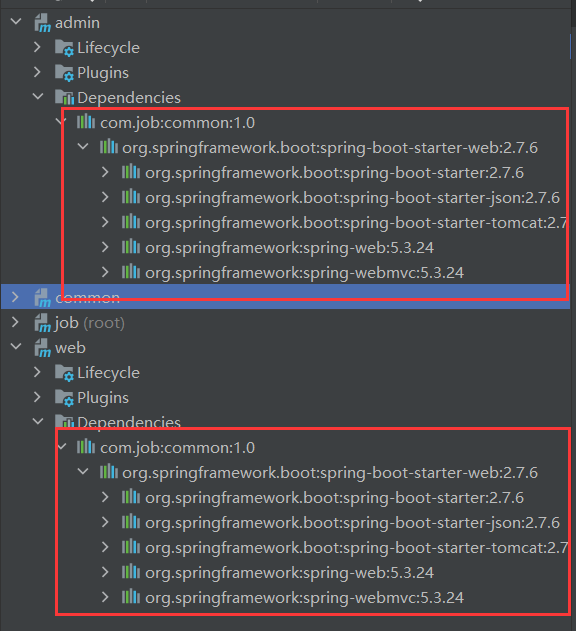

### 3.2.1 创建启动类

以web模块为例。

现在可以编写一个简单的控制器进行测试，首先创建启动类，步骤如下：

1. 启动类以Application为后缀。
2. 添加【@SpringbootAoolication】标识为springboot启动类。
3. 定义【main()】。
4. 在方法中调用【SpringApplication】的【run()】。
5. 将启动类字节码对象和【args】(`main()`的参数)作为参数传入【run()】中。

```java
@SpringBootApplication
public class WebApplication {
    public static void main(String[] args) {
        SpringApplication.run(WebApplication.class, args);
    }
}
```

### 3.2.2 配置文件

创建springboot的配置文件，我选择yml文件：


配置基础项：

- 端口
- 请求路径前缀

```yml
server:
  servlet:
    context-path: /api
  port: 8090
```

### 3.2.3 控制器输出测试

创建控制器然后向页面输出hello world进行测试：

```java
@RestController
@RequestMapping("/hw")
public class HWController {

    @GetMapping
    public String hw() {
        return "hello world";
    }
}
```

启动项目：

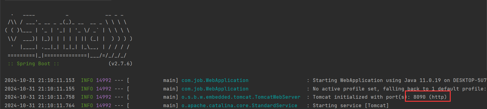

访问接口，以api作为前缀：


后端模块同样的操作：

启动类：

```java
@SpringBootApplication
public class AdminApplication {
    public static void main(String[] args) {
        SpringApplication.run(AdminApplication.class, args);
    }
}
```

配置项：

```yml
server:
  servlet:
    context-path: /admin
  port: 8091
```

控制器：

```java
@RestController
@RequestMapping("/test")
public class TestController {
    @GetMapping
    public String test() {
        return "admin server start!";
    }
}
```

将后端服务启动，访问接口，以admin为前缀：

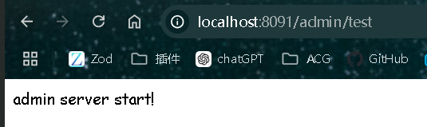


# 4 springboot配置项

常用的配置项见[springboot常用配置项.md](./springboot常用配置项.md)。


# 5 引入常用依赖

只有一个springboot的web依赖还不够，接下来引入项目常用的依赖。

在根模块中引入：

```xml
```

