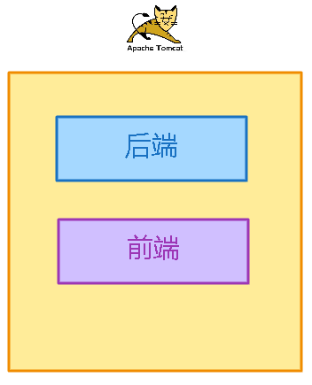
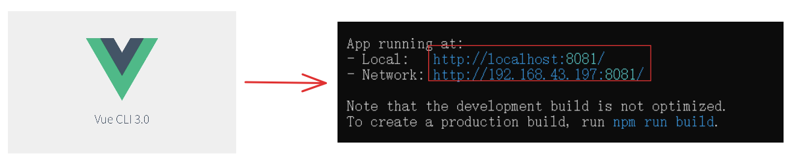
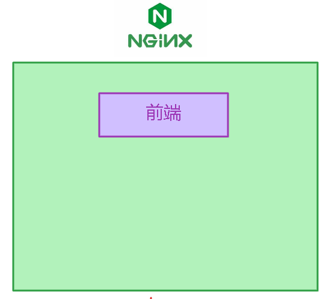
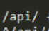
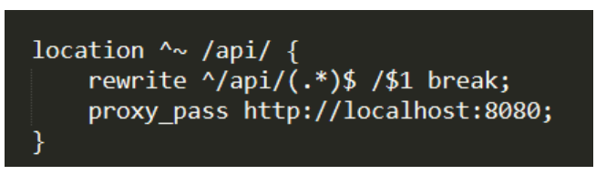

> 前后端不分离模式，后端和前端都在同一个服务器地址下
> 如：localhost:8080

> 这种模式下，前端请求后端的资源，其请求路径我们是知道的，因为是在同一个服务器下，一般会显示的写成服务器的地址或用一些特定的方法来获取服务器的地址。
>
> 使用vue-cli创建的前端工程，可以直接在浏览器中访问这是因为vue-cli内部默认使用webpack-dev-server作为开发服务器。webpack-dev-server是一个基于webpack的开发服务器它可以提供一个临时的web服务器来运行Vue.js项目。前端程序由此可以与后端分离开来，不用再依赖于后端服务器来访问。

> 当前端与后端分开，前端请求后端就需要显示的定义后端的路径。
>
> 前端工程打包好后放到Nginx代理服务器中。之前的前端由webpack-dev-server服务器提供访问，而现在由Nginx提供访问。

> 在Nginx的配置文件中可以配置前端服务的地址和端口。我们在浏览器中就通过该地址和端口访问资源

> 一般，前端工程中调用后端的请求URL会使用一个统一的前缀，就像上面的api。
>
> 此时的前端会显示的去访问后端的地址和端口，而是使用特定的方法获取当前的服务器URL。
>
> 比如，上面的Nginx的地址是localhost:90那么我们可以通过特定的方法获取到这个地址然后将要访问的后端的具体请求路径和前缀一起拼接成一个完成的路径，再将该路径发送给Nginx。
>
> 如：localhost:90/api/depts。

> Nginx拿到前端发送的请求，根据配置的处理/api请求的location块，会将前缀/api去除，并保留后面请求路径/depts然后处理请求转发到指定的后端地址，这里是localhost:8080，即最终Nginx会将localhost:90/api/depts代理到localhost:8080/depts
>
> 这也是为什么用了Nginx之后，前端中发起请求不需要显示的定义后端的地址和端口，因为我们配置好后端的请求后，Nginx会代理转发请求。
>
> 而且由Nginx代理的请求就不再由跨域的问题，因为通过代理后转发的最终都是后端请求。