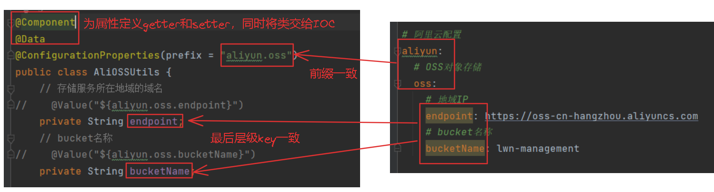
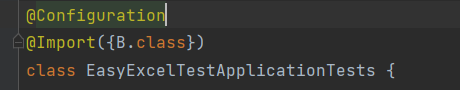
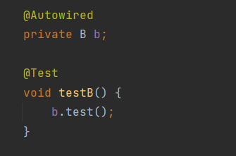
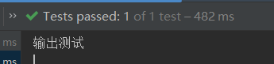
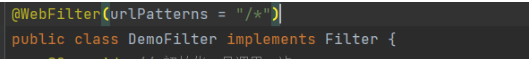
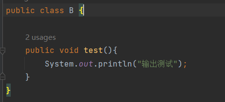
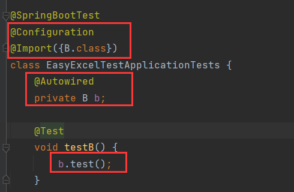
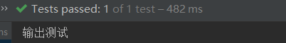

# 请求相关的注解

## @Controller

控制器注解，声明在类上表示该类是控制器，控制着请求和响应，同时声明该注解的类会成为IOC中的Bean


## @RequestMapping

映射Web请求到具体处理方法或类的注解

- GetMapping：GET请求
- PostMaping：POST请求
- ......：其他请求


## @ResponseBody

将方法返回值直接作为HTTP响应的内容。

对于字符串，直接响应给前端，对于对象，其内部会采用JSON序列化策略将对象转换为JSON字符串然后响应给前端。

@RestController，@RestController = @Controller + @ResponseBody


## @RequestParam：

> 见7.sprigboot请求与响应第2章

1、请求参数名与控制器方法形参名不一致时使用，用**name**属性指定，与请求参数名保持一致，如：

```java
// 假设请求参数是age
public Result m1(@RequestParam(name='age') Integer uAge){
    ......
}
```

2、**required**属性指定参数是否必填，它是一个布尔值，true表示必填、false表示非必填，默认值为true。

required=true表示请求中必须包含该参数，否则程序将报错，如果请求中有该参数但是没有值，那么程序不会报错，该参数会被解析成null，如：

```java
// 假设请求参数是age
public Result m1(@RequestParam(name='age', required=true) Integer uAge){
    ......
}
```

3、**defaultValue**属性指定参数的默认值，defaultValue是字符串类型，当参数为null或空时就将默认值赋值给参数。

对于字符串类型的参数，如果参数是空或者是null，那么spring在解析时会将其解析为""，如果不想让参数被解析成""，那么可以设置默认值

```java
// 参数age的默认值为20
public Result m1(@RequestParam(defaultValue="20") Integer age){
    ......
}
```

4、接收集合参数，如果请求参数是一个集合需要指定该注解，是为了与数组参数做出区分。

```java
// 参数ages为20,21,22
public Result m1(@RequestParam List<Integer> ages){
    ......
}
```


## @DateTimeFormat

1、用于对日期参数格式化，通过pattern属性，比如

```java
public Result m1(@DateTimeFormat(pattern="yyyy-MM-dd") LocalDate dateParam){
    ......
}
```

注意，参数类型必须是LocalDate或者LocalDateTime或者Date

2、可以声明在实体类的属性上，当实体类作为参数，且它的属性时日期类型时，声明@DateTimeFormat能将日期封装到该属性中

```java
public class entity1{
    ......
    @DateTimeFormat
    private LocalDate dateParam
    ......
}
```


## @RequestBody

将JSON类型的参数封装到实体类中

```java
public Result m1(@RequestBody User user){
    ......
}
```


## @PathVariable

获取路径参数，如果参数名与形参名不一致，使用其name属性来指定

```java
@GetMapping("/{id}")
public Result m1(@PathVariable Integer id){
    ......
}

@GetMapping("/{ids}")
public Result m1(@PathVariable(name="ids") Integer id){
    ......
}
```

当路径参数是一组数据时，比如/dept/1,2,3，@PathVariable能将这组参数解析成集合

```java
@GetMapping("/{ids}") // /dept/1,2,3
public Result m1(@PathVariable List<Integer> ids){
    ......
}
```


# Bean相关注解

## @Component

@Component声明的类会成为Bean，它有3个衍生注解：

|    注解     |         说明         |                     位置                     |
| :---------: | :------------------: | :------------------------------------------: |
| @Component  |  声明Bean的基础注解  |          不属于以下三类时，用此注解          |
| @Controller | @Component的衍生注解 |             标注在Controller类上             |
|  @Service   | @Component的衍生注解 |              标注在Service类上               |
| @Repository | @Component的衍生注解 | 标注在Dao类上<br>(由于于Mybatis整合，用的少) |


## @ComponentScan

四大注解声明的Bean要想生效，需要被@ComponentScan扫描到。启动类注解@SpringBootApplication的底层使用了@ComponentScan，其默认扫描范围是启动类包及其子包，当声明的Bean不在这个范围内，就需要显示的声明Bean的范围，才能使Bean生效。


## 依赖注入

### @Autowired

@Autowired按照类型来注入，当存在多个同类型的Bean时，使用@Autowired会报错。


### @Primary

设置Bean的优先级，要想哪个Bean生效，我们可以在类上加上@Primary，可以解决@Autowired同类型注入问题。


### @Qualifier

配和@Autowired一起使用解决同类型的注入问题。@Qualifier中有属性value，用来指定Bean的名字。要注入哪个Bean就使用该Bean的名称。


### @Resource

按照Bean的名称来注入，通过name属性指定。它是JDK提供的


# lombok

## @Access(chain=true)

开启链式调用


# 数据库相关注解

## @Options

数据表中插入一条数据后，如果我们需要获取插入的这条数据的id，我们可以在插入的这个方法上声明@Options注解。

指定两个属性：

- keyProperty
- useGeneratedkeys

useGeneratedkeys=true表示我们要拿到新增的这条数据的主键，keyProperty指定实体类的属性名，能将主键封装在该属性中。


## @Results

@Results注解解决Mybatis自动封装问题，也就是数据库_命名和属性的驼峰命名无法匹配。一般开启驼峰命名自动映射后，就用不到@Results了。

@Results的value需要传入一个数组，数组中声明一系列的@Result，而@Result中有两个属性column和property，column中传入字段名，property传入属性名，这样就能建立字段和属性之间的映射关系。

```java
@Results({
	@Result(column = "字段名1",property = "属性名1"),
    @Result(column = "字段名2",property = "属性名2"),
    @Result(column = "字段名3",property = "属性名3"),
    ...
    @Result(column = "字段名n",property = "属性名n"),
})
```


## @Param

@Param是mapper接口方法中指定#{}或${}与哪个参数进行匹配


# 配置的相关注解

## @Value

将配置文件中值注入到类的属性中，通过${}引用。

```yaml
file: 
    uploadPath: "file/to/path"
```

```java
public void class{
    @value("${file.uploadPath}")
    private String filePath;
}
```


## @ConfigurationProperties

在类上声明@ConfigurationProperties，就能将配置文件中的值自动注入到类的属性中。

需要保证：

- 配置文件中的最后一层级key值与类的属性名一致
- 需要类为属性提供getter和setter，加@Data即可
- 该类需要交给IOC容器管理，成为Bean，加@Component即可
- 我们只是保证了最后一层级的key与类的属性一致，还要保证key的前缀一致，这由@ConfigurationProperties来完成
- @ConfigurationProperties的prefix属性值与key的前缀保持一致




## @Configuration

声明在类上表示该类为springboot的配置类，在spring环境加载的时候，会实例化该类，并为其创建Bean(底层封装了@Component所以能创建Bean)。

- 注册(配置)拦截器的时候，需要创建配置类，要在该类上声明@Configuration

- 管理第三方Bean的时候，创建的配置类需要声明@Configuration

- 在类A上声明@Configuration，并声明@Import({B.class})（导入B类），两者结合就能创建B的Bean

  

  

  


# 拦截器相关注解

## @WebFilter

配置拦截器拦截的资源路径，其属性urlPatterns来指定拦的资源路径截路径。

```java
@WebFilter(urlPatterns = "/*")
```




## @ServletComponentScan

JavaWeb三大组件：Servlet、Filter、Listener，由于这3大组件不是springboot环境中的组件，因此要使用这三大组件需要在启动类上声明@ServletComponentScan，表示springboot支持这3大组件。


# 跨域相关注解

## @CrossOrigin

将它声明在控制器上，该控制器就能处理跨域请求。其属性origins设置需要允许的域名。

```java
@CrossOrigin(origins = "http://localhost:3001")
```


# 异常处理相关注解

## @RestControllerAdvice

全局异常处理器类需要声明@RestControllerAdvice。@RestControllerAdvice = @ControllerAdvice + @ResponseBody，所以这个注解可以将返回的对象封装成Json。


## @ExceptionHandler

全局异常处理器的方法需要声明@ExceptionHandler。如，该方法需要对所有异常进行处理：

```java
@ExceptionHandler(Exception.class)
```


# 事务的相关注解

## @Transactional

可以声明在类、方法、接口上，它的作用是将方法交给spring进行事务管理，方法执行前开启事务，成功执行，提交事务，出现异常，回滚事务。

如果声明在类上，表示该类的所有方法都进行事务管理。

如果声明在接口上，表示实现该接口的所有类的所有方法都进行事务管理。

它的两个重要属性：

- rollbackFor
- propagation

@Transactional默认只能识别运行时异常，要想识别运行时异常以外的异常需要使用rollbackFor属性。

```java
// 开启spring事务，rollbackFor = Exception.class表示对所有异常都进行事务回滚
@Transactional(rollbackFor = Exception.class)
```

@propagation控制事务的传播行为，主要关注@propagation的两个值REQUIRED和REQUIRES_NEW。

| 属性值                                | 含义                                                         |
| :------------------------------------ | :----------------------------------------------------------- |
| <font color='red'>REQUIRED</font>     | 默认值，需要事务，有则加入，无则创建新事务。即使没用指定propagation的值为REQUIRED，其默认值也为REQUIRED |
| <font color='red'>REQUIRES_NEW</font> | 需要事务，无论有无，总是创建新事务                           |
| SUPPORTS                              | 支持事务，有则加入，无则在无事务状态中运行                   |
| NOT_ SUPPORTED                        | 不支持事务，在无事务状态下运行，如果当前存在已有事务，则挂起当前事务 |
| MANDATORY                             | 必须有事务，否则抛异常                                       |
| NEVER                                 | 必须没事务，否则抛异常                                       |


# AOP相关注解

## @Aspect

创建AOP类需要声明@Aspect。

其通知方法的注解：

- @Around：环绕通知，此注解标注的通知方法在目标方法执行前和执行后都被执行
- @Before：前置通知，此注解标注的通知方法在目标方法执行前被执行
- @After：后置通知，此注解标注的通知方法在目标方法执行后被执行，无论是否有异常都会执行
- @AfterReturning：返回后通知， 此注解标注的通知方法在目标方法执行后被执行，有异常不会执行
- @AfterThrowing：异常后通知，此注解标注的通知方法在目标方法发生异常后执行

切入点表达式声明在这些注解中。


## @PointCut

抽离出切入点表达式，定义在@PointCut中。

```java
@Pointcut("execution(* com.lwn.service.*.*(..))")
private void pt() {

}
```


## @annotation

使用自定义注解的方式匹配切入点。

```java
// 自定义注解@Log，只要声明了@Log的方法都是被匹配的切入点
@Pointcut("@annotation(com.lwn.anno.Log)")
private void pt() {

}
```


## @Order

多个AOP之间的执行顺序可以通过声明@Order(数字)来控制。


# Bean相关注解

## @Scope

配置Bean的作用域，作用在类上。

```java
@Scope("prototype") // 声明DeptController类型的bean的作用域为prototype
@RestController
@SLF4J
@RequestMapping("/depts")
public Result DeptController(){
    ...
}
```

在spring中，我们所声明的Bean支持5种作用域：

| 作用域                             | 说明                                          |
| ---------------------------------- | --------------------------------------------- |
| <font color='red'>singleton</font> | 容器内同名称的bean 只有一个实例(单例) (默认)  |
| <font color='red'>prototype</font> | 每次使用该bean时会创建新的实例(非单例)        |
| request                            | 每个请求范围内会创建新的实例(web环境中，了解) |
| session                            | 每个会话范围内会创建新的实例(web环境中，了解) |
| application                        | 每个应用范围内会创建新的实例(web环境中，了解) |


## @Lazy

在类上声明@Lazy注解，让这个类延迟实例化。不在spring环境加载时实例化，而是延迟到第一次使用时才实例化。


## @Bean

第三方的资源不能通过@Component及其衍生注解创建Bean，可以使用@Bean注解。

@Bean声明在方法上，该方法会被springboot自动调用，且会将方法返回值交给IOC，成为Bean。


通过@Bean创建的Bean，其默认名称为方法名。


### @Conditional

@Conditional是条件装配的注解，按照一定的条件进行判断，在满足给定条件后才会注册对应的bean对象到Spring I0C容器中。一般搭配@Bean。

它可以作用在方法和类上，在方法上表示只是针对该方法声明的这个Bean有效，如果加在类上表示针对于整个配置类都有效。

@Conditional本身是一个父注解，派生出大量的子注解，下面是3种常见的：

| 注解                      | 作用                                                         |
| ------------------------- | ------------------------------------------------------------ |
| @ConditionalOnClass       | 判断环境中是否有对应字节码文件，有才注册bean到IOC容器。      |
| @ConditionalOnMissingBean | 判断环境中有没有对应的bean (可以根据Bean类型或名称判断)， 没有才注册bean到I0C容器。 |
| @ConditionalOnProperty    | 判断配置文件中有没有对应属性和值，有才注册bean到I0C容器。    |


# 自动配置相关依赖

## @Import

@Import主要是将组件和配置类(声明了@Component和@Configuration的类)导入，使得这些被导入的类能够被Spring容器扫描和实例化，但其实普通类(未声明任何注解的类)被导入后也能生成对应的Bean。@Import并不将导入的类生成Bean，他只是辅助Spring容器扫描和实例化，生成的动作是spring容器完成的。简单来说，@Import就是告诉spring容器，我导入的这些类你要生成对应的Bean。

其导入形式主要有以下几种：

| 导入的类                 |                                                              |
| ------------------------ | ------------------------------------------------------------ |
| 普通类                   | @Import导入普通类，能将这个类交给ICO管理。<br />该类不管有没有声明@Component，被导入都能成为Bean |
| 配置类                   | 配置类中所有Bean对象都会加载到IOC中                          |
| ImportSelector接口实现类 | ImportSelector接口的selectImports方法，它返回一个数组，数组中封装类名的信息 |

@Import的value属性中指定要导入的类，它接收一个数组，如导入A类：

```java
@Import({A.class})
```

利用@Import导入类后能，spring容器能为该类生成Bean的特性，我们可以这样来生成Bean，定义一个类B：



然后在另一个类(这里是测试类)中如果需要用到B的Bean，可以在该类上声明@Configuration并导入B类，这样B的实例就成为了Bean，我们通过注入就能得到B的Bean：






## @EnableXxxx

@EnableXxxx是以Enable为前缀的一系列注解，一般是由第三方依赖提供的，当然我们可以自己定义。

@Import存在这样的问题：使用@Import在导入第三方依赖时，需要知道第三方依赖都有哪些可以导入的Bean，否则我们就没法导入。

虽然我们不知道第三方依赖都有哪些可以导入的Bean，但是第三方是知道的，基于此，第三方会提供一个以Enable为前缀的依赖。

@EnableXxxx的底层会封装@Import，相当于我们使用@EnableXxxx就是把它底层@Import导入的类，导入进来。


### @EnableConfigurationProperties

@EnableConfigurationProperties的前缀是Enable，说明它底层封装了@Import，它的作用其实跟@EnableXxxx一样。

不过它只能作用于声明了@Configuration的类(配置类)上或者声明了@Bean的方法(Bean方法)上。

对于导入properties类(声明了@ConfigurationProperties)，推荐使用@EnableConfigurationProperties。