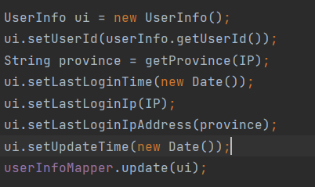
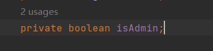
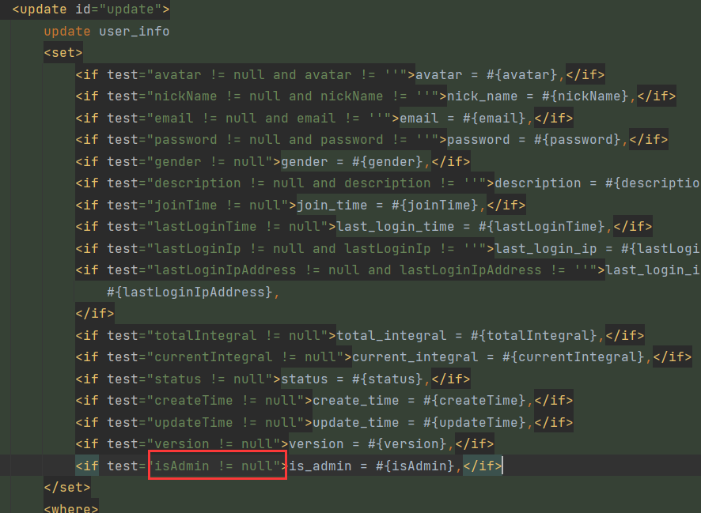

# POJO属性的类型建议都使用包装类

因为基本数据类型的属性，你不给它赋值，它是有默认值的。有些时候，我们并不希望这个属性参与SQL条件计算，通常的做法是POJO对象不给这个属性赋值，本意是让它为`null`这样条件判断不通过就会忽略这个字段，但是如果这个属性是基本数据类型，那么它就不是`null`，而是默认值。

而此时，SQL条件判断不为`null`，就会去使用这个默认值。比如登录的场景：

在这个场景中，登录后需要更新一些信息，如最后登录时间、IP等，如下图：

但是我们并不想更新`is_admin`这个字段，所有就没有调用它的`setter`，但是由于`isAdmin`是基本数据类型，即便没有给它赋值，它也会有默认值`false`：

这就导致，当管理员登录时，本应是`is_admin = 1`的字段，却被更新为了`is_admin = 0`：

正是因为有默认值，所以`isAdmin != null`判断为`true`，才造成`is_admin`字段被更新。所以改为包装类，避免调用默认值，没给它赋值就让它保持`null`值。